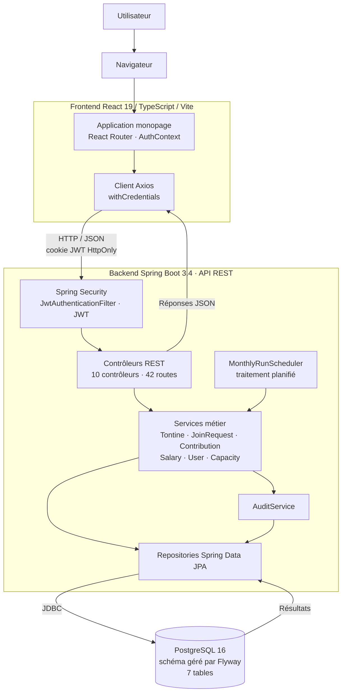

# RAPPORT FINAL : Examen DevSecOps
# SalaryTontine

**Étudiante :** Mame Fatou Laye Diop
**Matricule :** 1058948
**Date :** 30/08/2026
**Repo GitHub :** https://github.com/mfatou/salary-tontine
**Stack technique :** Java 21 / Spring Boot 3.4.2 · React 19.2 / TypeScript 5.9 / Vite 6.4 · PostgreSQL 16 · Flyway · Docker

---

## Résumé Exécutif

---

## 1. Présentation de l'Application

### 1.1 Description

#### Domaine métier

SalaryTontine est une plateforme académique qui **simule** l'effet d'une tontine sur le
salaire mensuel d'employés d'une entreprise.

Sa nature simulée conditionne toute l'analyse qui suit : **aucun argent réel n'est transféré**,
aucune API bancaire ni Mobile Money n'est appelée, et l'application ne produit ni bulletin légal
ni déclaration sociale — ce n'est pas un logiciel de paie. Les données de démonstration sont
fictives (`DemoDataSeeder`, désactivé par défaut). `backend/pom.xml` ne contient aucune
dépendance vers un service tiers : l'application ne communique qu'avec sa propre base.

**Le mécanisme de tontine tel qu'il est implémenté.** Une tontine est un groupe fermé de
participants. Chacun verse le même montant à chaque tour, et à chaque tour un seul participant
reçoit l'intégralité de la cagnotte. Le cycle compte exactement autant de tours qu'il y a de
participants (`TontineCycleService.cycleLength`), de sorte que chacun encaisse une fois et une
seule.

Les éléments suivants ont été vérifiés dans le code :

| Élément | Implémentation constatée |
|---|---|
| Statuts d'une tontine | `DRAFT`, `ACTIVE`, `COMPLETED`, `CANCELLED` (`TontineStatus`) |
| Adhésion | Un employé dépose une demande sur une tontine `DRAFT` ; le comptable accepte ou refuse (`JoinRequestService`). Une demande vit dans sa propre table `tontine_join_requests` et n'entre dans aucun calcul tant qu'elle n'est pas acceptée |
| Ordre de passage | `TontineMember.turnOrder`, entier unique par tontine, attribué à l'acceptation ; renuméroté de 1 à n après un départ (`TontineService.compactTurnOrders`) |
| Tours | Numérotés de 1 à n ; le tour k revient au participant dont le `turnOrder` vaut k (`TontineCycleService.resolveBeneficiary`) |
| Cadence | `TontineFrequency` : `WEEKLY` (7 j), `TEN_DAYS` (10 j), `BIWEEKLY` (14 j), `MONTHLY` (mois calendaire), `CUSTOM` (durée libre de 1 à 365 jours portée par `Tontine.periodDays`) |
| Cotisations | Une par participant et par tour, du montant de la tontine, statut `PENDING` puis `DEDUCTED` (`ContributionService`, `ContributionStatus`) |
| Bénéficiaire | Déterminé par le rang du tour, pas par une date |
| Génération des salaires | `SalaryService.generateForPeriod` : exige que les cotisations du tour existent pour tous les participants, calcule un `SalaryRecord` par participant, marque les cotisations `DEDUCTED`, et clôt la tontine (`COMPLETED`) après le dernier tour |
| Participation multiple | Implémentée : un employé peut appartenir à plusieurs tontines, dans la limite de sa capacité de cotisation (`ContributionCapacityService`) |
| Consolidation mensuelle | `SalaryService.recomputeMonthlyTotals` réaligne le salaire final de toutes les lignes du même mois |

**Formule de calcul.** Le calcul unitaire est isolé dans `SalaryCalculator`, sans accès à la
base ni au contexte HTTP :

```
salaire final = salaire de base − cotisation + cagnotte reçue
```

Mais comme un employé peut cotiser à plusieurs tontines et qu'une tontine infra-mensuelle
produit plusieurs tours dans le même mois, `SalaryService` recalcule ensuite le résultat au
niveau du **mois** :

```
salaire final du mois = salaire de base − Σ cotisations du mois + Σ cagnottes reçues dans le mois
```

C'est cette valeur consolidée qui est écrite dans chaque ligne `salary_records` du mois. Tous
les montants sont manipulés en `BigDecimal` ; aucun type flottant n'intervient dans un calcul
monétaire.

Une seconde règle de calcul mérite d'être signalée, car elle articule cadence et salaire :
`Tontine.monthlyCost()` ramène la cotisation d'un tour à un **coût mensuel moyen** en la
multipliant par le nombre moyen de tours dans un mois (30,4375 jours ÷ durée du tour). C'est
ce coût, et non la cotisation brute, qui est comparé au salaire de base par la règle de
plafond.

#### Fonctionnalités principales

Toutes confirmées par lecture des contrôleurs et des services correspondants.

| Domaine | Fonctionnalités |
|---|---|
| Comptes | Inscription publique (rôle `EMPLOYEE` et salaire nul imposés par le serveur, statut `PENDING`) ; validation ou refus d'une inscription par un `ADMIN` ; attribution du rôle ; correction du salaire de base |
| Authentification | Connexion — refusée si le compte n'est pas `ACTIVE` —, déconnexion, consultation de son profil, changement de son propre mot de passe avec vérification de l'actuel |
| Tontines | Création, modification (`DRAFT` seulement), activation, annulation, suppression (`DRAFT` seulement) ; ajout et retrait d'un participant ; départ volontaire avant démarrage ; calendrier prévisionnel du cycle |
| Adhésions | Demande, retrait de sa propre demande, consultation de ses demandes ; acceptation — qui crée le participant et fixe l'ordre de passage — ou refus ; file d'attente globale pour le gestionnaire |
| Cotisations et salaires | Génération des cotisations d'un tour, puis des salaires simulés ; consultation de son historique et du bulletin consolidé d'un mois ; consultation de l'historique d'un employé par un gestionnaire |
| Transverses | Tableau de bord agrégé ; annuaire salarial réservé aux rôles `ACCOUNTANT` et `ADMIN` ; journal d'audit paginé réservé à `ADMIN` — seul endpoint paginé de l'application ; traitement automatique planifié des tours échus |

**Aucun administrateur ne crée de compte ni ne choisit le mot de passe d'un tiers.** Chaque
utilisateur s'inscrit lui-même et définit son propre mot de passe ; l'administrateur n'intervient
qu'ensuite, pour valider ou refuser l'inscription et attribuer le rôle. Aucun endpoint ne permet
de définir le mot de passe d'un autre compte.

#### Stack technique

| Couche | Technologies | Rôle |
|---|---|---|
| Frontend | React 19.2.8, TypeScript 5.9.3, Vite 6.4.3, React Router 7.18.2, Axios 1.19.0 | Application monopage exécutée dans le navigateur |
| Serveur frontend | Nginx 1.27-alpine (image Docker uniquement) | Sert les fichiers statiques produits par Vite ; renvoie `index.html` sur toute route inconnue |
| Backend | Java 21, Spring Boot 3.4.2, Spring Web | API REST |
| Authentification | Spring Security, JJWT (`jjwt-api`, `jjwt-impl`, `jjwt-jackson`) | Jeton JWT transporté par cookie |
| Persistance | Spring Data JPA / Hibernate 6, pilote PostgreSQL | Accès aux données |
| Validation | Jakarta Bean Validation (`spring-boot-starter-validation`) | Validation des DTO d'entrée |
| Migrations | Flyway (`flyway-core`, `flyway-database-postgresql`) | Sept migrations versionnées, V1 à V7 |
| Base de données | PostgreSQL 16-alpine | Stockage |
| Documentation API | springdoc-openapi (Swagger UI) | Description des endpoints |
| Supervision | Spring Boot Actuator | Point de santé `/actuator/health` |
| Tests backend | JUnit 5, Mockito, AssertJ, Spring Security Test, MockMvc, Testcontainers | 180 méthodes `@Test` |
| Tests frontend | Vitest 3.2.7, Testing Library (react 16.3.2), jsdom 26.1.0 | 66 cas de test |
| Conteneurisation | Docker (builds multi-étapes), Docker Compose | Trois services : `postgres`, `backend`, `frontend` |

Les versions du backend proviennent de `backend/pom.xml`, les images Docker de
`docker-compose.yml` et des `Dockerfile`. Les versions frontend sont celles **réellement
verrouillées** dans `frontend/package-lock.json` (lockfile v3), et non les intervalles `^`
déclarés dans `package.json` : plusieurs paquets sont installés bien au-dessus de leur version
déclarée, notamment TypeScript (5.9.3 pour `^5.7.3`) et Axios (1.19.0 pour `^1.7.9`).

#### Données sensibles

| Donnée / Secret | Catégorie | Pourquoi sensible | Enjeu CIA principal |
|---|---|---|---|
| Nom, adresse e-mail | Donnée métier | Identifient une personne physique | Confidentialité |
| Salaire de base (`base_salary`) | Donnée métier | Rémunération individuelle ; base de tous les calculs | Confidentialité + Intégrité |
| Historique des salaires simulés (`salary_records`) | Donnée métier | Reconstitue la rémunération dans le temps | Confidentialité + Intégrité |
| Cotisations (`contributions`) | Donnée métier | Engagements d'un participant | Intégrité |
| Appartenance à une tontine (`tontine_members`) | Donnée métier | Révèle l'adhésion à un groupe d'épargne | Confidentialité |
| Ordre de passage (`turn_order`) | Donnée métier | Détermine qui encaisse la cagnotte et quand | Intégrité |
| Demandes d'adhésion (`tontine_join_requests`) | Donnée métier | Contiennent un message libre du demandeur | Confidentialité |
| Journal d'audit (`audit_logs`) | Donnée métier | Sa valeur probante repose sur son exactitude | Intégrité |
| Empreinte du mot de passe (`password_hash`, BCrypt) | Donnée d'authentification | Sa divulgation exposerait à une attaque hors ligne | Confidentialité |
| **Jeton JWT** | Donnée d'authentification (*credential*) | Porte l'identité et le rôle de l'appelant ; quiconque le détient agit au nom de son porteur | Confidentialité + Intégrité |
| Statut du compte (`PENDING`, `ACTIVE`, `REJECTED`) | Donnée d'authentification | Conditionne l'accès à l'application | Intégrité |
| Rôle (`EMPLOYEE`, `ACCOUNTANT`, `ADMIN`) | Donnée d'authentification | Détermine les autorisations | Intégrité |
| **`JWT_SECRET`** | Secret cryptographique | Clé de signature des jetons : la connaître permet d'en forger | Confidentialité + Intégrité |
| `DB_PASSWORD` | Secret technique | Ouvre un accès direct à la base, hors de tout contrôle applicatif | Confidentialité + Intégrité |
| `APP_ADMIN_PASSWORD` | Secret technique | Mot de passe du compte administrateur initial | Confidentialité |
| `APP_SEED_PASSWORD` | Secret technique | Mot de passe commun des comptes de démonstration | Confidentialité |
| `DB_USERNAME` | Identifiant technique | Nomme le compte de base de données ; sans le mot de passe associé, il n'ouvre aucun accès | Confidentialité (faible) |
| `APP_ADMIN_EMAIL` | Identifiant / configuration | Désigne le compte à amorcer ; n'est pas un secret, mais révèle le compte à privilèges | Confidentialité (faible) |
| Disponibilité de l'API et de la base | — | Sans elles, aucune consultation ni génération n'est possible | Disponibilité |

Ces trois catégories appellent des protections différentes. Une **donnée métier** décrit une
personne ou une opération : elle se protège par le contrôle d'accès. Une **donnée
d'authentification** sert à établir ou porter l'identité : elle se protège par le hachage, le
transport et la durée de vie. Un **secret technique** ne décrit personne, mais sa compromission
donne accès à l'ensemble des données métier : il se protège par l'environnement d'exécution.

Deux nuances méritent d'être posées. Le `JWT_SECRET` est un **secret cryptographique** et non un
simple mot de passe : le connaître ne donne pas accès à un compte, mais permet de **forger des
jetons pour n'importe quel compte et n'importe quel rôle**. À l'inverse, `APP_ADMIN_EMAIL` et
`DB_USERNAME` sont des **identifiants de configuration** : ils nomment un compte sans ouvrir
d'accès. Les traiter comme des secrets diluerait la notion ; les ignorer complètement serait
excessif, car ils désignent des comptes à privilèges.

#### Utilisateurs et rôles

L'énumération `Role.java` définit exactement trois rôles : `EMPLOYEE`, `ACCOUNTANT`, `ADMIN`.

| Rôle | Responsabilités principales | Accès aux données sensibles |
|---|---|---|
| `EMPLOYEE` | Consulter son profil et son historique de salaires ; parcourir les tontines ouvertes ; demander à rejoindre une tontine, retirer sa demande, quitter une tontine non démarrée ; changer son mot de passe | Son propre salaire et ses propres cotisations uniquement |
| `ACCOUNTANT` | Tout ce que peut un `EMPLOYEE`, plus : créer, modifier, activer, annuler et supprimer des tontines ; ajouter et retirer des participants ; arbitrer les demandes d'adhésion ; déclencher les générations ; consulter et corriger les salaires de base | Salaire de base et historique de tous les employés |
| `ADMIN` | Valider et refuser les inscriptions ; attribuer les rôles ; consulter le journal d'audit ; dispose également des droits de gestion des tontines et d'accès à l'annuaire salarial | Tous les comptes, tous les salaires, le journal d'audit |

**Règles vérifiées dans le backend.**

| Question | Réponse constatée |
|---|---|
| Qui modifie le salaire d'un `EMPLOYEE` ? | `ACCOUNTANT` ou `ADMIN` (`EmployeeDirectoryController`, `@PreAuthorize("hasAnyRole('ACCOUNTANT', 'ADMIN')")` ; `AdminUserController`, réservé à `ADMIN`) |
| Qui modifie le salaire d'un `ACCOUNTANT` ? | Les mêmes rôles : le comptable est un salarié ordinaire dans l'annuaire |
| Peut-on modifier son propre salaire ? | Non, quel que soit le rôle (`UserService.updateBaseSalary`) |
| Ce que `ADMIN` peut faire | Valider ou refuser une inscription, attribuer un rôle, corriger un salaire, lire le journal d'audit, gérer les tontines |
| Ce que `ADMIN` ne peut pas faire | Modifier son propre rôle, refuser son propre compte, fixer son propre salaire, participer à une tontine |
| Ce que `ACCOUNTANT` peut faire | Gérer tontines et salaires, et participer aux tontines comme tout salarié |
| Ce que `ACCOUNTANT` ne peut pas faire | Accéder à `/api/admin/**`, fixer son propre salaire, s'ajouter lui-même à une tontine, accepter sa propre demande |
| `ADMIN` participe-t-il aux tontines ? | Non : `Role.participatesInTontines()` retourne `false`. Ce rôle n'a pas de salaire de base |
| `ACCOUNTANT` participe-t-il ? | Oui : la même méthode retourne `true` |

**Séparation des tâches autour de la gestion salariale.** Trois règles distinctes,
implémentées côté service et donc indépendantes de l'interface :

1. Personne ne fixe son propre salaire de base (`UserService.updateBaseSalary`).
2. Personne ne s'ajoute soi-même à une tontine qu'il administre, ordre de passage compris
   (`TontineService.addMember`).
3. Personne n'accepte sa propre demande d'adhésion (`JoinRequestService.accept`), car cela
   permettrait de s'attribuer l'ordre de passage 1 et d'encaisser la cagnotte avant d'avoir
   cotisé.

Ces contrôles résident dans la couche service. Le frontend masque par ailleurs les actions
correspondantes, mais ce masquage relève de l'expérience utilisateur et non du contrôle
d'accès.

---

### 1.2 Architecture

#### Vue d'ensemble

L'application suit une architecture à trois composants : une application monopage exécutée
dans le navigateur, une API REST, et une base de données relationnelle. Aucun service tiers
n'est appelé.

#### Frontend

Application React 19 écrite en TypeScript, construite par Vite 6 et servie soit par le serveur
de développement Vite, soit par Nginx dans l'image Docker.

La navigation repose sur React Router 7. `AppRoutes` déclare deux niveaux de garde :

- `ProtectedRoute` redirige vers `/login` lorsqu'aucun utilisateur n'est chargé ;
- `RoleProtectedRoute` redirige vers `/forbidden` lorsque le rôle de l'utilisateur n'est pas
  dans la liste `allowedRoles`.

L'état d'authentification est porté par `AuthContext` / `AuthProvider`, qui conserve
l'utilisateur courant en mémoire React (`useState`) et l'obtient du backend. Aucun jeton n'est
stocké dans `localStorage` ni `sessionStorage`.

Les appels HTTP passent par une instance Axios unique (`api/client.ts`) configurée avec
`withCredentials: true`, indispensable pour que le navigateur transmette le cookie
d'authentification. Un intercepteur de réponse redirige vers `/login` sur un statut 401, sauf
sur les chemins où un 401 est un résultat normal.

Ces mécanismes servent la navigation et l'expérience utilisateur : ils déterminent ce que
l'interface affiche. Les autorisations effectives sont appliquées côté backend.

#### Backend

API REST Spring Boot organisée en couches : `controller` (HTTP seul — dix contrôleurs, 42
routes), `dto/request` et `dto/response` (contrats distincts des entités), `mapper`, `service`
(logique métier et transactions), `repository` (Spring Data JPA), `entity`, `security`,
`exception` et `config`.

Aucune entité JPA n'est exposée directement. La vue ouverte en session est désactivée
(`spring.jpa.open-in-view: false`), ce qui oblige chaque lecture à charger explicitement les
associations que le mapper traverse. Les DTO d'entrée portent des annotations Jakarta Bean
Validation, appliquées par `@Valid` dans les contrôleurs.

`GlobalExceptionHandler` centralise la traduction des exceptions en codes HTTP : 404 pour une
ressource absente, 400 pour une règle métier ou une validation invalide, 409 pour un doublon,
403 pour un accès refusé, 401 pour un défaut d'authentification, 405 pour une méthode non
supportée.

`MonthlyRunScheduler` déclenche `MonthlyRunService` selon une expression cron configurable ;
`AuditService` enregistre les actions sensibles dans `audit_logs`.

#### Base de données

PostgreSQL 16, dont le schéma est géré exclusivement par Flyway : `spring.jpa.hibernate.ddl-auto`
vaut `validate`, Hibernate ne crée ni ne modifie donc aucune table.

Sept migrations, V1 à V7, portent l'historique du schéma. Sept tables métier :

| Table | Contenu |
|---|---|
| `users` | Comptes : nom, e-mail, empreinte du mot de passe, rôle, statut, salaire de base |
| `tontines` | Tontines : cotisation par tour, cadence, durée de tour personnalisée, date de début, nombre de places, statut |
| `tontine_members` | Participation acceptée d'un utilisateur à une tontine, avec son ordre de passage |
| `tontine_join_requests` | Demandes d'adhésion et leur arbitrage |
| `contributions` | Cotisation d'un participant pour un tour donné |
| `salary_records` | Salaire simulé d'un participant pour un tour donné, rattaché à un mois de paie |
| `audit_logs` | Journal des actions sensibles |

Les invariants sont portés par la base et non par le seul code Java : unicité de l'e-mail,
unicité de la participation et de l'ordre de passage au sein d'une tontine, unicité d'une
cotisation par (tontine, utilisateur, tour), unicité d'un salaire par (utilisateur, tontine,
tour), contraintes de domaine sur les statuts, les rôles et les montants.

#### Authentification et autorisation

Description de l'implémentation constatée, sans appréciation à ce stade.

- **Jeton JWT.** `JwtService` construit le jeton avec `Jwts.builder()`, en y plaçant l'e-mail
  comme sujet, l'identifiant utilisateur et le rôle comme revendications, ainsi que les dates
  d'émission et d'expiration.
- **Algorithme.** La clé est dérivée du secret par `Keys.hmacShaKeyFor(...)`, ce qui sélectionne
  un algorithme HMAC-SHA dont la variante dépend de la longueur de la clé fournie. Le
  démarrage échoue si le secret fait moins de 32 caractères
  (`AppProperties.Jwt.MINIMUM_SECRET_LENGTH`).
- **Durée de vie.** Configurable par `JWT_EXPIRATION_SECONDS`, valeur par défaut 3600 secondes
  dans `application.yml` et dans `docker-compose.yml`.
- **Cookie.** `JwtCookieService` construit un `ResponseCookie` avec `httpOnly(true)`,
  `path("/")`, `sameSite("Lax")` et `secure(...)` piloté par `JWT_COOKIE_SECURE` (défaut
  `false`). La déconnexion émet un cookie vide dont l'âge maximal est nul.
- **Stratégie de session.** `SessionCreationPolicy.STATELESS` dans `SecurityConfig`.
- **Chaîne de filtres.** `JwtAuthenticationFilter` est inséré avant
  `UsernamePasswordAuthenticationFilter`. Les routes publiques sont `/api/auth/register`,
  `/api/auth/login`, `/api/auth/logout`, `/actuator/health`, `/v3/api-docs/**`,
  `/swagger-ui/**` et `/swagger-ui.html`. `/api/admin/**` exige le rôle `ADMIN`, et toute
  autre requête exige une authentification.
- **Contrôle du rôle par endpoint.** `@PreAuthorize` est utilisé sur `AdminUserController`,
  `AdminAuditController`, `EmployeeDirectoryController`, ainsi que sur des méthodes de
  `TontineController`, `JoinRequestController`, `ContributionController` et `SalaryController`.
- **Vérification du statut à chaque requête.** `JwtAuthenticationFilter.authenticate` interroge
  `userRepository.existsByIdAndStatus(id, ACTIVE)` avant de peupler le contexte de sécurité ;
  un jeton valide dont le compte n'est plus `ACTIVE` n'authentifie donc pas la requête.
- **Identité de l'appelant.** `CurrentUserProvider` lit l'utilisateur depuis le contexte de
  sécurité, jamais depuis un paramètre fourni par le client.
- **CORS.** `SecurityConfig.corsConfigurationSource` autorise une seule origine, celle de
  `APP_FRONTEND_URL`, les méthodes GET, POST, PATCH, PUT, DELETE, OPTIONS, les en-têtes
  `Content-Type`, `Accept`, `X-Requested-With`, avec `allowCredentials(true)`, sur `/api/**`.
- **CSRF.** La protection CSRF de Spring Security est désactivée dans `SecurityConfig`.
- **Mots de passe.** Hachés avec `BCryptPasswordEncoder` de coût 12.

#### Flux de données

| Source | Destination | Données transportées | Protocole / mécanisme |
|---|---|---|---|
| Utilisateur | Navigateur | Saisies de formulaire, identifiants | Interface graphique |
| Navigateur | React (SPA) | Événements d'interface, navigation | Exécution locale JavaScript |
| React | Spring Boot | Identifiants de connexion, formulaires, identifiants de ressources, paramètres de requête, données métier | HTTP/JSON via Axios, `withCredentials: true` |
| Navigateur | Spring Boot | Jeton JWT | Cookie `HttpOnly`, `SameSite=Lax`, transmis automatiquement |
| Spring Boot | PostgreSQL | Comptes, tontines, participations, demandes, cotisations, salaires simulés, journal d'audit | JDBC via HikariCP |
| PostgreSQL | Spring Boot | Résultats de requêtes | JDBC |
| Spring Boot | React | Réponses JSON, cookie d'authentification à la connexion, réponses d'erreur normalisées | HTTP/JSON |
| Planificateur | Services métier | Déclenchement des générations pour les tours échus | Appel interne `@Scheduled` |
| Services métier | PostgreSQL | Cotisations et salaires générés | JDBC |
| Actions sensibles | `AuditService` → `audit_logs` | Auteur, action, type et identifiant d'entité, détail textuel | Appel interne puis JDBC |

#### Environnements

Le dépôt permet deux modes d'exécution locale, tous deux décrits dans le `Makefile` :

- **Mode développement** (`make dev`) : PostgreSQL dans un conteneur Docker, backend lancé par
  Maven sur la machine hôte, frontend servi par Vite. Les variables proviennent du fichier
  `.env`, chargé par le `Makefile`.
- **Pile conteneurisée complète** (`make up` / `docker compose up --build`) : trois services
  Docker — `postgres`, `backend`, `frontend` — sur un réseau interne `salarytontine-net`, avec
  des sondes de santé et un ordonnancement des démarrages (`depends_on` conditionné par
  `service_healthy`). Le frontend est alors servi par Nginx.

Les images sont construites en plusieurs étapes : compilation Maven puis
`eclipse-temurin:21-jre-alpine` pour le backend, build Vite puis `nginx:1.27-alpine` pour le
frontend. Le conteneur backend s'exécute sous un utilisateur non privilégié.

La configuration provient intégralement de variables d'environnement (`AppProperties`, annoté
`@ConfigurationProperties(prefix = "app")`, et les substitutions `${...}` d'`application.yml`).
Aucun profil Spring n'est défini : il n'existe qu'un seul fichier de configuration.

**Il n'existe aucun déploiement réel.** Le dépôt ne contient ni manifeste Kubernetes, ni
configuration de plateforme d'hébergement, ni pipeline de déploiement. Les environnements
« développement » et « production » évoqués par l'énoncé se réduisent ici à deux modes
d'exécution locale ; la pile Docker Compose est la configuration la plus proche d'un
déploiement, sans en être un.

#### Schéma technique intermédiaire

> Le diagramme Mermaid suivant est un brouillon technique de l'architecture.
> La version finalisée est présentée juste après.
>
> Il ne s'agit pas du DFD Threat Dragon : il ne comporte ni frontière de confiance, ni menace,
> ni annotation STRIDE.



#### Architecture générale finalisée

Le diagramme ci-dessous présente la version finalisée de l'architecture générale de
SalaryTontine, en synthétisant les principaux composants applicatifs et leurs interactions.


---

## 2. Threat Modeling

Le modèle de menaces a été construit dans **OWASP Threat Dragon 2.0** et exporté dans
`threat-model_mame-fatou-laye-diop.json`. Il contient un diagramme de type STRIDE intitulé
« DFD SalaryTontine », composé de 20 éléments.

### 2.1 DFD et Frontières de Confiance


#### Acteurs

Les trois acteurs correspondent exactement aux rôles de l'énumération `Role.java`. Ils sont
externes au système : l'application ne contrôle ni leur poste, ni leur navigateur, ni leur
comportement.

| Acteur | Rôle dans le système |
|---|---|
| `EMPLOYEE` | Consulte son salaire simulé, demande à rejoindre une tontine, quitte une tontine non démarrée |
| `ACCOUNTANT` | Gère les tontines, arbitre les adhésions, consulte et corrige les salaires de base |
| `ADMIN` | Valide les inscriptions, attribue les rôles, consulte le journal d'audit |

#### Processus

| Processus | Description |
|---|---|
| Navigateur / React SPA | Application monopage exécutée sur le poste de l'utilisateur. Elle assemble les requêtes et affiche les réponses ; elle ne détient aucun secret et n'applique aucun contrôle d'accès opposable |
| Spring Boot REST API + Spring Security / JWT | Point d'entrée unique du système. Vérifie la signature du jeton, contrôle le statut du compte, applique les autorisations de rôle et valide les DTO |
| Services métier | Couche transactionnelle : règles de tontine, capacité de cotisation, séparation des tâches, calculs salariaux |
| `MonthlyRunScheduler` | Déclencheur temporel interne. Il n'est associé à aucun acteur : c'est le seul processus qui agit sans utilisateur à l'origine |

#### Store

Un seul magasin de données : **PostgreSQL 16**, qui persiste l'ensemble des sept tables métier
— comptes, tontines, participations, demandes d'adhésion, cotisations, salaires simulés et
journal d'audit. C'est le point de concentration de toutes les données sensibles de
l'application.

#### Flux de données

Dix flux sont modélisés, annotés du type de données transportées et du protocole employé.

| Flux | Données transportées | Protocole |
|---|---|---|
| Actions `EMPLOYEE` → SPA | Saisies de formulaire, navigation | Interface graphique |
| Actions `ACCOUNTANT` → SPA | Saisies de formulaire, décisions d'arbitrage | Interface graphique |
| Actions `ADMIN` → SPA | Saisies de formulaire, décisions de validation | Interface graphique |
| SPA → API | Requêtes HTTP/JSON accompagnées du cookie JWT transmis par le navigateur | HTTP/JSON, authentifié |
| API → SPA | Réponses JSON et en-tête `Set-Cookie` à la connexion | HTTP/JSON, authentifié |
| API → Services métier | Utilisateur authentifié, rôle, DTO validés | Appel interne |
| Services métier → API | Résultats métier | Appel interne |
| Services métier → PostgreSQL | Lectures et écritures : utilisateurs, tontines, cotisations, salaires, audit | JPA/JDBC |
| PostgreSQL → Services métier | Résultats de requêtes | JPA/JDBC |
| `MonthlyRunScheduler` → Services métier | Tours échus à traiter | `@Scheduled` |

#### Frontières de confiance

Deux frontières délimitent les changements de niveau de confiance. Elles ont été placées
avant les composants, selon le principe que **chaque flux qui traverse une frontière est une
menace potentielle**.

**TB1 — Navigateur / Backend applicatif.** Elle sépare ce que l'utilisateur contrôle de ce que
l'application contrôle. Tout ce qui se trouve du côté navigateur — le code React, les valeurs
saisies, les identifiants de ressources, le cookie lui-même — est manipulable par le
propriétaire du poste. Cette frontière justifie que les gardes `ProtectedRoute` et
`RoleProtectedRoute` ne soient jamais considérées comme un contrôle d'accès : elles s'exécutent
du mauvais côté de la frontière. Deux flux la traversent, dans les deux sens, et portent à la
fois les identifiants de connexion et le jeton d'authentification.

**TB2 — Backend applicatif / PostgreSQL.** Elle sépare la couche qui applique les règles
métier de celle qui détient les données. Un accès qui franchirait cette frontière sans passer
par les services — connexion directe à la base — contournerait l'intégralité des règles de
tontine, de la séparation des tâches et de la validation. Seules subsisteraient les contraintes
SQL portées par le schéma. Deux flux la traversent, dans les deux sens.

Le `MonthlyRunScheduler` occupe une position particulière : il se situe **à l'intérieur** de
la frontière applicative et n'est déclenché par aucun acteur. Il ne traverse donc TB1 à aucun
moment, mais ses écritures franchissent TB2 comme celles de tout autre service.

### 2.2 Analyse STRIDE

Huit menaces ont été documentées, réparties sur quatre composants et flux, et couvrant les
**six catégories STRIDE** — au-delà du minimum de cinq exigé.

| # | Composant / Flux | Catégorie STRIDE | Description de la menace | Sévérité | Mitigation proposée |
|---|---|---|---|---|---|
| 1 | Spring Boot REST API | Elevation of privilege | Un utilisateur tente d'accéder à une fonction privilégiée en manipulant son rôle côté client, un identifiant de ressource ou un jeton | **High** | Vérifier la signature JWT, contrôler le statut `ACTIVE` en base, appliquer `@PreAuthorize` et les contrôles d'autorisation côté backend, et ne jamais considérer les gardes React comme un contrôle de sécurité |
| 2 | Spring Boot REST API | Denial of service | Des requêtes répétées sur `/api/auth/login` ou `/api/auth/register` consomment des ressources et empêchent les utilisateurs légitimes d'accéder au service | Medium | Ajouter une limitation de débit sur les endpoints publics sensibles, limiter les tentatives, journaliser les abus et prévoir des seuils adaptés |
| 3 | Spring Boot REST API | Information disclosure | Une erreur de contrôle d'accès, au niveau d'un endpoint ou d'un objet, expose le salaire de base, l'historique salarial, les cotisations ou les données de tontine d'un autre utilisateur | **High** | Appliquer le contrôle de rôle et l'autorisation au niveau objet côté serveur, filtrer les ressources selon l'utilisateur courant, utiliser des DTO minimaux, et tester les accès croisés entre les trois rôles |
| 4 | Services métier | Repudiation | Un `ACCOUNTANT` ou un `ADMIN` conteste une modification de salaire, une décision d'adhésion ou une opération sur une tontine, la piste d'audit étant incomplète ou modifiable | Medium | Auditer toute action sensible avec auteur, horodatage, cible et contexte ; protéger l'intégrité des `audit_logs` et envisager un stockage en ajout seul ou une centralisation externe |
| 5 | PostgreSQL 16 | Tampering | Un accès non autorisé à la base permet de modifier `salary_records`, `contributions`, les rôles, `turn_order` ou `audit_logs` en contournant les règles métier | **High** | Restreindre PostgreSQL au réseau interne en production, appliquer le moindre privilège au compte de base, ne pas publier inutilement le port, conserver les contraintes SQL, mettre en place sauvegardes et contrôles d'intégrité |
| 6 | Flux SPA → API (cookie JWT) | Spoofing | Un attaquant qui obtient le cookie JWT rejoue le jeton et agit au nom de sa victime jusqu'à expiration. Le risque est majeur pour un compte `ACCOUNTANT` ou `ADMIN` | **High** | Conserver le JWT en cookie `HttpOnly`, imposer HTTPS et `Secure=true` en production, maintenir une durée de vie courte, protéger et faire tourner `JWT_SECRET`, prévoir révocation et rotation |
| 7 | Flux SPA → API | Tampering | Le client modifie identifiants, montants, paramètres ou ordres envoyés dans les requêtes afin d'altérer une tontine, une adhésion, une cotisation ou un calcul salarial | **High** | Valider toutes les entrées côté serveur, dériver l'identité du JWT vérifié, ne jamais accepter un calcul salarial fourni par le client, appliquer les règles dans les services et conserver les contraintes d'intégrité en base |
| 8 | Flux SPA → API | Information disclosure | Déployée sans TLS, l'application laisse intercepter en transit les identifiants, les réponses métier et le cookie d'authentification | **High** | Imposer HTTPS/TLS en production, activer `Secure=true` sur le cookie, ajouter HSTS et refuser les accès non chiffrés |

**Couverture obtenue**

| Catégorie STRIDE | Menaces |
|---|---|
| Spoofing | 1 (n° 6) |
| Tampering | 2 (n° 5, 7) |
| Repudiation | 1 (n° 4) |
| Information disclosure | 2 (n° 3, 8) |
| Denial of service | 1 (n° 2) |
| Elevation of privilege | 1 (n° 1) |

Six menaces sont de sévérité **High**, deux de sévérité **Medium**. Cette répartition n'est pas
fortuite : les menaces concentrées sur l'API et sur le flux qui traverse TB1 touchent
directement la confidentialité des salaires et l'intégrité du cycle de tontine, tandis que
celles de sévérité moindre — saturation et répudiation — dégradent le service ou la traçabilité
sans exposer ni altérer directement les données.

### 2.3 Priorisation des Menaces

#### Classement

| Rang | # | Menace | Catégorie | Sévérité |
|---|---|---|---|---|
| 1 | 1 | Élévation de privilèges vers `ACCOUNTANT` ou `ADMIN` | Elevation of privilege | High |
| 2 | 6 | Usurpation d'identité par vol ou rejeu du JWT | Spoofing | High |
| 3 | 3 | Divulgation de salaires ou de données d'un autre utilisateur | Information disclosure | High |
| 4 | 7 | Altération des données métier envoyées par le client | Tampering | High |
| 5 | 8 | Interception de données sensibles faute de TLS | Information disclosure | High |
| 6 | 5 | Altération directe des données en base | Tampering | High |
| 7 | 4 | Déni d'une action sensible insuffisamment traçable | Repudiation | Medium |
| 8 | 2 | Saturation des endpoints d'authentification | Denial of service | Medium |

Le classement ne suit pas la seule sévérité : à sévérité égale, il départage selon la
**facilité d'exploitation** et selon l'**ampleur du dommage dans le contexte métier de
SalaryTontine**, à savoir la confidentialité des rémunérations et l'équité du cycle de tontine.

#### Justification des trois menaces les plus critiques

**1 — Élévation de privilèges (n° 1).** C'est la menace la plus grave parce qu'elle ne
compromet pas une donnée, mais **le modèle de sécurité entier**. Toute la conception de
SalaryTontine repose sur une séparation des tâches : personne ne fixe son propre salaire, ne
s'ajoute soi-même à une tontine, ni n'accepte sa propre demande d'adhésion. Ces trois règles
supposent qu'un utilisateur ne peut pas changer de rôle. Un `EMPLOYEE` devenu `ACCOUNTANT`
accède d'un coup au salaire de base de tous ses collègues, peut les modifier, et peut
s'attribuer un ordre de passage favorable dans une tontine — donc encaisser la cagnotte avant
d'avoir cotisé. Le dommage est simultanément une atteinte à la confidentialité et à
l'intégrité, et il est silencieux : rien dans l'interface ne le signalerait aux autres
participants. La surface est par ailleurs large, puisqu'elle couvre les 42 routes de l'API.

**2 — Usurpation d'identité par vol ou rejeu du JWT (n° 6).** Le jeton est la **seule preuve
d'identité** de l'application : aucune session serveur ne double l'authentification, et
`SessionCreationPolicy.STATELESS` en fait le point unique de confiance. Quiconque le détient
agit au nom de son porteur, sans mot de passe. Deux caractéristiques du contexte aggravent
cette menace. D'abord, l'attribut `Secure` du cookie est piloté par `JWT_COOKIE_SECURE`, dont
la valeur par défaut est `false` : hors HTTPS, le jeton circule en clair. Ensuite, il n'existe
aucun mécanisme de révocation — la déconnexion efface le cookie côté navigateur, mais un jeton
déjà capté reste valide jusqu'à son expiration, une heure par défaut. Le seul garde-fou est le
contrôle de statut à chaque requête, qui ne bloque que les comptes devenus non `ACTIVE`. Une
usurpation de compte `ACCOUNTANT` donne accès à l'ensemble des salaires pendant toute cette
fenêtre.

**3 — Divulgation de salaires (n° 3).** Le salaire est la donnée la plus sensible de
l'application, et sa confidentialité en est la promesse centrale. Cette menace se place au
troisième rang plutôt qu'au premier parce qu'elle expose sans altérer : elle rompt la
confidentialité, non l'intégrité du cycle. Mais elle est **plus difficile à détecter** que les
deux précédentes. Une élévation de privilèges laisse une trace dans le journal d'audit ; une
lecture non autorisée d'une ressource d'autrui, si elle passe par un endpoint légitime avec un
identifiant qui n'est pas le sien, peut n'en laisser aucune. Le contexte métier aggrave la
conséquence : dans une entreprise, la divulgation des rémunérations produit un dommage social
durable, que la correction technique de la faille ne répare pas.

**Pourquoi les autres menaces viennent ensuite.** L'altération des données envoyées par le
client (n° 7) est de sévérité identique, mais sa surface est bornée par la validation Jakarta
et par le fait que les calculs monétaires ne sont jamais acceptés du client. L'interception
faute de TLS (n° 8) et l'altération directe en base (n° 5) supposent toutes deux un
prérequis extérieur à l'application — un réseau non chiffré, ou un accès déjà obtenu à
l'infrastructure. La répudiation (n° 4) est réelle mais partiellement couverte par
`AuditService`. La saturation des endpoints d'authentification (n° 2) dégrade la disponibilité
d'un outil de simulation interne, dont l'indisponibilité temporaire n'a pas de conséquence
financière directe.

---

## 3. Analyse OWASP Top 10

### 3.1 Vulnérabilités Identifiées Manuellement

L'analyse a porté sur l'intégralité des controllers, des services, de la configuration Spring
Security, des DTO, des repositories, de la configuration d'environnement et de l'orchestration
Docker. Chaque constat ci-dessous est appuyé par un extrait de code et une localisation précise.

Huit constats sont retenus comme vulnérabilités ou faiblesses de sécurité, au-delà du minimum de
cinq exigé. Quatre observations complémentaires sont présentées séparément, car elles ne
constituent pas des failles confirmées.

#### Tableau de synthèse

| Fichier | Ligne | Catégorie OWASP | CWE | Description | Sévérité |
|---|---|---|---|---|---|
| `backend/src/main/java/com/salarytontine/security/JwtAuthenticationFilter.java` | 51-55 | A01:2021 Broken Access Control | CWE-613 | Le rôle est lu depuis le JWT et jamais relu en base : une rétrogradation reste sans effet jusqu'à l'expiration du jeton | **High** |
| `backend/src/main/java/com/salarytontine/config/SecurityConfig.java` | 39-47 | A07:2021 Identification and Authentication Failures | CWE-307 | Aucune limitation de débit ni verrouillage de compte sur `/api/auth/login` et `/api/auth/register` | **High** |
| `backend/src/main/java/com/salarytontine/service/TontineService.java` | 133-135 | A01:2021 Broken Access Control | CWE-200 / CWE-359 | L'exception de lecture accordée aux tontines `DRAFT` expose le nom et l'adresse e-mail de leurs participants à tout compte authentifié | Medium |
| `backend/src/main/java/com/salarytontine/service/AuthService.java` | 69-81 | A09:2021 Security Logging and Monitoring Failures | CWE-778 | Les échecs d'authentification ne produisent ni trace d'audit ni journal applicatif | Medium |
| `backend/src/main/java/com/salarytontine/controller/AuthController.java` | 71-77 | A07:2021 Identification and Authentication Failures | CWE-613 | La déconnexion se limite à expirer le cookie côté client : aucune révocation serveur du jeton | Medium |
| `backend/src/main/java/com/salarytontine/config/AppProperties.java` | 115 | A02:2021 Cryptographic Failures | CWE-614 | L'attribut `Secure` du cookie d'authentification vaut `false` par défaut, dans le code comme dans la configuration | Medium |
| `docker-compose.yml` | 17-18 | A05:2021 Security Misconfiguration | CWE-668 | Le port PostgreSQL est publié sur l'hôte alors que le backend joint la base par le réseau interne | Medium |
| `backend/src/main/java/com/salarytontine/service/AuthService.java` | 43-45 | A07:2021 Identification and Authentication Failures | CWE-204 | L'inscription distingue par un code 409 explicite un e-mail déjà enregistré d'un e-mail inconnu | Low |

#### Protections déjà présentes et corrections recommandées

| # | Constat | Protections déjà présentes | Correction recommandée |
|---|---|---|---|
| C1 | Rôle figé dans le JWT | Le statut du compte est revérifié en base à chaque requête : un compte rejeté perd l'accès immédiatement. Jeton signé en HMAC-SHA, durée de vie bornée à une heure | Remplacer `existsByIdAndStatus` par une lecture de l'entité et construire le principal à partir du rôle en base. La requête est déjà effectuée : le coût est nul |
| C5 | Aucune limitation de débit | BCrypt en coût 12, supérieur au défaut. Message d'erreur uniforme entre e-mail inconnu et mot de passe erroné. Politique de mot de passe de 8 à 72 caractères imposée côté serveur | Limitation par adresse IP et par compte sur `/login` et `/register`, temporisation progressive, verrouillage temporaire après un nombre défini d'échecs |
| C4 | E-mails exposés sur les tontines `DRAFT` | Authentification requise, aucun accès anonyme. Aucun montant dans le DTO concerné. L'accès se referme sur les seuls participants dès l'activation. Les cotisations restent filtrées par utilisateur | Retirer `userEmail` du DTO pour les non-gestionnaires, ou limiter l'exception `DRAFT` à la fiche de la tontine sans la liste nominative |
| C6 | Échecs d'authentification non journalisés | Journal d'audit métier complet : vingt-deux actions tracées avec auteur, entité et horodatage. Un test d'intégration vérifie qu'aucune trace ne contient de secret | Ajouter deux actions d'audit `LOGIN_SUCCESS` et `LOGIN_FAILED` avec l'adresse IP, et un `log.warn` sur chaque échec |
| C2 | Aucune révocation de session | Cookie `HttpOnly`, non exfiltrable par XSS. Durée de vie limitée à une heure. Le changement de mot de passe exige le mot de passe actuel : un jeton volé ne permet pas de verrouiller la victime | Ajouter une colonne `token_version` sur `users`, la porter en claim, l'incrémenter à la déconnexion et au changement de mot de passe, la comparer dans le filtre |
| C3 | Cookie sans attribut `Secure` | `HttpOnly` et `SameSite=Lax` appliqués systématiquement. La variable `JWT_COOKIE_SECURE` est correctement externalisée et documentée | Inverser le défaut à `true` et ne le repasser à `false` que via un profil de développement explicite |
| C9 | Port PostgreSQL publié | `DB_PASSWORD` obligatoire, avec échec explicite du démarrage si absent : aucun mot de passe par défaut. Réseau bridge dédié, healthchecks sur les trois services, volume nommé | Retirer la section `ports` du service `postgres` ; y accéder en développement par `docker compose exec` |
| C7 | Énumération de comptes | La connexion ne fuit rien : message identique dans les deux cas. Le statut du compte n'est révélé qu'après vérification du mot de passe | Réponse uniforme à l'inscription, ou à défaut limitation de débit stricte sur `/register` |

#### Analyse détaillée des constats majeurs

**C1 — Le rôle est figé dans le JWT : la révocation de privilèges est différée.**

```java
// JwtService.java:48 — le rôle est écrit dans le jeton à la connexion
.claim(CLAIM_ROLE, user.getRole().name())

// JwtAuthenticationFilter.java:51-55 — seul le statut est relu en base
if (!userRepository.existsByIdAndStatus(payload.userId(), UserStatus.ACTIVE)) { return; }
AuthenticatedUser principal =
        new AuthenticatedUser(payload.userId(), payload.email(), null, payload.role());
```

Le filtre interroge déjà la base pour vérifier le statut du compte, mais reconstruit le principal
à partir de `payload.role()`, c'est-à-dire le rôle tel qu'il était au moment de la connexion. Le
rôle réel en base n'est jamais relu.

Le scénario d'exploitation est direct. Un `ACCOUNTANT` abuse de ses droits ; un `ADMIN` le
rétrograde en `EMPLOYEE` via `PATCH /api/admin/users/{id}/role`. La rétrogradation est bien
enregistrée et auditée, mais l'intéressé conserve son cookie : jusqu'à l'expiration du jeton,
toutes les annotations `@PreAuthorize("hasAnyRole('ACCOUNTANT','ADMIN')")` continuent de
l'autoriser. Il peut créer des tontines, arbitrer des adhésions, consulter le salaire de base de
tous les employés et déclencher des prélèvements. La fenêtre correspond à
`JWT_EXPIRATION_SECONDS`, soit une heure par défaut.

Ce constat concrétise directement la menace d'élévation de privilèges identifiée dans le modèle
STRIDE, et peut, selon le rôle conservé, conduire à des accès non autorisés aux données métier.
Il est classé en tête parce qu'il rend inopérante la seule mesure corrective disponible face à un
abus de privilèges, et parce que sa correction ne coûte rien : le trajet vers la base est déjà
effectué à chaque requête.

**C5 — Aucune limitation de débit sur les endpoints d'authentification.**

```java
// SecurityConfig.java:39-47
private static final String[] PUBLIC_ENDPOINTS = {
        "/api/auth/register",
        "/api/auth/login",
        ...
```

Une recherche sur l'ensemble du backend et du `pom.xml` ne retourne aucune occurrence de
mécanisme de limitation de débit : ni bibliothèque dédiée, ni filtre, ni compteur de tentatives.
La méthode `AuthenticatedUser.isAccountNonLocked()` retourne `true` en dur, ce qui neutralise le
mécanisme de verrouillage pourtant prévu par Spring Security.

Deux exploitations distinctes en découlent. La première est le *credential stuffing* : un
attaquant rejoue une liste de couples e-mail / mot de passe issus d'une fuite tierce, sans plafond
ni alerte, et sans laisser de trace exploitable puisque les échecs ne sont pas journalisés
— la combinaison avec C6 est ici déterminante. La seconde tient au coût de calcul : BCrypt en
coût 12 est volontairement coûteux en CPU, ce qui est une bonne propriété face au cassage hors
ligne, mais devient un facteur aggravant en l'absence de limitation, des tentatives concurrentes
pouvant contribuer à une saturation du serveur sous charge.

**C4 — Adresses e-mail des participants d'une tontine `DRAFT` exposées à tout compte authentifié.**

```java
// TontineService.java:131-135
// Une tontine encore au statut DRAFT est ouverte aux inscriptions :
// tout employé doit pouvoir l'examiner avant de demander à la rejoindre.
if (tontine.isDraft()) {
    return;
}
```

```java
// TontineMapper.java:41-46
return new TontineMemberResponse(
        member.getId(), member.getUser().getId(),
        member.getUser().getName(), member.getUser().getEmail(),   // ← adresse e-mail
        member.getTurnOrder());
```

L'exception accordée au statut `DRAFT` est délibérée et légitime pour la fiche de la tontine : un
employé doit pouvoir examiner une tontine avant de demander à la rejoindre. Mais elle
court-circuite `checkReadAccess` pour trois routes qui retournent la composition —
`GET /api/tontines/{id}`, `GET /api/tontines/{id}/members` et `GET /api/tontines/{id}/schedule` —
et le DTO transporte l'adresse e-mail.

Un `EMPLOYEE` authentifié récupère les identifiants de tontines via `GET /api/tontines/open`, puis
parcourt `GET /api/tontines/{id}/members` pour chacune. Il reconstitue le nom et l'adresse
professionnelle de collègues sans rapport avec lui, base d'une campagne d'hameçonnage interne
ciblée.

La portée doit être énoncée avec précision : **il ne s'agit pas d'une fuite de salaires**.
`TontineMemberResponse` ne contient aucun montant, et les cotisations sont effectivement filtrées
par utilisateur dans `ContributionService`. Le périmètre est celui de l'annuaire, pas celui de la
paie.

#### Les cinq autres constats

**C6 — Échecs d'authentification non journalisés.** L'inscription réussie est tracée, mais
l'échec de connexion ne produit ni trace d'audit ni log applicatif : `AuthService.authenticate`
lève une `BadCredentialsException` sans appeler `AuditService`, et le gestionnaire d'exception
renvoie un 401 sans écrire de ligne. Le niveau racine étant fixé à `INFO`, la journalisation
`DEBUG` de Spring Security n'apparaît pas non plus. Combiné à C5, une campagne de force brute de
plusieurs milliers de tentatives ne laisse aucune trace, et l'analyse post-incident devient
aveugle.

**C2 — Aucune révocation serveur des jetons.** La déconnexion se limite à renvoyer un cookie vide
et expiré. Il n'existe ni liste de révocation, ni identifiant de session en base, ni compteur de
version de jeton. Un jeton capté avant la déconnexion reste valide jusqu'à son expiration, et la
victime n'a aucun moyen de l'invalider. À noter également que `/api/auth/logout` figure parmi les
routes publiques : l'appel anonyme est inoffensif puisqu'il ne fait que poser un cookie, mais la
route n'a aucune raison d'être ouverte.

**C3 — Cookie sans attribut `Secure` par défaut.** La valeur par défaut est `false` à trois
niveaux : le champ `cookieSecure` d'`AppProperties`, l'expression `${JWT_COOKIE_SECURE:false}`
dans `application.yml`, et la valeur de repli du `docker-compose.yml`. Un déploiement qui
omettrait de positionner la variable hériterait donc silencieusement d'un cookie transmis en
clair sur HTTP.

La sévérité retenue est **Medium dans le contexte actuel** : SalaryTontine ne dispose d'aucun
déploiement de production réel, l'application ne tournant qu'en local et derrière Docker Compose,
où le défaut `false` est le comportement attendu et nécessaire. Cette faiblesse **deviendrait
High, voire critique, si cette configuration était déployée telle quelle sur un environnement
accessible sans HTTPS** : le jeton circulerait alors en clair, et un attaquant présent sur le
réseau obtiendrait une session valide une heure, avec les privilèges de sa victime. Ce qui est en
cause n'est donc pas une exploitation actuelle, mais un défaut qui n'est pas sûr : l'oubli d'une
variable d'environnement suffit à créer la vulnérabilité.

**C9 — Port PostgreSQL publié sur l'hôte.** Le backend joint la base par le réseau interne
`salarytontine-net`, sous le nom de service `postgres` : la publication du port sur l'hôte ne
sert que le confort de développement. Sur un serveur exposé, elle rendrait le port 5432
accessible depuis l'extérieur. Ce constat concrétise la frontière **TB2** identifiée dans le
modèle de menaces : un accès direct à la base contourne l'intégralité des règles métier
— séparation des tâches, plafond de cotisation, cohérence des ordres de passage — pour ne laisser
subsister que les contraintes SQL, et sans qu'aucune trace n'apparaisse dans le journal d'audit,
celui-ci étant alimenté par la couche applicative.

**C7 — Énumération de comptes à l'inscription.** `POST /api/auth/register` est public et distingue
par un code 409 explicite un e-mail déjà enregistré d'un e-mail inconnu. L'oracle est direct : un
attaquant soumet une liste d'adresses au format `prenom.nom@entreprise.com` et retient celles qui
renvoient 409. Pris isolément, l'impact est faible, puisque l'information ne compromet aucun
compte. C'est sa combinaison avec C5 qui le rend exploitable à grande échelle, aucun plafond ne
s'opposant à une énumération massive. Le contraste avec la connexion, correctement protégée par
un message uniforme, montre qu'il s'agit d'une omission ponctuelle et non d'une négligence de
conception.

#### Observations ne constituant pas des vulnérabilités confirmées

Ces quatre points ont été relevés pendant l'inspection mais ne sont pas retenus comme failles.
Les distinguer explicitement est utile : la Partie 6 comparera ces résultats manuels aux
détections automatisées, et plusieurs d'entre eux seront très probablement signalés par les
outils.

| Observation | Fichier | Nature réelle |
|---|---|---|
| **C8 — Protection CSRF désactivée** | `SecurityConfig.java:64-66` | **Risque résiduel, pas une faille confirmée.** Aucun scénario exploitable n'a pu être construit sur un navigateur à jour. Le cookie porte `SameSite=Lax`, qui empêche son émission sur une requête `POST`, `PATCH` ou `DELETE` inter-site. Vérification effectuée sur les 42 endpoints : aucun `@GetMapping` ne modifie l'état, il n'existe donc pas de vecteur. Le risque résiduel concerne les navigateurs anciens ignorant `SameSite`, et une éventuelle compromission d'un sous-domaine du même site |
| **C10 — Swagger et `/v3/api-docs` publics** | `SecurityConfig.java:43-46` | Exposition de la surface d'API à un utilisateur non authentifié : les 42 routes, la structure des DTO et le nom du cookie. Aucune donnée métier n'est servie par ces routes, et `/actuator` n'expose que `health` avec `show-details: never`. C'est une aide à la reconnaissance, pas un accès. À conditionner à un profil de développement avant toute mise en production |
| **C11 — Absence de pagination** | 8 routes de liste | Faiblesse de dimensionnement, sans conséquence à l'échelle d'une PME. Le journal d'audit, seul volume à croissance non bornée par construction, **est** paginé et plafonné à 200 éléments par page, avec bornes validées côté serveur. `open-in-view: false` évite par ailleurs les requêtes hors transaction |
| **S2 — `backend/.dockerignore` incomplet** | `backend/.dockerignore` | **Faiblesse latente uniquement.** Le fichier n'exclut ni `.env` ni `.env.*`, mais cela reste sans effet : le `Dockerfile` du backend ne copie que `pom.xml` et `src`. Le risque n'apparaîtrait qu'en passant à un `COPY . .`. Par comparaison, le `.dockerignore` du frontend exclut bien `.env`, ce qui est nécessaire puisque son `Dockerfile` copie l'intégralité du contexte |

#### Contrôles vérifiés sans constat

L'analyse a également cherché, sans les trouver, plusieurs classes de vulnérabilités
fréquemment attendues sur ce type d'application. Ces résultats négatifs font partie de l'analyse.

| Catégorie | Vérification effectuée | Résultat |
|---|---|---|
| A03 — Injection SQL | Recherche de `nativeQuery`, `createQuery`, `String.format` et de concaténation dans `repository/` | Aucune occurrence. Toutes les requêtes sont écrites en JPQL avec paramètres nommés |
| A03 — XSS | Recherche de `dangerouslySetInnerHTML`, `innerHTML` et `eval(` dans `frontend/src` | Aucune occurrence. L'échappement React par défaut s'applique partout |
| A10 — SSRF | Recherche de `RestTemplate`, `WebClient`, `HttpClient` et `new URL(` dans le backend | Aucun client HTTP sortant. **Catégorie non applicable** |
| A08 — Désérialisation | Recherche de `ObjectInputStream`, `@JsonTypeInfo`, `enableDefaultTyping` | Aucune occurrence. Jackson en configuration stricte |
| Traversée de chemin | Recherche de `MultipartFile`, `Files.write`, `new File(` | Aucune manipulation de fichier issue d'une entrée utilisateur |
| Fuite de trace d'exécution | `include-stacktrace: never`, `include-message: never`, gestionnaire global | Message générique côté client, détail conservé côté serveur |
| Exposition de l'empreinte de mot de passe | Inspection de tous les DTO de réponse et des mappers | `passwordHash` absent de l'ensemble des réponses ; le principal est construit avec `null` dans le filtre |
| Conteneur privilégié | `backend/Dockerfile` | Utilisateur dédié non-root, build multi-étapes, image JRE Alpine |
| Séparation des tâches | Trois règles vérifiées dans les services | Salaire de base, auto-ajout à une tontine et auto-acceptation d'adhésion sont effectivement bloqués côté serveur |

Une incohérence de conception a par ailleurs été relevée sans être classée comme vulnérabilité :
la méthode `accept()` de `JoinRequestService` interdit d'arbitrer sa propre demande, tandis que
`reject()` ne porte pas ce contrôle. Refuser sa propre demande ne procure toutefois aucun
avantage, et une méthode dédiée permet déjà de la retirer.

---

### 3.2 Inventaire des Entrées Utilisateur

L'inventaire couvre les **42 endpoints** exposés par les dix controllers. Il distingue quatre
sources d'entrée : le corps de requête lié à un DTO (`@RequestBody`), les variables de chemin
(`@PathVariable`), les paramètres de requête (`@RequestParam`), et l'identité de l'appelant,
dérivée du JWT via le `SecurityContext`.

#### Répartition des sources d'entrée

| Source | Nombre d'endpoints | Validation appliquée |
|---|---|---|
| `@RequestBody` lié à un DTO | 12 | Bean Validation côté serveur via `@Valid`, sur chacun des 12 |
| `@PathVariable` | 22 | Typage fort (`Long`, `YearMonth`) ; autorisation portée par la couche service |
| `@RequestParam` | 3 | `@Min` / `@Max` sur les paramètres de pagination, activés par `@Validated` |
| Identité issue du JWT | 42 | Jamais fournie par le client : lue dans le `SecurityContext` |

Les douze DTO d'entrée portent tous des contraintes déclaratives, effectivement appliquées côté
serveur : `@NotBlank`, `@NotNull`, `@Email`, `@Size`, `@Min`, `@Max`, `@Positive`,
`@PositiveOrZero`, `@DecimalMin` et `@Digits`. Les violations sont converties en réponse 400
structurée, champ par champ, par le gestionnaire d'exception global.

#### Authentification et profil

| Endpoint | Méthode | Entrée | Validation en place | Risque si non validée |
|---|---|---|---|---|
| `/api/auth/register` | POST | `RegisterRequest` | `@NotBlank`, `@Email`, `@Size` (2-120 / ≤180 / 8-72) | Création de comptes malformés, mots de passe faibles |
| `/api/auth/login` | POST | `LoginRequest` | `@NotBlank`, `@Email` | Requêtes malformées, sondage de l'authentification |
| `/api/auth/logout` | POST | aucune | — | Aucun |
| `/api/auth/me` | GET | identité JWT | — | Aucun : l'identité ne vient pas du client |
| `/api/users/me` | GET | identité JWT | — | Aucun |
| `/api/users/me/password` | PATCH | `ChangePasswordRequest` | `@NotBlank`, `@Size` (8-72) | Contournement de la politique de mot de passe |

Le rôle et le salaire de base ne figurent volontairement dans aucun DTO d'inscription : ils sont
imposés par le serveur, ce qui ferme la voie à une élévation de privilèges par *mass assignment*.

#### Administration

| Endpoint | Méthode | Entrée | Validation en place | Risque si non validée |
|---|---|---|---|---|
| `/api/admin/users` | GET | aucune | Contrôle de rôle `ADMIN` | Divulgation de l'annuaire complet |
| `/api/admin/users/{id}/approve` | POST | `@PathVariable` + `ApproveUserRequest` | `@NotNull` sur le rôle, `@DecimalMin(0)`, `@Digits(13,2)` | Attribution d'un rôle arbitraire, salaire négatif ou hors format |
| `/api/admin/users/{id}/reject` | POST | `@PathVariable` | Règle métier : auto-refus bloqué | Blocage de l'unique compte administrateur |
| `/api/admin/users/{id}/role` | PATCH | `@PathVariable` + `UpdateRoleRequest` | `@NotNull` sur un type énuméré ; auto-rétrogradation bloquée | Application rendue inadministrable, élévation de privilèges |
| `/api/admin/users/{id}/salary` | PATCH | `@PathVariable` + `UpdateSalaryRequest` | `@NotNull`, `@PositiveOrZero`, `@Digits` ; auto-attribution bloquée | Rupture de la séparation des tâches sur la paie |
| `/api/admin/users/{id}/salaries` | GET | `@PathVariable` | Contrôle de rôle `ADMIN` | Divulgation de l'historique salarial d'autrui |
| `/api/admin/audit-logs` | GET | `@RequestParam` `page`, `size` | `@Min(0)`, `@Min(1) @Max(200)`, activés par `@Validated` | Épuisement mémoire par une taille de page arbitraire |

Ces routes sont protégées deux fois : par la règle `requestMatchers("/api/admin/**").hasRole("ADMIN")`
de la configuration de sécurité, et par une annotation `@PreAuthorize` au niveau de la classe.

#### Tontines et adhésions

| Endpoint | Méthode | Entrée | Validation en place | Risque si non validée |
|---|---|---|---|---|
| `/api/tontines` | GET | aucune | Filtrage serveur selon le rôle | Divulgation de tontines non concernées |
| `/api/tontines/open` | GET | aucune | Authentification | Aucun : ouverture assumée par conception |
| `/api/tontines/{id}` | GET | `@PathVariable` | `checkReadAccess` — **exception `DRAFT`, voir C4** | Lecture de tontines dont l'appelant n'est pas participant |
| `/api/tontines` | POST | `CreateTontineRequest` | `@NotBlank`, `@Positive`, `@Digits`, `@Min(2)`, `@Max(60)`, `@Min(1)`, `@Max(365)` | Montants négatifs, cadences absurdes, cycles ingérables |
| `/api/tontines/{id}` | PATCH | `@PathVariable` + `UpdateTontineRequest` | Mêmes contraintes, champs optionnels ; restreint au statut `DRAFT` | Modification d'un cycle déjà engagé |
| `/api/tontines/{id}/members` | GET | `@PathVariable` | `checkReadAccess` — **exception `DRAFT`, voir C4** | Divulgation de la composition et des adresses e-mail |
| `/api/tontines/{id}/members` | POST | `@PathVariable` + `AddMemberRequest` | `@NotNull`, `@Positive`, `@Min(1)` ; auto-ajout bloqué ; plafond de cotisation vérifié | Auto-inscription, prélèvement supérieur au salaire |
| `/api/tontines/{id}/members/{userId}` | DELETE | deux `@PathVariable` | Restreint au statut `DRAFT` | Retrait d'un participant en cours de cycle |
| `/api/tontines/{id}/members/me` | DELETE | `@PathVariable` + identité JWT | Identité serveur ; départ interdit une fois la tontine active | Départ unilatéral au détriment des autres participants |
| `/api/tontines/{id}/activate` | POST | `@PathVariable` | Ordres de passage vérifiés comme suite complète de 1 à n | Cycle insoluble, tour sans bénéficiaire |
| `/api/tontines/{id}/cancel` | POST | `@PathVariable` | Statut vérifié | Annulation d'une tontine déjà close |
| `/api/tontines/{id}` | DELETE | `@PathVariable` | `DRAFT` uniquement | Effacement en cascade de l'historique salarial |
| `/api/tontines/{id}/schedule` | GET | `@PathVariable` | `checkReadAccess` — **exception `DRAFT`** | Divulgation des bénéficiaires |
| `/api/tontines/{id}/join-requests` | POST | `@PathVariable` + `JoinTontineRequest` | `@Size(max=300)`, corps optionnel ; demandeur issu du JWT | Demande soumise au nom d'un tiers |
| `.../join-requests/me` | DELETE | `@PathVariable` + identité JWT | Identité serveur | Retrait de la demande d'autrui |
| `.../join-requests` | GET | `@PathVariable` | `@PreAuthorize` + revérification dans le service | Divulgation des candidatures |
| `/api/join-requests/pending` | GET | aucune | `@PreAuthorize` | Divulgation de la file d'arbitrage |
| `/api/join-requests/me` | GET | identité JWT | — | Aucun |
| `.../{requestId}/accept` | POST | deux `@PathVariable` + `JoinRequestDecision` | `@Min(1)`, `@Size(≤300)` ; cohérence demande/tontine vérifiée ; auto-acceptation bloquée | Attribution d'un ordre de passage favorable à soi-même |
| `.../{requestId}/reject` | POST | deux `@PathVariable` + `JoinRequestDecision` | Mêmes contraintes ; cohérence vérifiée | Refus d'une demande d'une autre tontine |

La vérification de cohérence entre `tontineId` et `requestId` mérite d'être signalée : elle évite
qu'une demande soit arbitrée depuis le contexte d'une tontine à laquelle elle n'appartient pas.

#### Cotisations, salaires et tableau de bord

| Endpoint | Méthode | Entrée | Validation en place | Risque si non validée |
|---|---|---|---|---|
| `/api/tontines/{id}/contributions/generate` | POST | `@PathVariable` + `PeriodRequest` | `@NotNull`, `@Min(1)` ; tour vérifié dans les bornes du cycle | Génération hors cycle, doublons de cotisations |
| `/api/tontines/{id}/contributions` | GET | `@PathVariable` + `@RequestParam` `periodIndex` | Typage `Integer` ; filtrage par utilisateur pour les non-gestionnaires | Divulgation des cotisations d'autrui |
| `/api/tontines/{id}/salaries/generate` | POST | `@PathVariable` + `PeriodRequest` | `@NotNull`, `@Min(1)` ; cotisations exigées au préalable | Salaires calculés sur des données incomplètes |
| `/api/salaries/me` | GET | identité JWT | — | Aucun |
| `/api/salaries/me/{month}` | GET | `@PathVariable` `YearMonth` | `@DateTimeFormat` et désérialiseur strict au format `YYYY-MM` | Format invalide traité en erreur serveur |
| `/api/employees` | GET | aucune | `@PreAuthorize` au niveau de la classe | Divulgation de tous les salaires de base |
| `/api/employees/{id}/salary` | PATCH | `@PathVariable` + `UpdateSalaryRequest` | `@NotNull`, `@PositiveOrZero`, `@Digits` ; auto-attribution bloquée | Rupture de la séparation des tâches |
| `/api/employees/{id}/salaries` | GET | `@PathVariable` | `@PreAuthorize` | Divulgation de l'historique salarial |
| `/api/dashboard` | GET | identité JWT | — | Aucun |

Un point de conception est déterminant pour la sécurité du calcul : **aucun montant financier
n'est jamais accepté du client**. La cotisation provient toujours de la tontine, la cagnotte est
calculée à partir du montant et du nombre de participants, et le salaire final est dérivé côté
serveur. Le client ne fournit qu'un rang de tour, borné.

#### Constat positif : absence d'IDOR horizontal classique

Aucun endpoint accessible à un rôle non privilégié n'accepte un identifiant d'utilisateur
arbitraire. L'identité de l'appelant est systématiquement dérivée du `SecurityContext`, par un
composant unique dédié, et jamais d'un paramètre fourni par le client. Les trois routes qui
acceptent un identifiant d'utilisateur — historique salarial et modification du salaire de base —
sont réservées aux rôles `ACCOUNTANT` et `ADMIN`, pour lesquels l'accès transversal fait partie
des attributions. Les routes personnelles se terminent par `/me` et ignorent tout identifiant.

La seule brèche de contrôle d'accès identifiée, C4, n'est pas un IDOR mais une exception de
lecture volontairement accordée à un statut, dont le périmètre est trop large.

---

### 3.3 Gestion des Secrets

L'inspection a porté sur `application.yml`, `docker-compose.yml`, les deux `Dockerfile`, les
fichiers `.dockerignore`, `.env.example`, `.gitignore`, ainsi que sur l'usage effectif de
`JWT_SECRET` et des variables PostgreSQL dans le code. Une recherche de secrets codés en dur a
été menée sur les fichiers Java, TypeScript, YAML, JSON, SQL et Markdown du dépôt.

**Aucune valeur de secret n'est reproduite dans ce rapport, et le fichier `.env` réel n'y figure
sous aucune forme.**

#### Ce qui est correctement externalisé

| Élément | Emplacement | Constat |
|---|---|---|
| `JWT_SECRET` | `application.yml:39`, `JwtService.java:32-41` | Aucune valeur par défaut. L'application **refuse de démarrer** si le secret est absent ou fait moins de 32 caractères. Ce choix de défaillance immédiate est la bonne décision : il rend impossible un démarrage avec une clé faible |
| `DB_PASSWORD` | `application.yml:8`, `docker-compose.yml:14` et `:40` | Aucun mot de passe par défaut. La syntaxe `${DB_PASSWORD:?...}` provoque un échec explicite de `docker compose` si la variable est absente |
| `APP_ADMIN_PASSWORD` | `AdminBootstrap.java:48-56` | L'amorçage du compte administrateur est ignoré si le mot de passe est absent ou fait moins de 12 caractères. Le mot de passe n'est **jamais journalisé** : seule l'adresse e-mail l'est |
| `APP_SEED_PASSWORD` | `DemoDataSeeder.java:76-81` | Le jeu de démonstration est conditionné à `APP_SEED_ENABLED=true`, désactivé par défaut. Le mot de passe provient de l'environnement, avec une longueur minimale contrôlée |
| Variables PostgreSQL | `application.yml:6-8` | Hôte, port, base, utilisateur et mot de passe entièrement paramétrés par l'environnement |
| `.env` | `.gitignore:1-5` | Ignoré par les motifs `.env`, `.env.local` et `*.env`. **Vérifié** : `git check-ignore` confirme l'exclusion de `.env` et de `frontend/.env` ; `git ls-files` ne retourne aucun fichier `.env` parmi les fichiers suivis |
| `.env.example` | `.env.example` | Dix-neuf variables, **toutes vides**. Les commentaires décrivent ce qu'attend chaque variable, y compris les commandes de génération, sans jamais fournir de valeur d'exemple |
| Journal d'audit | `AuditService.java`, test d'intégration dédié | Le champ de détail ne contient que des informations métier. Un test automatisé vérifie qu'aucune trace ne contient de secret |
| Configuration applicative | `AppProperties.java` | L'ensemble de la configuration sensible transite par une classe de propriétés typée et validée, alimentée exclusivement par l'environnement |

**Recherche de secrets codés en dur.** Les seules correspondances retournées sont des littéraux
de test — mots de passe fictifs des tests d'intégration, clé de signature propre au contexte de
test — et des noms de paramètres de méthodes d'affectation. **Aucun secret de production n'a été
trouvé en dur dans le code source.** Les quatre commits de l'historique sont propres de ce point
de vue.

#### Améliorations recommandées

| Point | Emplacement | Nature | Priorité |
|---|---|---|---|
| `JWT_COOKIE_SECURE` par défaut à `false` | `AppProperties.java:115`, `application.yml:42`, `docker-compose.yml:43` | Défaut qui n'est pas sûr, répliqué à trois niveaux. Correspond au constat **C3** : Medium dans le contexte actuel, mais deviendrait critique sur un environnement accessible sans HTTPS | Élevée |
| Port PostgreSQL publié sur l'hôte | `docker-compose.yml:17-18` | Correspond au constat **C9**. Le backend n'en a pas besoin : il joint la base par le réseau interne | Moyenne |
| `baseline-on-migrate: true` | `application.yml:25` | Relève de l'intégrité (A08). Sur une base non vide dépourvue de table d'historique, Flyway pose une ligne de base et **saute silencieusement la première migration** : le schéma peut alors diverger sans qu'aucune erreur ne soit levée | Moyenne |
| `backend/.dockerignore` incomplet | `backend/.dockerignore` | **Amélioration préventive uniquement.** Le fichier n'exclut ni `.env` ni `.env.*`, mais le `Dockerfile` ne copie que `pom.xml` et `src` : aucun secret ne peut aujourd'hui entrer dans l'image. Ajouter la règle protège d'une évolution ultérieure vers un `COPY . .` | Faible |
| Absence de limites de ressources | `docker-compose.yml` | Aucune section `deploy.resources` : un conteneur emballé peut épuiser les ressources de l'hôte | Faible |

Un point de vigilance opérationnel, extérieur au code, mérite d'être noté : le fichier `.env`
réel existe sur la machine de développement et contient les valeurs effectives. Il est
correctement ignoré par Git et n'a jamais été versionné, mais il ne doit accompagner ni le dépôt,
ni l'archive de rendu.

---

### Conclusion de la Partie 3

Cette analyse a été conduite **entièrement à la main, avant toute exécution de Semgrep, Snyk,
Trivy ou GitLeaks**. Aucun outil automatisé n'est intervenu dans son établissement, et aucune
vulnérabilité n'a été corrigée : le code reste dans l'état exact où il se trouvait à l'issue de la
Partie 2.

Ce choix de séquence est délibéré et conditionne la suite de l'examen. La Partie 6 devra comparer
les résultats manuels aux détections automatisées ; cette comparaison n'aurait aucune valeur si
l'analyse manuelle avait été menée après avoir lu les rapports d'outils, ou sur un code déjà
assaini. L'état vulnérable est donc conservé intact jusqu'à la Partie 7, qui documentera les
corrections et leur validation.

Trois enseignements se dégagent de cette inspection, et serviront de points de comparaison.
D'abord, les vulnérabilités les plus sérieuses trouvées ici — le rôle figé dans le jeton,
l'absence de limitation de débit — relèvent de la **logique métier et de l'architecture
d'authentification**, un terrain sur lequel les analyseurs statiques sont structurellement peu
performants. Ensuite, plusieurs points que les outils signaleront très probablement — la
désactivation de la protection CSRF au premier chef — ne constituent pas des failles exploitables
dans ce contexte précis, et l'analyse manuelle permet de le démontrer preuve à l'appui. Enfin,
l'inspection a mis en évidence un nombre significatif de **contrôles correctement implémentés** :
absence d'injection SQL, absence de XSS, absence d'IDOR horizontal, secrets externalisés avec
échec immédiat en cas d'absence, BCrypt en coût renforcé, CORS restreint à une origine unique,
séparation des tâches effectivement appliquée côté serveur. L'objectif n'était pas de trouver des
failles à tout prix, mais d'évaluer honnêtement la posture de sécurité de l'application.

---

## 4. Règles Semgrep Custom

---

## 5. Pipeline DevSecOps

### 5.1 Architecture de la Pipeline

### 5.2 Réponses aux Questions Q5.1, Q5.2, Q5.3

---

## 6. Résultats

### 6.1 Tableau Complet des Alertes

### 6.2 Analyse des CVE

### 6.3 Comparaison Manuelle vs Automatisée

---

## 7. Corrections et Validation

### 7.1 Corrections Appliquées

### 7.2 Plan de Remédiation

### 7.3 Dockerfile Sécurisé

---

## 8. Bilan et Leçons Apprises

---
*Examen Final 2INF2311 — SUP de CO Dakar*
