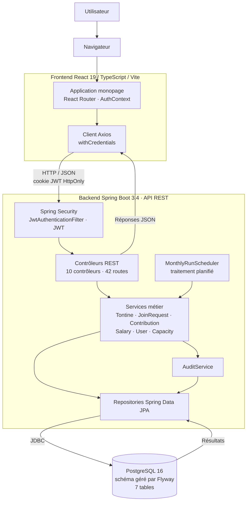

# RAPPORT FINAL : Examen DevSecOps
# SalaryTontine

**Étudiante :** Mame Fatou Laye Diop
**Matricule :** 1058948
**Date :** 30/08/2026
**Repo GitHub :** https://github.com/mfatou/salary-tontine
**Stack technique :** Java 21 / Spring Boot 3.4.2 · React 19.2 / TypeScript 5.9 / Vite 6.4 · PostgreSQL 16 · Flyway · Docker

---

## Résumé Exécutif

---

## 1. Présentation de l'Application

### 1.1 Description

#### Domaine métier

SalaryTontine est une plateforme académique qui **simule** l'effet d'une tontine sur le
salaire mensuel d'employés d'une entreprise.

Sa nature simulée conditionne toute l'analyse qui suit : **aucun argent réel n'est transféré**,
aucune API bancaire ni Mobile Money n'est appelée, et l'application ne produit ni bulletin légal
ni déclaration sociale — ce n'est pas un logiciel de paie. Les données de démonstration sont
fictives (`DemoDataSeeder`, désactivé par défaut). `backend/pom.xml` ne contient aucune
dépendance vers un service tiers : l'application ne communique qu'avec sa propre base.

**Le mécanisme de tontine tel qu'il est implémenté.** Une tontine est un groupe fermé de
participants. Chacun verse le même montant à chaque tour, et à chaque tour un seul participant
reçoit l'intégralité de la cagnotte. Le cycle compte exactement autant de tours qu'il y a de
participants (`TontineCycleService.cycleLength`), de sorte que chacun encaisse une fois et une
seule.

Les éléments suivants ont été vérifiés dans le code :

| Élément | Implémentation constatée |
|---|---|
| Statuts d'une tontine | `DRAFT`, `ACTIVE`, `COMPLETED`, `CANCELLED` (`TontineStatus`) |
| Adhésion | Un employé dépose une demande sur une tontine `DRAFT` ; le comptable accepte ou refuse (`JoinRequestService`). Une demande vit dans sa propre table `tontine_join_requests` et n'entre dans aucun calcul tant qu'elle n'est pas acceptée |
| Ordre de passage | `TontineMember.turnOrder`, entier unique par tontine, attribué à l'acceptation ; renuméroté de 1 à n après un départ (`TontineService.compactTurnOrders`) |
| Tours | Numérotés de 1 à n ; le tour k revient au participant dont le `turnOrder` vaut k (`TontineCycleService.resolveBeneficiary`) |
| Cadence | `TontineFrequency` : `WEEKLY` (7 j), `TEN_DAYS` (10 j), `BIWEEKLY` (14 j), `MONTHLY` (mois calendaire), `CUSTOM` (durée libre de 1 à 365 jours portée par `Tontine.periodDays`) |
| Cotisations | Une par participant et par tour, du montant de la tontine, statut `PENDING` puis `DEDUCTED` (`ContributionService`, `ContributionStatus`) |
| Bénéficiaire | Déterminé par le rang du tour, pas par une date |
| Génération des salaires | `SalaryService.generateForPeriod` : exige que les cotisations du tour existent pour tous les participants, calcule un `SalaryRecord` par participant, marque les cotisations `DEDUCTED`, et clôt la tontine (`COMPLETED`) après le dernier tour |
| Participation multiple | Implémentée : un employé peut appartenir à plusieurs tontines, dans la limite de sa capacité de cotisation (`ContributionCapacityService`) |
| Consolidation mensuelle | `SalaryService.recomputeMonthlyTotals` réaligne le salaire final de toutes les lignes du même mois |

**Formule de calcul.** Le calcul unitaire est isolé dans `SalaryCalculator`, sans accès à la
base ni au contexte HTTP :

```
salaire final = salaire de base − cotisation + cagnotte reçue
```

Mais comme un employé peut cotiser à plusieurs tontines et qu'une tontine infra-mensuelle
produit plusieurs tours dans le même mois, `SalaryService` recalcule ensuite le résultat au
niveau du **mois** :

```
salaire final du mois = salaire de base − Σ cotisations du mois + Σ cagnottes reçues dans le mois
```

C'est cette valeur consolidée qui est écrite dans chaque ligne `salary_records` du mois. Tous
les montants sont manipulés en `BigDecimal` ; aucun type flottant n'intervient dans un calcul
monétaire.

Une seconde règle de calcul mérite d'être signalée, car elle articule cadence et salaire :
`Tontine.monthlyCost()` ramène la cotisation d'un tour à un **coût mensuel moyen** en la
multipliant par le nombre moyen de tours dans un mois (30,4375 jours ÷ durée du tour). C'est
ce coût, et non la cotisation brute, qui est comparé au salaire de base par la règle de
plafond.

#### Fonctionnalités principales

Toutes confirmées par lecture des contrôleurs et des services correspondants.

| Domaine | Fonctionnalités |
|---|---|
| Comptes | Inscription publique (rôle `EMPLOYEE` et salaire nul imposés par le serveur, statut `PENDING`) ; validation ou refus d'une inscription par un `ADMIN` ; attribution du rôle ; correction du salaire de base |
| Authentification | Connexion — refusée si le compte n'est pas `ACTIVE` —, déconnexion, consultation de son profil, changement de son propre mot de passe avec vérification de l'actuel |
| Tontines | Création, modification (`DRAFT` seulement), activation, annulation, suppression (`DRAFT` seulement) ; ajout et retrait d'un participant ; départ volontaire avant démarrage ; calendrier prévisionnel du cycle |
| Adhésions | Demande, retrait de sa propre demande, consultation de ses demandes ; acceptation — qui crée le participant et fixe l'ordre de passage — ou refus ; file d'attente globale pour le gestionnaire |
| Cotisations et salaires | Génération des cotisations d'un tour, puis des salaires simulés ; consultation de son historique et du bulletin consolidé d'un mois ; consultation de l'historique d'un employé par un gestionnaire |
| Transverses | Tableau de bord agrégé ; annuaire salarial réservé aux rôles `ACCOUNTANT` et `ADMIN` ; journal d'audit paginé réservé à `ADMIN` — seul endpoint paginé de l'application ; traitement automatique planifié des tours échus |

**Aucun administrateur ne crée de compte ni ne choisit le mot de passe d'un tiers.** Chaque
utilisateur s'inscrit lui-même et définit son propre mot de passe ; l'administrateur n'intervient
qu'ensuite, pour valider ou refuser l'inscription et attribuer le rôle. Aucun endpoint ne permet
de définir le mot de passe d'un autre compte.

#### Stack technique

| Couche | Technologies | Rôle |
|---|---|---|
| Frontend | React 19.2.8, TypeScript 5.9.3, Vite 6.4.3, React Router 7.18.2, Axios 1.19.0 | Application monopage exécutée dans le navigateur |
| Serveur frontend | Nginx 1.27-alpine (image Docker uniquement) | Sert les fichiers statiques produits par Vite ; renvoie `index.html` sur toute route inconnue |
| Backend | Java 21, Spring Boot 3.4.2, Spring Web | API REST |
| Authentification | Spring Security, JJWT (`jjwt-api`, `jjwt-impl`, `jjwt-jackson`) | Jeton JWT transporté par cookie |
| Persistance | Spring Data JPA / Hibernate 6, pilote PostgreSQL | Accès aux données |
| Validation | Jakarta Bean Validation (`spring-boot-starter-validation`) | Validation des DTO d'entrée |
| Migrations | Flyway (`flyway-core`, `flyway-database-postgresql`) | Sept migrations versionnées, V1 à V7 |
| Base de données | PostgreSQL 16-alpine | Stockage |
| Documentation API | springdoc-openapi (Swagger UI) | Description des endpoints |
| Supervision | Spring Boot Actuator | Point de santé `/actuator/health` |
| Tests backend | JUnit 5, Mockito, AssertJ, Spring Security Test, MockMvc, Testcontainers | 180 méthodes `@Test` |
| Tests frontend | Vitest 3.2.7, Testing Library (react 16.3.2), jsdom 26.1.0 | 66 cas de test |
| Conteneurisation | Docker (builds multi-étapes), Docker Compose | Trois services : `postgres`, `backend`, `frontend` |

Les versions du backend proviennent de `backend/pom.xml`, les images Docker de
`docker-compose.yml` et des `Dockerfile`. Les versions frontend sont celles **réellement
verrouillées** dans `frontend/package-lock.json` (lockfile v3), et non les intervalles `^`
déclarés dans `package.json` : plusieurs paquets sont installés bien au-dessus de leur version
déclarée, notamment TypeScript (5.9.3 pour `^5.7.3`) et Axios (1.19.0 pour `^1.7.9`).

#### Données sensibles

| Donnée / Secret | Catégorie | Pourquoi sensible | Enjeu CIA principal |
|---|---|---|---|
| Nom, adresse e-mail | Donnée métier | Identifient une personne physique | Confidentialité |
| Salaire de base (`base_salary`) | Donnée métier | Rémunération individuelle ; base de tous les calculs | Confidentialité + Intégrité |
| Historique des salaires simulés (`salary_records`) | Donnée métier | Reconstitue la rémunération dans le temps | Confidentialité + Intégrité |
| Cotisations (`contributions`) | Donnée métier | Engagements d'un participant | Intégrité |
| Appartenance à une tontine (`tontine_members`) | Donnée métier | Révèle l'adhésion à un groupe d'épargne | Confidentialité |
| Ordre de passage (`turn_order`) | Donnée métier | Détermine qui encaisse la cagnotte et quand | Intégrité |
| Demandes d'adhésion (`tontine_join_requests`) | Donnée métier | Contiennent un message libre du demandeur | Confidentialité |
| Journal d'audit (`audit_logs`) | Donnée métier | Sa valeur probante repose sur son exactitude | Intégrité |
| Empreinte du mot de passe (`password_hash`, BCrypt) | Donnée d'authentification | Sa divulgation exposerait à une attaque hors ligne | Confidentialité |
| **Jeton JWT** | Donnée d'authentification (*credential*) | Porte l'identité et le rôle de l'appelant ; quiconque le détient agit au nom de son porteur | Confidentialité + Intégrité |
| Statut du compte (`PENDING`, `ACTIVE`, `REJECTED`) | Donnée d'authentification | Conditionne l'accès à l'application | Intégrité |
| Rôle (`EMPLOYEE`, `ACCOUNTANT`, `ADMIN`) | Donnée d'authentification | Détermine les autorisations | Intégrité |
| **`JWT_SECRET`** | Secret cryptographique | Clé de signature des jetons : la connaître permet d'en forger | Confidentialité + Intégrité |
| `DB_PASSWORD` | Secret technique | Ouvre un accès direct à la base, hors de tout contrôle applicatif | Confidentialité + Intégrité |
| `APP_ADMIN_PASSWORD` | Secret technique | Mot de passe du compte administrateur initial | Confidentialité |
| `APP_SEED_PASSWORD` | Secret technique | Mot de passe commun des comptes de démonstration | Confidentialité |
| `DB_USERNAME` | Identifiant technique | Nomme le compte de base de données ; sans le mot de passe associé, il n'ouvre aucun accès | Confidentialité (faible) |
| `APP_ADMIN_EMAIL` | Identifiant / configuration | Désigne le compte à amorcer ; n'est pas un secret, mais révèle le compte à privilèges | Confidentialité (faible) |
| Disponibilité de l'API et de la base | — | Sans elles, aucune consultation ni génération n'est possible | Disponibilité |

Ces trois catégories appellent des protections différentes. Une **donnée métier** décrit une
personne ou une opération : elle se protège par le contrôle d'accès. Une **donnée
d'authentification** sert à établir ou porter l'identité : elle se protège par le hachage, le
transport et la durée de vie. Un **secret technique** ne décrit personne, mais sa compromission
donne accès à l'ensemble des données métier : il se protège par l'environnement d'exécution.

Deux nuances méritent d'être posées. Le `JWT_SECRET` est un **secret cryptographique** et non un
simple mot de passe : le connaître ne donne pas accès à un compte, mais permet de **forger des
jetons pour n'importe quel compte et n'importe quel rôle**. À l'inverse, `APP_ADMIN_EMAIL` et
`DB_USERNAME` sont des **identifiants de configuration** : ils nomment un compte sans ouvrir
d'accès. Les traiter comme des secrets diluerait la notion ; les ignorer complètement serait
excessif, car ils désignent des comptes à privilèges.

#### Utilisateurs et rôles

L'énumération `Role.java` définit exactement trois rôles : `EMPLOYEE`, `ACCOUNTANT`, `ADMIN`.

| Rôle | Responsabilités principales | Accès aux données sensibles |
|---|---|---|
| `EMPLOYEE` | Consulter son profil et son historique de salaires ; parcourir les tontines ouvertes ; demander à rejoindre une tontine, retirer sa demande, quitter une tontine non démarrée ; changer son mot de passe | Son propre salaire et ses propres cotisations uniquement |
| `ACCOUNTANT` | Tout ce que peut un `EMPLOYEE`, plus : créer, modifier, activer, annuler et supprimer des tontines ; ajouter et retirer des participants ; arbitrer les demandes d'adhésion ; déclencher les générations ; consulter et corriger les salaires de base | Salaire de base et historique de tous les employés |
| `ADMIN` | Valider et refuser les inscriptions ; attribuer les rôles ; consulter le journal d'audit ; dispose également des droits de gestion des tontines et d'accès à l'annuaire salarial | Tous les comptes, tous les salaires, le journal d'audit |

**Règles vérifiées dans le backend.**

| Question | Réponse constatée |
|---|---|
| Qui modifie le salaire d'un `EMPLOYEE` ? | `ACCOUNTANT` ou `ADMIN` (`EmployeeDirectoryController`, `@PreAuthorize("hasAnyRole('ACCOUNTANT', 'ADMIN')")` ; `AdminUserController`, réservé à `ADMIN`) |
| Qui modifie le salaire d'un `ACCOUNTANT` ? | Les mêmes rôles : le comptable est un salarié ordinaire dans l'annuaire |
| Peut-on modifier son propre salaire ? | Non, quel que soit le rôle (`UserService.updateBaseSalary`) |
| Ce que `ADMIN` peut faire | Valider ou refuser une inscription, attribuer un rôle, corriger un salaire, lire le journal d'audit, gérer les tontines |
| Ce que `ADMIN` ne peut pas faire | Modifier son propre rôle, refuser son propre compte, fixer son propre salaire, participer à une tontine |
| Ce que `ACCOUNTANT` peut faire | Gérer tontines et salaires, et participer aux tontines comme tout salarié |
| Ce que `ACCOUNTANT` ne peut pas faire | Accéder à `/api/admin/**`, fixer son propre salaire, s'ajouter lui-même à une tontine, accepter sa propre demande |
| `ADMIN` participe-t-il aux tontines ? | Non : `Role.participatesInTontines()` retourne `false`. Ce rôle n'a pas de salaire de base |
| `ACCOUNTANT` participe-t-il ? | Oui : la même méthode retourne `true` |

**Séparation des tâches autour de la gestion salariale.** Trois règles distinctes,
implémentées côté service et donc indépendantes de l'interface :

1. Personne ne fixe son propre salaire de base (`UserService.updateBaseSalary`).
2. Personne ne s'ajoute soi-même à une tontine qu'il administre, ordre de passage compris
   (`TontineService.addMember`).
3. Personne n'accepte sa propre demande d'adhésion (`JoinRequestService.accept`), car cela
   permettrait de s'attribuer l'ordre de passage 1 et d'encaisser la cagnotte avant d'avoir
   cotisé.

Ces contrôles résident dans la couche service. Le frontend masque par ailleurs les actions
correspondantes, mais ce masquage relève de l'expérience utilisateur et non du contrôle
d'accès.

---

### 1.2 Architecture

#### Vue d'ensemble

L'application suit une architecture à trois composants : une application monopage exécutée
dans le navigateur, une API REST, et une base de données relationnelle. Aucun service tiers
n'est appelé.

#### Frontend

Application React 19 écrite en TypeScript, construite par Vite 6 et servie soit par le serveur
de développement Vite, soit par Nginx dans l'image Docker.

La navigation repose sur React Router 7. `AppRoutes` déclare deux niveaux de garde :

- `ProtectedRoute` redirige vers `/login` lorsqu'aucun utilisateur n'est chargé ;
- `RoleProtectedRoute` redirige vers `/forbidden` lorsque le rôle de l'utilisateur n'est pas
  dans la liste `allowedRoles`.

L'état d'authentification est porté par `AuthContext` / `AuthProvider`, qui conserve
l'utilisateur courant en mémoire React (`useState`) et l'obtient du backend. Aucun jeton n'est
stocké dans `localStorage` ni `sessionStorage`.

Les appels HTTP passent par une instance Axios unique (`api/client.ts`) configurée avec
`withCredentials: true`, indispensable pour que le navigateur transmette le cookie
d'authentification. Un intercepteur de réponse redirige vers `/login` sur un statut 401, sauf
sur les chemins où un 401 est un résultat normal.

Ces mécanismes servent la navigation et l'expérience utilisateur : ils déterminent ce que
l'interface affiche. Les autorisations effectives sont appliquées côté backend.

#### Backend

API REST Spring Boot organisée en couches : `controller` (HTTP seul — dix contrôleurs, 42
routes), `dto/request` et `dto/response` (contrats distincts des entités), `mapper`, `service`
(logique métier et transactions), `repository` (Spring Data JPA), `entity`, `security`,
`exception` et `config`.

Aucune entité JPA n'est exposée directement. La vue ouverte en session est désactivée
(`spring.jpa.open-in-view: false`), ce qui oblige chaque lecture à charger explicitement les
associations que le mapper traverse. Les DTO d'entrée portent des annotations Jakarta Bean
Validation, appliquées par `@Valid` dans les contrôleurs.

`GlobalExceptionHandler` centralise la traduction des exceptions en codes HTTP : 404 pour une
ressource absente, 400 pour une règle métier ou une validation invalide, 409 pour un doublon,
403 pour un accès refusé, 401 pour un défaut d'authentification, 405 pour une méthode non
supportée.

`MonthlyRunScheduler` déclenche `MonthlyRunService` selon une expression cron configurable ;
`AuditService` enregistre les actions sensibles dans `audit_logs`.

#### Base de données

PostgreSQL 16, dont le schéma est géré exclusivement par Flyway : `spring.jpa.hibernate.ddl-auto`
vaut `validate`, Hibernate ne crée ni ne modifie donc aucune table.

Sept migrations, V1 à V7, portent l'historique du schéma. Sept tables métier :

| Table | Contenu |
|---|---|
| `users` | Comptes : nom, e-mail, empreinte du mot de passe, rôle, statut, salaire de base |
| `tontines` | Tontines : cotisation par tour, cadence, durée de tour personnalisée, date de début, nombre de places, statut |
| `tontine_members` | Participation acceptée d'un utilisateur à une tontine, avec son ordre de passage |
| `tontine_join_requests` | Demandes d'adhésion et leur arbitrage |
| `contributions` | Cotisation d'un participant pour un tour donné |
| `salary_records` | Salaire simulé d'un participant pour un tour donné, rattaché à un mois de paie |
| `audit_logs` | Journal des actions sensibles |

Les invariants sont portés par la base et non par le seul code Java : unicité de l'e-mail,
unicité de la participation et de l'ordre de passage au sein d'une tontine, unicité d'une
cotisation par (tontine, utilisateur, tour), unicité d'un salaire par (utilisateur, tontine,
tour), contraintes de domaine sur les statuts, les rôles et les montants.

#### Authentification et autorisation

Description de l'implémentation constatée, sans appréciation à ce stade.

- **Jeton JWT.** `JwtService` construit le jeton avec `Jwts.builder()`, en y plaçant l'e-mail
  comme sujet, l'identifiant utilisateur et le rôle comme revendications, ainsi que les dates
  d'émission et d'expiration.
- **Algorithme.** La clé est dérivée du secret par `Keys.hmacShaKeyFor(...)`, ce qui sélectionne
  un algorithme HMAC-SHA dont la variante dépend de la longueur de la clé fournie. Le
  démarrage échoue si le secret fait moins de 32 caractères
  (`AppProperties.Jwt.MINIMUM_SECRET_LENGTH`).
- **Durée de vie.** Configurable par `JWT_EXPIRATION_SECONDS`, valeur par défaut 3600 secondes
  dans `application.yml` et dans `docker-compose.yml`.
- **Cookie.** `JwtCookieService` construit un `ResponseCookie` avec `httpOnly(true)`,
  `path("/")`, `sameSite("Lax")` et `secure(...)` piloté par `JWT_COOKIE_SECURE` (défaut
  `false`). La déconnexion émet un cookie vide dont l'âge maximal est nul.
- **Stratégie de session.** `SessionCreationPolicy.STATELESS` dans `SecurityConfig`.
- **Chaîne de filtres.** `JwtAuthenticationFilter` est inséré avant
  `UsernamePasswordAuthenticationFilter`. Les routes publiques sont `/api/auth/register`,
  `/api/auth/login`, `/api/auth/logout`, `/actuator/health`, `/v3/api-docs/**`,
  `/swagger-ui/**` et `/swagger-ui.html`. `/api/admin/**` exige le rôle `ADMIN`, et toute
  autre requête exige une authentification.
- **Contrôle du rôle par endpoint.** `@PreAuthorize` est utilisé sur `AdminUserController`,
  `AdminAuditController`, `EmployeeDirectoryController`, ainsi que sur des méthodes de
  `TontineController`, `JoinRequestController`, `ContributionController` et `SalaryController`.
- **Vérification du statut à chaque requête.** `JwtAuthenticationFilter.authenticate` interroge
  `userRepository.existsByIdAndStatus(id, ACTIVE)` avant de peupler le contexte de sécurité ;
  un jeton valide dont le compte n'est plus `ACTIVE` n'authentifie donc pas la requête.
- **Identité de l'appelant.** `CurrentUserProvider` lit l'utilisateur depuis le contexte de
  sécurité, jamais depuis un paramètre fourni par le client.
- **CORS.** `SecurityConfig.corsConfigurationSource` autorise une seule origine, celle de
  `APP_FRONTEND_URL`, les méthodes GET, POST, PATCH, PUT, DELETE, OPTIONS, les en-têtes
  `Content-Type`, `Accept`, `X-Requested-With`, avec `allowCredentials(true)`, sur `/api/**`.
- **CSRF.** La protection CSRF de Spring Security est désactivée dans `SecurityConfig`.
- **Mots de passe.** Hachés avec `BCryptPasswordEncoder` de coût 12.

#### Flux de données

| Source | Destination | Données transportées | Protocole / mécanisme |
|---|---|---|---|
| Utilisateur | Navigateur | Saisies de formulaire, identifiants | Interface graphique |
| Navigateur | React (SPA) | Événements d'interface, navigation | Exécution locale JavaScript |
| React | Spring Boot | Identifiants de connexion, formulaires, identifiants de ressources, paramètres de requête, données métier | HTTP/JSON via Axios, `withCredentials: true` |
| Navigateur | Spring Boot | Jeton JWT | Cookie `HttpOnly`, `SameSite=Lax`, transmis automatiquement |
| Spring Boot | PostgreSQL | Comptes, tontines, participations, demandes, cotisations, salaires simulés, journal d'audit | JDBC via HikariCP |
| PostgreSQL | Spring Boot | Résultats de requêtes | JDBC |
| Spring Boot | React | Réponses JSON, cookie d'authentification à la connexion, réponses d'erreur normalisées | HTTP/JSON |
| Planificateur | Services métier | Déclenchement des générations pour les tours échus | Appel interne `@Scheduled` |
| Services métier | PostgreSQL | Cotisations et salaires générés | JDBC |
| Actions sensibles | `AuditService` → `audit_logs` | Auteur, action, type et identifiant d'entité, détail textuel | Appel interne puis JDBC |

#### Environnements

Le dépôt permet deux modes d'exécution locale, tous deux décrits dans le `Makefile` :

- **Mode développement** (`make dev`) : PostgreSQL dans un conteneur Docker, backend lancé par
  Maven sur la machine hôte, frontend servi par Vite. Les variables proviennent du fichier
  `.env`, chargé par le `Makefile`.
- **Pile conteneurisée complète** (`make up` / `docker compose up --build`) : trois services
  Docker — `postgres`, `backend`, `frontend` — sur un réseau interne `salarytontine-net`, avec
  des sondes de santé et un ordonnancement des démarrages (`depends_on` conditionné par
  `service_healthy`). Le frontend est alors servi par Nginx.

Les images sont construites en plusieurs étapes : compilation Maven puis
`eclipse-temurin:21-jre-alpine` pour le backend, build Vite puis `nginx:1.27-alpine` pour le
frontend. Le conteneur backend s'exécute sous un utilisateur non privilégié.

La configuration provient intégralement de variables d'environnement (`AppProperties`, annoté
`@ConfigurationProperties(prefix = "app")`, et les substitutions `${...}` d'`application.yml`).
Aucun profil Spring n'est défini : il n'existe qu'un seul fichier de configuration.

**Il n'existe aucun déploiement réel.** Le dépôt ne contient ni manifeste Kubernetes, ni
configuration de plateforme d'hébergement, ni pipeline de déploiement. Les environnements
« développement » et « production » évoqués par l'énoncé se réduisent ici à deux modes
d'exécution locale ; la pile Docker Compose est la configuration la plus proche d'un
déploiement, sans en être un.

#### Schéma technique intermédiaire

> Le diagramme Mermaid suivant est un brouillon technique de l'architecture.
> La version finalisée est présentée juste après.
>
> Il ne s'agit pas du DFD Threat Dragon : il ne comporte ni frontière de confiance, ni menace,
> ni annotation STRIDE.



#### Architecture générale finalisée

Le diagramme ci-dessous présente la version finalisée de l'architecture générale de
SalaryTontine, en synthétisant les principaux composants applicatifs et leurs interactions.


---

## 2. Threat Modeling

### 2.1 DFD et Frontières de Confiance

### 2.2 Analyse STRIDE

### 2.3 Priorisation des Menaces

---

## 3. Analyse OWASP Top 10

### 3.1 Vulnérabilités Identifiées Manuellement

### 3.2 Inventaire des Entrées Utilisateur

### 3.3 Gestion des Secrets

---

## 4. Règles Semgrep Custom

---

## 5. Pipeline DevSecOps

### 5.1 Architecture de la Pipeline

### 5.2 Réponses aux Questions Q5.1, Q5.2, Q5.3

---

## 6. Résultats

### 6.1 Tableau Complet des Alertes

### 6.2 Analyse des CVE

### 6.3 Comparaison Manuelle vs Automatisée

---

## 7. Corrections et Validation

### 7.1 Corrections Appliquées

### 7.2 Plan de Remédiation

### 7.3 Dockerfile Sécurisé

---

## 8. Bilan et Leçons Apprises

---
*Examen Final 2INF2311 — SUP de CO Dakar*
