# RAPPORT FINAL : Examen DevSecOps

# SalaryTontine

**Étudiante :** Mame Fatou Laye Diop
**Matricule :** 1058948
**Date :** 30/08/2026
**Repo GitHub :** [https://github.com/mfatou/salary-tontine](https://github.com/mfatou/salary-tontine)
**Stack technique :** Java 21 / Spring Boot 3.4.2 · React 19.2 / TypeScript 5.9 / Vite 6.4 · PostgreSQL 16 · Flyway · Docker

---

## Résumé Exécutif

---

## 1. Présentation de l'Application

### 1.1 Description

#### Domaine métier

SalaryTontine est une plateforme académique qui **simule** l'effet d'une tontine sur le
salaire mensuel d'employés d'une entreprise.

Sa nature simulée conditionne toute l'analyse qui suit : **aucun argent réel n'est transféré**,
aucune API bancaire ni Mobile Money n'est appelée, et l'application ne produit ni bulletin légal
ni déclaration sociale — ce n'est pas un logiciel de paie. Les données de démonstration sont
fictives (`DemoDataSeeder`, désactivé par défaut). `backend/pom.xml` ne contient aucune
dépendance vers un service tiers : l'application ne communique qu'avec sa propre base.

**Le mécanisme de tontine tel qu'il est implémenté.** Une tontine est un groupe fermé de
participants. Chacun verse le même montant à chaque tour, et à chaque tour un seul participant
reçoit l'intégralité de la cagnotte. Le cycle compte exactement autant de tours qu'il y a de
participants (`TontineCycleService.cycleLength`), de sorte que chacun encaisse une fois et une
seule.

Les éléments suivants ont été vérifiés dans le code :


| Élément                 | Implémentation constatée                                                                                                                                                                                                                        |
| ----------------------- | ----------------------------------------------------------------------------------------------------------------------------------------------------------------------------------------------------------------------------------------------- |
| Statuts d'une tontine   | `DRAFT`, `ACTIVE`, `COMPLETED`, `CANCELLED` (`TontineStatus`)                                                                                                                                                                                   |
| Adhésion                | Un employé dépose une demande sur une tontine `DRAFT` ; le comptable accepte ou refuse (`JoinRequestService`). Une demande vit dans sa propre table `tontine_join_requests` et n'entre dans aucun calcul tant qu'elle n'est pas acceptée        |
| Ordre de passage        | `TontineMember.turnOrder`, entier unique par tontine, attribué à l'acceptation ; renuméroté de 1 à n après un départ (`TontineService.compactTurnOrders`)                                                                                       |
| Tours                   | Numérotés de 1 à n ; le tour k revient au participant dont le `turnOrder` vaut k (`TontineCycleService.resolveBeneficiary`)                                                                                                                     |
| Cadence                 | `TontineFrequency` : `WEEKLY` (7 j), `TEN_DAYS` (10 j), `BIWEEKLY` (14 j), `MONTHLY` (mois calendaire), `CUSTOM` (durée libre de 1 à 365 jours portée par `Tontine.periodDays`)                                                                 |
| Cotisations             | Une par participant et par tour, du montant de la tontine, statut `PENDING` puis `DEDUCTED` (`ContributionService`, `ContributionStatus`)                                                                                                       |
| Bénéficiaire            | Déterminé par le rang du tour, pas par une date                                                                                                                                                                                                 |
| Génération des salaires | `SalaryService.generateForPeriod` : exige que les cotisations du tour existent pour tous les participants, calcule un `SalaryRecord` par participant, marque les cotisations `DEDUCTED`, et clôt la tontine (`COMPLETED`) après le dernier tour |
| Participation multiple  | Implémentée : un employé peut appartenir à plusieurs tontines, dans la limite de sa capacité de cotisation (`ContributionCapacityService`)                                                                                                      |
| Consolidation mensuelle | `SalaryService.recomputeMonthlyTotals` réaligne le salaire final de toutes les lignes du même mois                                                                                                                                              |


**Formule de calcul.** Le calcul unitaire est isolé dans `SalaryCalculator`, sans accès à la
base ni au contexte HTTP :

```
salaire final = salaire de base − cotisation + cagnotte reçue
```

Mais comme un employé peut cotiser à plusieurs tontines et qu'une tontine infra-mensuelle
produit plusieurs tours dans le même mois, `SalaryService` recalcule ensuite le résultat au
niveau du **mois** :

```
salaire final du mois = salaire de base − Σ cotisations du mois + Σ cagnottes reçues dans le mois
```

C'est cette valeur consolidée qui est écrite dans chaque ligne `salary_records` du mois. Tous
les montants sont manipulés en `BigDecimal` ; aucun type flottant n'intervient dans un calcul
monétaire.

Une seconde règle de calcul mérite d'être signalée, car elle articule cadence et salaire :
`Tontine.monthlyCost()` ramène la cotisation d'un tour à un **coût mensuel moyen** en la
multipliant par le nombre moyen de tours dans un mois (30,4375 jours ÷ durée du tour). C'est
ce coût, et non la cotisation brute, qui est comparé au salaire de base par la règle de
plafond.

#### Fonctionnalités principales

Toutes confirmées par lecture des contrôleurs et des services correspondants.


| Domaine                 | Fonctionnalités                                                                                                                                                                                                           |
| ----------------------- | ------------------------------------------------------------------------------------------------------------------------------------------------------------------------------------------------------------------------- |
| Comptes                 | Inscription publique (rôle `EMPLOYEE` et salaire nul imposés par le serveur, statut `PENDING`) ; validation ou refus d'une inscription par un `ADMIN` ; attribution du rôle ; correction du salaire de base               |
| Authentification        | Connexion — refusée si le compte n'est pas `ACTIVE` —, déconnexion, consultation de son profil, changement de son propre mot de passe avec vérification de l'actuel                                                       |
| Tontines                | Création, modification (`DRAFT` seulement), activation, annulation, suppression (`DRAFT` seulement) ; ajout et retrait d'un participant ; départ volontaire avant démarrage ; calendrier prévisionnel du cycle            |
| Adhésions               | Demande, retrait de sa propre demande, consultation de ses demandes ; acceptation — qui crée le participant et fixe l'ordre de passage — ou refus ; file d'attente globale pour le gestionnaire                           |
| Cotisations et salaires | Génération des cotisations d'un tour, puis des salaires simulés ; consultation de son historique et du bulletin consolidé d'un mois ; consultation de l'historique d'un employé par un gestionnaire                       |
| Transverses             | Tableau de bord agrégé ; annuaire salarial réservé aux rôles `ACCOUNTANT` et `ADMIN` ; journal d'audit paginé réservé à `ADMIN` — seul endpoint paginé de l'application ; traitement automatique planifié des tours échus |


**Aucun administrateur ne crée de compte ni ne choisit le mot de passe d'un tiers.** Chaque
utilisateur s'inscrit lui-même et définit son propre mot de passe ; l'administrateur n'intervient
qu'ensuite, pour valider ou refuser l'inscription et attribuer le rôle. Aucun endpoint ne permet
de définir le mot de passe d'un autre compte.

#### Stack technique


| Couche            | Technologies                                                                  | Rôle                                                                                          |
| ----------------- | ----------------------------------------------------------------------------- | --------------------------------------------------------------------------------------------- |
| Frontend          | React 19.2.8, TypeScript 5.9.3, Vite 6.4.3, React Router 7.18.2, Axios 1.19.0 | Application monopage exécutée dans le navigateur                                              |
| Serveur frontend  | Nginx 1.27-alpine (image Docker uniquement)                                   | Sert les fichiers statiques produits par Vite ; renvoie `index.html` sur toute route inconnue |
| Backend           | Java 21, Spring Boot 3.4.2, Spring Web                                        | API REST                                                                                      |
| Authentification  | Spring Security, JJWT (`jjwt-api`, `jjwt-impl`, `jjwt-jackson`)               | Jeton JWT transporté par cookie                                                               |
| Persistance       | Spring Data JPA / Hibernate 6, pilote PostgreSQL                              | Accès aux données                                                                             |
| Validation        | Jakarta Bean Validation (`spring-boot-starter-validation`)                    | Validation des DTO d'entrée                                                                   |
| Migrations        | Flyway (`flyway-core`, `flyway-database-postgresql`)                          | Sept migrations versionnées, V1 à V7                                                          |
| Base de données   | PostgreSQL 16-alpine                                                          | Stockage                                                                                      |
| Documentation API | springdoc-openapi (Swagger UI)                                                | Description des endpoints                                                                     |
| Supervision       | Spring Boot Actuator                                                          | Point de santé `/actuator/health`                                                             |
| Tests backend     | JUnit 5, Mockito, AssertJ, Spring Security Test, MockMvc, Testcontainers      | 180 méthodes `@Test`                                                                          |
| Tests frontend    | Vitest 3.2.7, Testing Library (react 16.3.2), jsdom 26.1.0                    | 66 cas de test                                                                                |
| Conteneurisation  | Docker (builds multi-étapes), Docker Compose                                  | Trois services : `postgres`, `backend`, `frontend`                                            |


Les versions du backend proviennent de `backend/pom.xml`, les images Docker de
`docker-compose.yml` et des `Dockerfile`. Les versions frontend sont celles **réellement
verrouillées** dans `frontend/package-lock.json` (lockfile v3), et non les intervalles `^`
déclarés dans `package.json` : plusieurs paquets sont installés bien au-dessus de leur version
déclarée, notamment TypeScript (5.9.3 pour `^5.7.3`) et Axios (1.19.0 pour `^1.7.9`).

#### Données sensibles


| Donnée / Secret                                     | Catégorie                                | Pourquoi sensible                                                                           | Enjeu CIA principal         |
| --------------------------------------------------- | ---------------------------------------- | ------------------------------------------------------------------------------------------- | --------------------------- |
| Nom, adresse e-mail                                 | Donnée métier                            | Identifient une personne physique                                                           | Confidentialité             |
| Salaire de base (`base_salary`)                     | Donnée métier                            | Rémunération individuelle ; base de tous les calculs                                        | Confidentialité + Intégrité |
| Historique des salaires simulés (`salary_records`)  | Donnée métier                            | Reconstitue la rémunération dans le temps                                                   | Confidentialité + Intégrité |
| Cotisations (`contributions`)                       | Donnée métier                            | Engagements d'un participant                                                                | Intégrité                   |
| Appartenance à une tontine (`tontine_members`)      | Donnée métier                            | Révèle l'adhésion à un groupe d'épargne                                                     | Confidentialité             |
| Ordre de passage (`turn_order`)                     | Donnée métier                            | Détermine qui encaisse la cagnotte et quand                                                 | Intégrité                   |
| Demandes d'adhésion (`tontine_join_requests`)       | Donnée métier                            | Contiennent un message libre du demandeur                                                   | Confidentialité             |
| Journal d'audit (`audit_logs`)                      | Donnée métier                            | Sa valeur probante repose sur son exactitude                                                | Intégrité                   |
| Empreinte du mot de passe (`password_hash`, BCrypt) | Donnée d'authentification                | Sa divulgation exposerait à une attaque hors ligne                                          | Confidentialité             |
| **Jeton JWT**                                       | Donnée d'authentification (*credential*) | Porte l'identité et le rôle de l'appelant ; quiconque le détient agit au nom de son porteur | Confidentialité + Intégrité |
| Statut du compte (`PENDING`, `ACTIVE`, `REJECTED`)  | Donnée d'authentification                | Conditionne l'accès à l'application                                                         | Intégrité                   |
| Rôle (`EMPLOYEE`, `ACCOUNTANT`, `ADMIN`)            | Donnée d'authentification                | Détermine les autorisations                                                                 | Intégrité                   |
| `JWT_SECRET`                                        | Secret cryptographique                   | Clé de signature des jetons : la connaître permet d'en forger                               | Confidentialité + Intégrité |
| `DB_PASSWORD`                                       | Secret technique                         | Ouvre un accès direct à la base, hors de tout contrôle applicatif                           | Confidentialité + Intégrité |
| `APP_ADMIN_PASSWORD`                                | Secret technique                         | Mot de passe du compte administrateur initial                                               | Confidentialité             |
| `APP_SEED_PASSWORD`                                 | Secret technique                         | Mot de passe commun des comptes de démonstration                                            | Confidentialité             |
| `DB_USERNAME`                                       | Identifiant technique                    | Nomme le compte de base de données ; sans le mot de passe associé, il n'ouvre aucun accès   | Confidentialité (faible)    |
| `APP_ADMIN_EMAIL`                                   | Identifiant / configuration              | Désigne le compte à amorcer ; n'est pas un secret, mais révèle le compte à privilèges       | Confidentialité (faible)    |
| Disponibilité de l'API et de la base                | —                                        | Sans elles, aucune consultation ni génération n'est possible                                | Disponibilité               |


Ces trois catégories appellent des protections différentes. Une **donnée métier** décrit une
personne ou une opération : elle se protège par le contrôle d'accès. Une **donnée
d'authentification** sert à établir ou porter l'identité : elle se protège par le hachage, le
transport et la durée de vie. Un **secret technique** ne décrit personne, mais sa compromission
donne accès à l'ensemble des données métier : il se protège par l'environnement d'exécution.

Deux nuances méritent d'être posées. Le `JWT_SECRET` est un **secret cryptographique** et non un
simple mot de passe : le connaître ne donne pas accès à un compte, mais permet de **forger des
jetons pour n'importe quel compte et n'importe quel rôle**. À l'inverse, `APP_ADMIN_EMAIL` et
`DB_USERNAME` sont des **identifiants de configuration** : ils nomment un compte sans ouvrir
d'accès. Les traiter comme des secrets diluerait la notion ; les ignorer complètement serait
excessif, car ils désignent des comptes à privilèges.

#### Utilisateurs et rôles

L'énumération `Role.java` définit exactement trois rôles : `EMPLOYEE`, `ACCOUNTANT`, `ADMIN`.


| Rôle         | Responsabilités principales                                                                                                                                                                                                                           | Accès aux données sensibles                              |
| ------------ | ----------------------------------------------------------------------------------------------------------------------------------------------------------------------------------------------------------------------------------------------------- | -------------------------------------------------------- |
| `EMPLOYEE`   | Consulter son profil et son historique de salaires ; parcourir les tontines ouvertes ; demander à rejoindre une tontine, retirer sa demande, quitter une tontine non démarrée ; changer son mot de passe                                              | Son propre salaire et ses propres cotisations uniquement |
| `ACCOUNTANT` | Tout ce que peut un `EMPLOYEE`, plus : créer, modifier, activer, annuler et supprimer des tontines ; ajouter et retirer des participants ; arbitrer les demandes d'adhésion ; déclencher les générations ; consulter et corriger les salaires de base | Salaire de base et historique de tous les employés       |
| `ADMIN`      | Valider et refuser les inscriptions ; attribuer les rôles ; consulter le journal d'audit ; dispose également des droits de gestion des tontines et d'accès à l'annuaire salarial                                                                      | Tous les comptes, tous les salaires, le journal d'audit  |


**Règles vérifiées dans le backend.**


| Question                                   | Réponse constatée                                                                                                                                        |
| ------------------------------------------ | -------------------------------------------------------------------------------------------------------------------------------------------------------- |
| Qui modifie le salaire d'un `EMPLOYEE` ?   | `ACCOUNTANT` ou `ADMIN` (`EmployeeDirectoryController`, `@PreAuthorize("hasAnyRole('ACCOUNTANT', 'ADMIN')")` ; `AdminUserController`, réservé à `ADMIN`) |
| Qui modifie le salaire d'un `ACCOUNTANT` ? | Les mêmes rôles : le comptable est un salarié ordinaire dans l'annuaire                                                                                  |
| Peut-on modifier son propre salaire ?      | Non, quel que soit le rôle (`UserService.updateBaseSalary`)                                                                                              |
| Ce que `ADMIN` peut faire                  | Valider ou refuser une inscription, attribuer un rôle, corriger un salaire, lire le journal d'audit, gérer les tontines                                  |
| Ce que `ADMIN` ne peut pas faire           | Modifier son propre rôle, refuser son propre compte, fixer son propre salaire, participer à une tontine                                                  |
| Ce que `ACCOUNTANT` peut faire             | Gérer tontines et salaires, et participer aux tontines comme tout salarié                                                                                |
| Ce que `ACCOUNTANT` ne peut pas faire      | Accéder à `/api/admin/**`, fixer son propre salaire, s'ajouter lui-même à une tontine, accepter sa propre demande                                        |
| `ADMIN` participe-t-il aux tontines ?      | Non : `Role.participatesInTontines()` retourne `false`. Ce rôle n'a pas de salaire de base                                                               |
| `ACCOUNTANT` participe-t-il ?              | Oui : la même méthode retourne `true`                                                                                                                    |


**Séparation des tâches autour de la gestion salariale.** Trois règles distinctes,
implémentées côté service et donc indépendantes de l'interface :

1. Personne ne fixe son propre salaire de base (`UserService.updateBaseSalary`).
2. Personne ne s'ajoute soi-même à une tontine qu'il administre, ordre de passage compris
  (`TontineService.addMember`).
3. Personne n'accepte sa propre demande d'adhésion (`JoinRequestService.accept`), car cela
  permettrait de s'attribuer l'ordre de passage 1 et d'encaisser la cagnotte avant d'avoir
   cotisé.

Ces contrôles résident dans la couche service. Le frontend masque par ailleurs les actions
correspondantes, mais ce masquage relève de l'expérience utilisateur et non du contrôle
d'accès.

---


### 1.2 Architecture


#### Vue d'ensemble

L'application suit une architecture à trois composants : une application monopage exécutée
dans le navigateur, une API REST, et une base de données relationnelle. Aucun service tiers
n'est appelé.

#### Frontend

Application React 19 écrite en TypeScript, construite par Vite 6 et servie soit par le serveur
de développement Vite, soit par Nginx dans l'image Docker.

La navigation repose sur React Router 7. `AppRoutes` déclare deux niveaux de garde :

- `ProtectedRoute` redirige vers `/login` lorsqu'aucun utilisateur n'est chargé ;
- `RoleProtectedRoute` redirige vers `/forbidden` lorsque le rôle de l'utilisateur n'est pas
dans la liste `allowedRoles`.

L'état d'authentification est porté par `AuthContext` / `AuthProvider`, qui conserve
l'utilisateur courant en mémoire React (`useState`) et l'obtient du backend. Aucun jeton n'est
stocké dans `localStorage` ni `sessionStorage`.

Les appels HTTP passent par une instance Axios unique (`api/client.ts`) configurée avec
`withCredentials: true`, indispensable pour que le navigateur transmette le cookie
d'authentification. Un intercepteur de réponse redirige vers `/login` sur un statut 401, sauf
sur les chemins où un 401 est un résultat normal.

Ces mécanismes servent la navigation et l'expérience utilisateur : ils déterminent ce que
l'interface affiche. Les autorisations effectives sont appliquées côté backend.

#### Backend

API REST Spring Boot organisée en couches : `controller` (HTTP seul — dix contrôleurs, 42
routes), `dto/request` et `dto/response` (contrats distincts des entités), `mapper`, `service`
(logique métier et transactions), `repository` (Spring Data JPA), `entity`, `security`,
`exception` et `config`.

Aucune entité JPA n'est exposée directement. La vue ouverte en session est désactivée
(`spring.jpa.open-in-view: false`), ce qui oblige chaque lecture à charger explicitement les
associations que le mapper traverse. Les DTO d'entrée portent des annotations Jakarta Bean
Validation, appliquées par `@Valid` dans les contrôleurs.

`GlobalExceptionHandler` centralise la traduction des exceptions en codes HTTP : 404 pour une
ressource absente, 400 pour une règle métier ou une validation invalide, 409 pour un doublon,
403 pour un accès refusé, 401 pour un défaut d'authentification, 405 pour une méthode non
supportée.

`MonthlyRunScheduler` déclenche `MonthlyRunService` selon une expression cron configurable ;
`AuditService` enregistre les actions sensibles dans `audit_logs`.

#### Base de données

PostgreSQL 16, dont le schéma est géré exclusivement par Flyway : `spring.jpa.hibernate.ddl-auto`
vaut `validate`, Hibernate ne crée ni ne modifie donc aucune table.

Sept migrations, V1 à V7, portent l'historique du schéma. Sept tables métier :


| Table                   | Contenu                                                                                                       |
| ----------------------- | ------------------------------------------------------------------------------------------------------------- |
| `users`                 | Comptes : nom, e-mail, empreinte du mot de passe, rôle, statut, salaire de base                               |
| `tontines`              | Tontines : cotisation par tour, cadence, durée de tour personnalisée, date de début, nombre de places, statut |
| `tontine_members`       | Participation acceptée d'un utilisateur à une tontine, avec son ordre de passage                              |
| `tontine_join_requests` | Demandes d'adhésion et leur arbitrage                                                                         |
| `contributions`         | Cotisation d'un participant pour un tour donné                                                                |
| `salary_records`        | Salaire simulé d'un participant pour un tour donné, rattaché à un mois de paie                                |
| `audit_logs`            | Journal des actions sensibles                                                                                 |


Les invariants sont portés par la base et non par le seul code Java : unicité de l'e-mail,
unicité de la participation et de l'ordre de passage au sein d'une tontine, unicité d'une
cotisation par (tontine, utilisateur, tour), unicité d'un salaire par (utilisateur, tontine,
tour), contraintes de domaine sur les statuts, les rôles et les montants.

#### Authentification et autorisation

Description de l'implémentation constatée, sans appréciation à ce stade.

- **Jeton JWT.** `JwtService` construit le jeton avec `Jwts.builder()`, en y plaçant l'e-mail
comme sujet, l'identifiant utilisateur et le rôle comme revendications, ainsi que les dates
d'émission et d'expiration.
- **Algorithme.** La clé est dérivée du secret par `Keys.hmacShaKeyFor(...)`, ce qui sélectionne
un algorithme HMAC-SHA dont la variante dépend de la longueur de la clé fournie. Le
démarrage échoue si le secret fait moins de 32 caractères
(`AppProperties.Jwt.MINIMUM_SECRET_LENGTH`).
- **Durée de vie.** Configurable par `JWT_EXPIRATION_SECONDS`, valeur par défaut 3600 secondes
dans `application.yml` et dans `docker-compose.yml`.
- **Cookie.** `JwtCookieService` construit un `ResponseCookie` avec `httpOnly(true)`,
`path("/")`, `sameSite("Lax")` et `secure(...)` piloté par `JWT_COOKIE_SECURE` (défaut
`false`). La déconnexion émet un cookie vide dont l'âge maximal est nul.
- **Stratégie de session.** `SessionCreationPolicy.STATELESS` dans `SecurityConfig`.
- **Chaîne de filtres.** `JwtAuthenticationFilter` est inséré avant
`UsernamePasswordAuthenticationFilter`. Les routes publiques sont `/api/auth/register`,
`/api/auth/login`, `/api/auth/logout`, `/actuator/health`, `/v3/api-docs/**`,
`/swagger-ui/**` et `/swagger-ui.html`. `/api/admin/**` exige le rôle `ADMIN`, et toute
autre requête exige une authentification.
- **Contrôle du rôle par endpoint.** `@PreAuthorize` est utilisé sur `AdminUserController`,
`AdminAuditController`, `EmployeeDirectoryController`, ainsi que sur des méthodes de
`TontineController`, `JoinRequestController`, `ContributionController` et `SalaryController`.
- **Vérification du statut à chaque requête.** `JwtAuthenticationFilter.authenticate` interroge
`userRepository.existsByIdAndStatus(id, ACTIVE)` avant de peupler le contexte de sécurité ;
un jeton valide dont le compte n'est plus `ACTIVE` n'authentifie donc pas la requête.
- **Identité de l'appelant.** `CurrentUserProvider` lit l'utilisateur depuis le contexte de
sécurité, jamais depuis un paramètre fourni par le client.
- **CORS.** `SecurityConfig.corsConfigurationSource` autorise une seule origine, celle de
`APP_FRONTEND_URL`, les méthodes GET, POST, PATCH, PUT, DELETE, OPTIONS, les en-têtes
`Content-Type`, `Accept`, `X-Requested-With`, avec `allowCredentials(true)`, sur `/api/**`.
- **CSRF.** La protection CSRF de Spring Security est désactivée dans `SecurityConfig`.
- **Mots de passe.** Hachés avec `BCryptPasswordEncoder` de coût 12.


#### Flux de données


| Source            | Destination                   | Données transportées                                                                                      | Protocole / mécanisme                                       |
| ----------------- | ----------------------------- | --------------------------------------------------------------------------------------------------------- | ----------------------------------------------------------- |
| Utilisateur       | Navigateur                    | Saisies de formulaire, identifiants                                                                       | Interface graphique                                         |
| Navigateur        | React (SPA)                   | Événements d'interface, navigation                                                                        | Exécution locale JavaScript                                 |
| React             | Spring Boot                   | Identifiants de connexion, formulaires, identifiants de ressources, paramètres de requête, données métier | HTTP/JSON via Axios, `withCredentials: true`                |
| Navigateur        | Spring Boot                   | Jeton JWT                                                                                                 | Cookie `HttpOnly`, `SameSite=Lax`, transmis automatiquement |
| Spring Boot       | PostgreSQL                    | Comptes, tontines, participations, demandes, cotisations, salaires simulés, journal d'audit               | JDBC via HikariCP                                           |
| PostgreSQL        | Spring Boot                   | Résultats de requêtes                                                                                     | JDBC                                                        |
| Spring Boot       | React                         | Réponses JSON, cookie d'authentification à la connexion, réponses d'erreur normalisées                    | HTTP/JSON                                                   |
| Planificateur     | Services métier               | Déclenchement des générations pour les tours échus                                                        | Appel interne `@Scheduled`                                  |
| Services métier   | PostgreSQL                    | Cotisations et salaires générés                                                                           | JDBC                                                        |
| Actions sensibles | `AuditService` → `audit_logs` | Auteur, action, type et identifiant d'entité, détail textuel                                              | Appel interne puis JDBC                                     |


#### Environnements

Le dépôt permet deux modes d'exécution locale, tous deux décrits dans le `Makefile` :

- **Mode développement** (`make dev`) : PostgreSQL dans un conteneur Docker, backend lancé par
Maven sur la machine hôte, frontend servi par Vite. Les variables proviennent du fichier
`.env`, chargé par le `Makefile`.
- **Pile conteneurisée complète** (`make up` / `docker compose up --build`) : trois services
Docker — `postgres`, `backend`, `frontend` — sur un réseau interne `salarytontine-net`, avec
des sondes de santé et un ordonnancement des démarrages (`depends_on` conditionné par
`service_healthy`). Le frontend est alors servi par Nginx.

Les images sont construites en plusieurs étapes : compilation Maven puis
`eclipse-temurin:21-jre-alpine` pour le backend, build Vite puis `nginx:1.27-alpine` pour le
frontend. Le conteneur backend s'exécute sous un utilisateur non privilégié.

La configuration provient intégralement de variables d'environnement (`AppProperties`, annoté
`@ConfigurationProperties(prefix = "app")`, et les substitutions `${...}` d'`application.yml`).
Aucun profil Spring n'est défini : il n'existe qu'un seul fichier de configuration.

**Il n'existe aucun déploiement réel.** Le dépôt ne contient ni manifeste Kubernetes, ni
configuration de plateforme d'hébergement, ni pipeline de déploiement. Les environnements
« développement » et « production » évoqués par l'énoncé se réduisent ici à deux modes
d'exécution locale ; la pile Docker Compose est la configuration la plus proche d'un
déploiement, sans en être un.

#### Schéma technique intermédiaire

> Le diagramme Mermaid suivant est un brouillon technique de l'architecture.
> La version finalisée est présentée juste après.
>
> Il ne s'agit pas du DFD Threat Dragon : il ne comporte ni frontière de confiance, ni menace,
> ni annotation STRIDE.

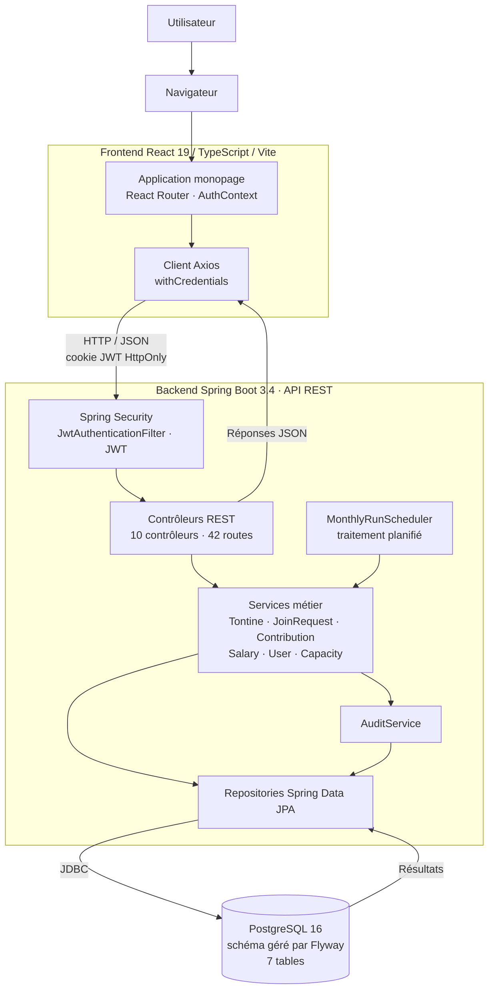


#### Architecture générale finalisée

Le diagramme ci-dessous présente la version finalisée de l'architecture générale de
SalaryTontine, en synthétisant les principaux composants applicatifs et leurs interactions.

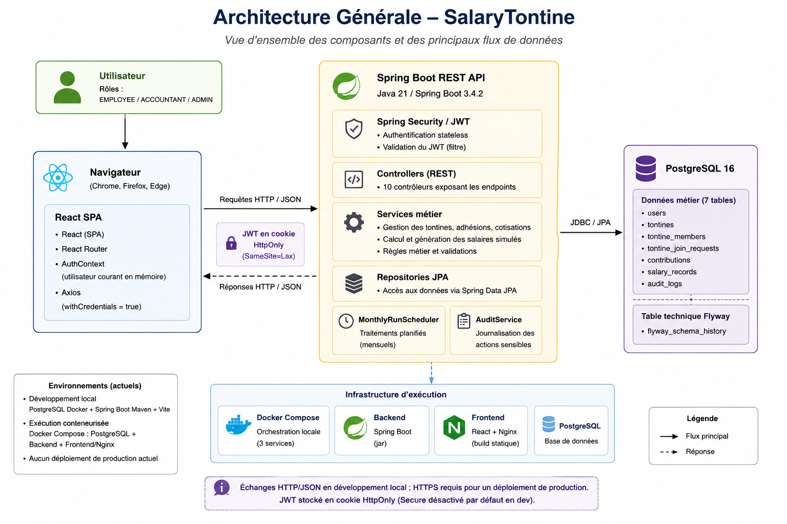

---


## 2. Threat Modeling

Le modèle de menaces a été construit dans **OWASP Threat Dragon 2.0** et exporté dans
`threat-model_mame-fatou-laye-diop.json`. Il contient un diagramme de type STRIDE intitulé
« DFD SalaryTontine », composé de 20 éléments.

### 2.1 DFD et Frontières de Confiance

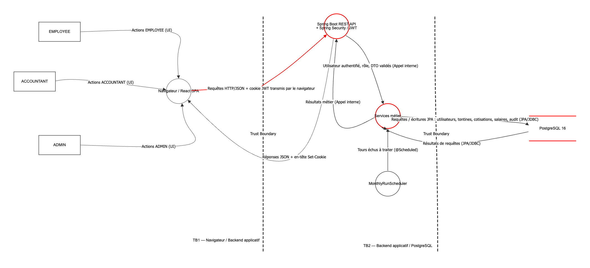

#### Acteurs

Les trois acteurs correspondent exactement aux rôles de l'énumération `Role.java`. Ils sont
externes au système : l'application ne contrôle ni leur poste, ni leur navigateur, ni leur
comportement.


| Acteur       | Rôle dans le système                                                                          |
| ------------ | --------------------------------------------------------------------------------------------- |
| `EMPLOYEE`   | Consulte son salaire simulé, demande à rejoindre une tontine, quitte une tontine non démarrée |
| `ACCOUNTANT` | Gère les tontines, arbitre les adhésions, consulte et corrige les salaires de base            |
| `ADMIN`      | Valide les inscriptions, attribue les rôles, consulte le journal d'audit                      |


#### Processus


| Processus                                    | Description                                                                                                                                                                                   |
| -------------------------------------------- | --------------------------------------------------------------------------------------------------------------------------------------------------------------------------------------------- |
| Navigateur / React SPA                       | Application monopage exécutée sur le poste de l'utilisateur. Elle assemble les requêtes et affiche les réponses ; elle ne détient aucun secret et n'applique aucun contrôle d'accès opposable |
| Spring Boot REST API + Spring Security / JWT | Point d'entrée unique du système. Vérifie la signature du jeton, contrôle le statut du compte, applique les autorisations de rôle et valide les DTO                                           |
| Services métier                              | Couche transactionnelle : règles de tontine, capacité de cotisation, séparation des tâches, calculs salariaux                                                                                 |
| `MonthlyRunScheduler`                        | Déclencheur temporel interne. Il n'est associé à aucun acteur : c'est le seul processus qui agit sans utilisateur à l'origine                                                                 |


#### Store

Un seul magasin de données : **PostgreSQL 16**, qui persiste l'ensemble des sept tables métier
— comptes, tontines, participations, demandes d'adhésion, cotisations, salaires simulés et
journal d'audit. C'est le point de concentration de toutes les données sensibles de
l'application.

#### Flux de données

Dix flux sont modélisés, annotés du type de données transportées et du protocole employé.


| Flux                                    | Données transportées                                                         | Protocole              |
| --------------------------------------- | ---------------------------------------------------------------------------- | ---------------------- |
| Actions `EMPLOYEE` → SPA                | Saisies de formulaire, navigation                                            | Interface graphique    |
| Actions `ACCOUNTANT` → SPA              | Saisies de formulaire, décisions d'arbitrage                                 | Interface graphique    |
| Actions `ADMIN` → SPA                   | Saisies de formulaire, décisions de validation                               | Interface graphique    |
| SPA → API                               | Requêtes HTTP/JSON accompagnées du cookie JWT transmis par le navigateur     | HTTP/JSON, authentifié |
| API → SPA                               | Réponses JSON et en-tête `Set-Cookie` à la connexion                         | HTTP/JSON, authentifié |
| API → Services métier                   | Utilisateur authentifié, rôle, DTO validés                                   | Appel interne          |
| Services métier → API                   | Résultats métier                                                             | Appel interne          |
| Services métier → PostgreSQL            | Lectures et écritures : utilisateurs, tontines, cotisations, salaires, audit | JPA/JDBC               |
| PostgreSQL → Services métier            | Résultats de requêtes                                                        | JPA/JDBC               |
| `MonthlyRunScheduler` → Services métier | Tours échus à traiter                                                        | `@Scheduled`           |


#### Frontières de confiance

Deux frontières délimitent les changements de niveau de confiance. Elles ont été placées
avant les composants, selon le principe que **chaque flux qui traverse une frontière est une
menace potentielle**.

**TB1 — Navigateur / Backend applicatif.** Elle sépare ce que l'utilisateur contrôle de ce que
l'application contrôle. Tout ce qui se trouve du côté navigateur — le code React, les valeurs
saisies, les identifiants de ressources, le cookie lui-même — est manipulable par le
propriétaire du poste. Cette frontière justifie que les gardes `ProtectedRoute` et
`RoleProtectedRoute` ne soient jamais considérées comme un contrôle d'accès : elles s'exécutent
du mauvais côté de la frontière. Deux flux la traversent, dans les deux sens, et portent à la
fois les identifiants de connexion et le jeton d'authentification.

**TB2 — Backend applicatif / PostgreSQL.** Elle sépare la couche qui applique les règles
métier de celle qui détient les données. Un accès qui franchirait cette frontière sans passer
par les services — connexion directe à la base — contournerait l'intégralité des règles de
tontine, de la séparation des tâches et de la validation. Seules subsisteraient les contraintes
SQL portées par le schéma. Deux flux la traversent, dans les deux sens.

Le `MonthlyRunScheduler` occupe une position particulière : il se situe **à l'intérieur** de
la frontière applicative et n'est déclenché par aucun acteur. Il ne traverse donc TB1 à aucun
moment, mais ses écritures franchissent TB2 comme celles de tout autre service.

### 2.2 Analyse STRIDE

Huit menaces ont été documentées, réparties sur quatre composants et flux, et couvrant les
**six catégories STRIDE** — au-delà du minimum de cinq exigé.


| #   | Composant / Flux            | Catégorie STRIDE       | Description de la menace                                                                                                                                                                  | Sévérité | Mitigation proposée                                                                                                                                                                                                               |
| --- | --------------------------- | ---------------------- | ----------------------------------------------------------------------------------------------------------------------------------------------------------------------------------------- | -------- | --------------------------------------------------------------------------------------------------------------------------------------------------------------------------------------------------------------------------------- |
| 1   | Spring Boot REST API        | Elevation of privilege | Un utilisateur tente d'accéder à une fonction privilégiée en manipulant son rôle côté client, un identifiant de ressource ou un jeton                                                     | **High** | Vérifier la signature JWT, contrôler le statut `ACTIVE` en base, appliquer `@PreAuthorize` et les contrôles d'autorisation côté backend, et ne jamais considérer les gardes React comme un contrôle de sécurité                   |
| 2   | Spring Boot REST API        | Denial of service      | Des requêtes répétées sur `/api/auth/login` ou `/api/auth/register` consomment des ressources et empêchent les utilisateurs légitimes d'accéder au service                                | Medium   | Ajouter une limitation de débit sur les endpoints publics sensibles, limiter les tentatives, journaliser les abus et prévoir des seuils adaptés                                                                                   |
| 3   | Spring Boot REST API        | Information disclosure | Une erreur de contrôle d'accès, au niveau d'un endpoint ou d'un objet, expose le salaire de base, l'historique salarial, les cotisations ou les données de tontine d'un autre utilisateur | **High** | Appliquer le contrôle de rôle et l'autorisation au niveau objet côté serveur, filtrer les ressources selon l'utilisateur courant, utiliser des DTO minimaux, et tester les accès croisés entre les trois rôles                    |
| 4   | Services métier             | Repudiation            | Un `ACCOUNTANT` ou un `ADMIN` conteste une modification de salaire, une décision d'adhésion ou une opération sur une tontine, la piste d'audit étant incomplète ou modifiable             | Medium   | Auditer toute action sensible avec auteur, horodatage, cible et contexte ; protéger l'intégrité des `audit_logs` et envisager un stockage en ajout seul ou une centralisation externe                                             |
| 5   | PostgreSQL 16               | Tampering              | Un accès non autorisé à la base permet de modifier `salary_records`, `contributions`, les rôles, `turn_order` ou `audit_logs` en contournant les règles métier                            | **High** | Restreindre PostgreSQL au réseau interne en production, appliquer le moindre privilège au compte de base, ne pas publier inutilement le port, conserver les contraintes SQL, mettre en place sauvegardes et contrôles d'intégrité |
| 6   | Flux SPA → API (cookie JWT) | Spoofing               | Un attaquant qui obtient le cookie JWT rejoue le jeton et agit au nom de sa victime jusqu'à expiration. Le risque est majeur pour un compte `ACCOUNTANT` ou `ADMIN`                       | **High** | Conserver le JWT en cookie `HttpOnly`, imposer HTTPS et `Secure=true` en production, maintenir une durée de vie courte, protéger et faire tourner `JWT_SECRET`, prévoir révocation et rotation                                    |
| 7   | Flux SPA → API              | Tampering              | Le client modifie identifiants, montants, paramètres ou ordres envoyés dans les requêtes afin d'altérer une tontine, une adhésion, une cotisation ou un calcul salarial                   | **High** | Valider toutes les entrées côté serveur, dériver l'identité du JWT vérifié, ne jamais accepter un calcul salarial fourni par le client, appliquer les règles dans les services et conserver les contraintes d'intégrité en base   |
| 8   | Flux SPA → API              | Information disclosure | Déployée sans TLS, l'application laisse intercepter en transit les identifiants, les réponses métier et le cookie d'authentification                                                      | **High** | Imposer HTTPS/TLS en production, activer `Secure=true` sur le cookie, ajouter HSTS et refuser les accès non chiffrés                                                                                                              |


**Couverture obtenue**


| Catégorie STRIDE       | Menaces     |
| ---------------------- | ----------- |
| Spoofing               | 1 (n° 6)    |
| Tampering              | 2 (n° 5, 7) |
| Repudiation            | 1 (n° 4)    |
| Information disclosure | 2 (n° 3, 8) |
| Denial of service      | 1 (n° 2)    |
| Elevation of privilege | 1 (n° 1)    |


Six menaces sont de sévérité **High**, deux de sévérité **Medium**. Cette répartition n'est pas
fortuite : les menaces concentrées sur l'API et sur le flux qui traverse TB1 touchent
directement la confidentialité des salaires et l'intégrité du cycle de tontine, tandis que
celles de sévérité moindre — saturation et répudiation — dégradent le service ou la traçabilité
sans exposer ni altérer directement les données.

### 2.3 Priorisation des Menaces


#### Classement


| Rang | #   | Menace                                                       | Catégorie              | Sévérité |
| ---- | --- | ------------------------------------------------------------ | ---------------------- | -------- |
| 1    | 1   | Élévation de privilèges vers `ACCOUNTANT` ou `ADMIN`         | Elevation of privilege | High     |
| 2    | 6   | Usurpation d'identité par vol ou rejeu du JWT                | Spoofing               | High     |
| 3    | 3   | Divulgation de salaires ou de données d'un autre utilisateur | Information disclosure | High     |
| 4    | 7   | Altération des données métier envoyées par le client         | Tampering              | High     |
| 5    | 8   | Interception de données sensibles faute de TLS               | Information disclosure | High     |
| 6    | 5   | Altération directe des données en base                       | Tampering              | High     |
| 7    | 4   | Déni d'une action sensible insuffisamment traçable           | Repudiation            | Medium   |
| 8    | 2   | Saturation des endpoints d'authentification                  | Denial of service      | Medium   |


Le classement ne suit pas la seule sévérité : à sévérité égale, il départage selon la
**facilité d'exploitation** et selon l'**ampleur du dommage dans le contexte métier de
SalaryTontine**, à savoir la confidentialité des rémunérations et l'équité du cycle de tontine.

#### Justification des trois menaces les plus critiques

**1 — Élévation de privilèges (n° 1).** C'est la menace la plus grave parce qu'elle ne
compromet pas une donnée, mais **le modèle de sécurité entier**. Toute la conception de
SalaryTontine repose sur une séparation des tâches : personne ne fixe son propre salaire, ne
s'ajoute soi-même à une tontine, ni n'accepte sa propre demande d'adhésion. Ces trois règles
supposent qu'un utilisateur ne peut pas changer de rôle. Un `EMPLOYEE` devenu `ACCOUNTANT`
accède d'un coup au salaire de base de tous ses collègues, peut les modifier, et peut
s'attribuer un ordre de passage favorable dans une tontine — donc encaisser la cagnotte avant
d'avoir cotisé. Le dommage est simultanément une atteinte à la confidentialité et à
l'intégrité, et il est silencieux : rien dans l'interface ne le signalerait aux autres
participants. La surface est par ailleurs large, puisqu'elle couvre les 42 routes de l'API.

**2 — Usurpation d'identité par vol ou rejeu du JWT (n° 6).** Le jeton est la **seule preuve
d'identité** de l'application : aucune session serveur ne double l'authentification, et
`SessionCreationPolicy.STATELESS` en fait le point unique de confiance. Quiconque le détient
agit au nom de son porteur, sans mot de passe. Deux caractéristiques du contexte aggravent
cette menace. D'abord, l'attribut `Secure` du cookie est piloté par `JWT_COOKIE_SECURE`, dont
la valeur par défaut est `false` : hors HTTPS, le jeton circule en clair. Ensuite, il n'existe
aucun mécanisme de révocation — la déconnexion efface le cookie côté navigateur, mais un jeton
déjà capté reste valide jusqu'à son expiration, une heure par défaut. Le seul garde-fou est le
contrôle de statut à chaque requête, qui ne bloque que les comptes devenus non `ACTIVE`. Une
usurpation de compte `ACCOUNTANT` donne accès à l'ensemble des salaires pendant toute cette
fenêtre.

**3 — Divulgation de salaires (n° 3).** Le salaire est la donnée la plus sensible de
l'application, et sa confidentialité en est la promesse centrale. Cette menace se place au
troisième rang plutôt qu'au premier parce qu'elle expose sans altérer : elle rompt la
confidentialité, non l'intégrité du cycle. Mais elle est **plus difficile à détecter** que les
deux précédentes. Une élévation de privilèges laisse une trace dans le journal d'audit ; une
lecture non autorisée d'une ressource d'autrui, si elle passe par un endpoint légitime avec un
identifiant qui n'est pas le sien, peut n'en laisser aucune. Le contexte métier aggrave la
conséquence : dans une entreprise, la divulgation des rémunérations produit un dommage social
durable, que la correction technique de la faille ne répare pas.

**Pourquoi les autres menaces viennent ensuite.** L'altération des données envoyées par le
client (n° 7) est de sévérité identique, mais sa surface est bornée par la validation Jakarta
et par le fait que les calculs monétaires ne sont jamais acceptés du client. L'interception
faute de TLS (n° 8) et l'altération directe en base (n° 5) supposent toutes deux un
prérequis extérieur à l'application — un réseau non chiffré, ou un accès déjà obtenu à
l'infrastructure. La répudiation (n° 4) est réelle mais partiellement couverte par
`AuditService`. La saturation des endpoints d'authentification (n° 2) dégrade la disponibilité
d'un outil de simulation interne, dont l'indisponibilité temporaire n'a pas de conséquence
financière directe.

---


## 3. Analyse OWASP Top 10


### 3.1 Vulnérabilités Identifiées Manuellement

L'analyse a porté sur l'intégralité des controllers, des services, de la configuration Spring
Security, des DTO, des repositories, de la configuration d'environnement et de l'orchestration
Docker. Chaque constat ci-dessous est appuyé par un extrait de code et une localisation précise.

Huit constats sont retenus comme vulnérabilités ou faiblesses de sécurité, au-delà du minimum de
cinq exigé. Quatre observations complémentaires sont présentées séparément, car elles ne
constituent pas des failles confirmées.

#### Tableau de synthèse


| Fichier                                                                         | Ligne   | Catégorie OWASP                                     | CWE               | Description                                                                                                                            | Sévérité |
| ------------------------------------------------------------------------------- | ------- | --------------------------------------------------- | ----------------- | -------------------------------------------------------------------------------------------------------------------------------------- | -------- |
| `backend/src/main/java/com/salarytontine/security/JwtAuthenticationFilter.java` | 51-55   | A01:2021 Broken Access Control                      | CWE-613           | Le rôle est lu depuis le JWT et jamais relu en base : une rétrogradation reste sans effet jusqu'à l'expiration du jeton                | **High** |
| `backend/src/main/java/com/salarytontine/config/SecurityConfig.java`            | 39-47   | A07:2021 Identification and Authentication Failures | CWE-307           | Aucune limitation de débit ni verrouillage de compte sur `/api/auth/login` et `/api/auth/register`                                     | **High** |
| `backend/src/main/java/com/salarytontine/service/TontineService.java`           | 133-135 | A01:2021 Broken Access Control                      | CWE-200 / CWE-359 | L'exception de lecture accordée aux tontines `DRAFT` expose le nom et l'adresse e-mail de leurs participants à tout compte authentifié | Medium   |
| `backend/src/main/java/com/salarytontine/service/AuthService.java`              | 69-81   | A09:2021 Security Logging and Monitoring Failures   | CWE-778           | Les échecs d'authentification ne produisent ni trace d'audit ni journal applicatif                                                     | Medium   |
| `backend/src/main/java/com/salarytontine/controller/AuthController.java`        | 71-77   | A07:2021 Identification and Authentication Failures | CWE-613           | La déconnexion se limite à expirer le cookie côté client : aucune révocation serveur du jeton                                          | Medium   |
| `backend/src/main/java/com/salarytontine/config/AppProperties.java`             | 115     | A02:2021 Cryptographic Failures                     | CWE-614           | L'attribut `Secure` du cookie d'authentification vaut `false` par défaut, dans le code comme dans la configuration                     | Medium   |
| `docker-compose.yml`                                                            | 17-18   | A05:2021 Security Misconfiguration                  | CWE-668           | Le port PostgreSQL est publié sur l'hôte alors que le backend joint la base par le réseau interne                                      | Medium   |
| `backend/src/main/java/com/salarytontine/service/AuthService.java`              | 43-45   | A07:2021 Identification and Authentication Failures | CWE-204           | L'inscription distingue par un code 409 explicite un e-mail déjà enregistré d'un e-mail inconnu                                        | Low      |


#### Protections déjà présentes et corrections recommandées


| #   | Constat                                   | Protections déjà présentes                                                                                                                                                                          | Correction recommandée                                                                                                                                           |
| --- | ----------------------------------------- | --------------------------------------------------------------------------------------------------------------------------------------------------------------------------------------------------- | ---------------------------------------------------------------------------------------------------------------------------------------------------------------- |
| C1  | Rôle figé dans le JWT                     | Le statut du compte est revérifié en base à chaque requête : un compte rejeté perd l'accès immédiatement. Jeton signé en HMAC-SHA, durée de vie bornée à une heure                                  | Remplacer `existsByIdAndStatus` par une lecture de l'entité et construire le principal à partir du rôle en base. La requête est déjà effectuée : le coût est nul |
| C5  | Aucune limitation de débit                | BCrypt en coût 12, supérieur au défaut. Message d'erreur uniforme entre e-mail inconnu et mot de passe erroné. Politique de mot de passe de 8 à 72 caractères imposée côté serveur                  | Limitation par adresse IP et par compte sur `/login` et `/register`, temporisation progressive, verrouillage temporaire après un nombre défini d'échecs          |
| C4  | E-mails exposés sur les tontines `DRAFT`  | Authentification requise, aucun accès anonyme. Aucun montant dans le DTO concerné. L'accès se referme sur les seuls participants dès l'activation. Les cotisations restent filtrées par utilisateur | Retirer `userEmail` du DTO pour les non-gestionnaires, ou limiter l'exception `DRAFT` à la fiche de la tontine sans la liste nominative                          |
| C6  | Échecs d'authentification non journalisés | Journal d'audit métier complet : vingt-deux actions tracées avec auteur, entité et horodatage. Un test d'intégration vérifie qu'aucune trace ne contient de secret                                  | Ajouter deux actions d'audit `LOGIN_SUCCESS` et `LOGIN_FAILED` avec l'adresse IP, et un `log.warn` sur chaque échec                                              |
| C2  | Aucune révocation de session              | Cookie `HttpOnly`, non exfiltrable par XSS. Durée de vie limitée à une heure. Le changement de mot de passe exige le mot de passe actuel : un jeton volé ne permet pas de verrouiller la victime    | Ajouter une colonne `token_version` sur `users`, la porter en claim, l'incrémenter à la déconnexion et au changement de mot de passe, la comparer dans le filtre |
| C3  | Cookie sans attribut `Secure`             | `HttpOnly` et `SameSite=Lax` appliqués systématiquement. La variable `JWT_COOKIE_SECURE` est correctement externalisée et documentée                                                                | Inverser le défaut à `true` et ne le repasser à `false` que via un profil de développement explicite                                                             |
| C9  | Port PostgreSQL publié                    | `DB_PASSWORD` obligatoire, avec échec explicite du démarrage si absent : aucun mot de passe par défaut. Réseau bridge dédié, healthchecks sur les trois services, volume nommé                      | Retirer la section `ports` du service `postgres` ; y accéder en développement par `docker compose exec`                                                          |
| C7  | Énumération de comptes                    | La connexion ne fuit rien : message identique dans les deux cas. Le statut du compte n'est révélé qu'après vérification du mot de passe                                                             | Réponse uniforme à l'inscription, ou à défaut limitation de débit stricte sur `/register`                                                                        |


#### Analyse détaillée des constats majeurs

**C1 — Le rôle est figé dans le JWT : la révocation de privilèges est différée.**

```java
// JwtService.java:48 — le rôle est écrit dans le jeton à la connexion
.claim(CLAIM_ROLE, user.getRole().name())

// JwtAuthenticationFilter.java:51-55 — seul le statut est relu en base
if (!userRepository.existsByIdAndStatus(payload.userId(), UserStatus.ACTIVE)) { return; }
AuthenticatedUser principal =
        new AuthenticatedUser(payload.userId(), payload.email(), null, payload.role());
```

Le filtre interroge déjà la base pour vérifier le statut du compte, mais reconstruit le principal
à partir de `payload.role()`, c'est-à-dire le rôle tel qu'il était au moment de la connexion. Le
rôle réel en base n'est jamais relu.

Le scénario d'exploitation est direct. Un `ACCOUNTANT` abuse de ses droits ; un `ADMIN` le
rétrograde en `EMPLOYEE` via `PATCH /api/admin/users/{id}/role`. La rétrogradation est bien
enregistrée et auditée, mais l'intéressé conserve son cookie : jusqu'à l'expiration du jeton,
toutes les annotations `@PreAuthorize("hasAnyRole('ACCOUNTANT','ADMIN')")` continuent de
l'autoriser. Il peut créer des tontines, arbitrer des adhésions, consulter le salaire de base de
tous les employés et déclencher des prélèvements. La fenêtre correspond à
`JWT_EXPIRATION_SECONDS`, soit une heure par défaut.

Ce constat concrétise directement la menace d'élévation de privilèges identifiée dans le modèle
STRIDE, et peut, selon le rôle conservé, conduire à des accès non autorisés aux données métier.
Il est classé en tête parce qu'il rend inopérante la seule mesure corrective disponible face à un
abus de privilèges, et parce que sa correction ne coûte rien : le trajet vers la base est déjà
effectué à chaque requête.

**C5 — Aucune limitation de débit sur les endpoints d'authentification.**

```java
// SecurityConfig.java:39-47
private static final String[] PUBLIC_ENDPOINTS = {
        "/api/auth/register",
        "/api/auth/login",
        ...
```

Une recherche sur l'ensemble du backend et du `pom.xml` ne retourne aucune occurrence de
mécanisme de limitation de débit : ni bibliothèque dédiée, ni filtre, ni compteur de tentatives.
La méthode `AuthenticatedUser.isAccountNonLocked()` retourne `true` en dur, ce qui neutralise le
mécanisme de verrouillage pourtant prévu par Spring Security.

Deux exploitations distinctes en découlent. La première est le *credential stuffing* : un
attaquant rejoue une liste de couples e-mail / mot de passe issus d'une fuite tierce, sans plafond
ni alerte, et sans laisser de trace exploitable puisque les échecs ne sont pas journalisés
— la combinaison avec C6 est ici déterminante. La seconde tient au coût de calcul : BCrypt en
coût 12 est volontairement coûteux en CPU, ce qui est une bonne propriété face au cassage hors
ligne, mais devient un facteur aggravant en l'absence de limitation, des tentatives concurrentes
pouvant contribuer à une saturation du serveur sous charge.

**C4 — Adresses e-mail des participants d'une tontine** `DRAFT` **exposées à tout compte authentifié.**

```java
// TontineService.java:131-135
// Une tontine encore au statut DRAFT est ouverte aux inscriptions :
// tout employé doit pouvoir l'examiner avant de demander à la rejoindre.
if (tontine.isDraft()) {
    return;
}
```

```java
// TontineMapper.java:41-46
return new TontineMemberResponse(
        member.getId(), member.getUser().getId(),
        member.getUser().getName(), member.getUser().getEmail(),   // ← adresse e-mail
        member.getTurnOrder());
```

L'exception accordée au statut `DRAFT` est délibérée et légitime pour la fiche de la tontine : un
employé doit pouvoir examiner une tontine avant de demander à la rejoindre. Mais elle
court-circuite `checkReadAccess` pour trois routes qui retournent la composition —
`GET /api/tontines/{id}`, `GET /api/tontines/{id}/members` et `GET /api/tontines/{id}/schedule` —
et le DTO transporte l'adresse e-mail.

Un `EMPLOYEE` authentifié récupère les identifiants de tontines via `GET /api/tontines/open`, puis
parcourt `GET /api/tontines/{id}/members` pour chacune. Il reconstitue le nom et l'adresse
professionnelle de collègues sans rapport avec lui, base d'une campagne d'hameçonnage interne
ciblée.

La portée doit être énoncée avec précision : **il ne s'agit pas d'une fuite de salaires**.
`TontineMemberResponse` ne contient aucun montant, et les cotisations sont effectivement filtrées
par utilisateur dans `ContributionService`. Le périmètre est celui de l'annuaire, pas celui de la
paie.

#### Les cinq autres constats

**C6 — Échecs d'authentification non journalisés.** L'inscription réussie est tracée, mais
l'échec de connexion ne produit ni trace d'audit ni log applicatif : `AuthService.authenticate`
lève une `BadCredentialsException` sans appeler `AuditService`, et le gestionnaire d'exception
renvoie un 401 sans écrire de ligne. Le niveau racine étant fixé à `INFO`, la journalisation
`DEBUG` de Spring Security n'apparaît pas non plus. Combiné à C5, une campagne de force brute de
plusieurs milliers de tentatives ne laisse aucune trace, et l'analyse post-incident devient
aveugle.

**C2 — Aucune révocation serveur des jetons.** La déconnexion se limite à renvoyer un cookie vide
et expiré. Il n'existe ni liste de révocation, ni identifiant de session en base, ni compteur de
version de jeton. Un jeton capté avant la déconnexion reste valide jusqu'à son expiration, et la
victime n'a aucun moyen de l'invalider. À noter également que `/api/auth/logout` figure parmi les
routes publiques : l'appel anonyme est inoffensif puisqu'il ne fait que poser un cookie, mais la
route n'a aucune raison d'être ouverte.

**C3 — Cookie sans attribut** `Secure` **par défaut.** La valeur par défaut est `false` à trois
niveaux : le champ `cookieSecure` d'`AppProperties`, l'expression `${JWT_COOKIE_SECURE:false}`
dans `application.yml`, et la valeur de repli du `docker-compose.yml`. Un déploiement qui
omettrait de positionner la variable hériterait donc silencieusement d'un cookie transmis en
clair sur HTTP.

La sévérité retenue est **Medium dans le contexte actuel** : SalaryTontine ne dispose d'aucun
déploiement de production réel, l'application ne tournant qu'en local et derrière Docker Compose,
où le défaut `false` est le comportement attendu et nécessaire. Cette faiblesse **deviendrait
High, voire critique, si cette configuration était déployée telle quelle sur un environnement
accessible sans HTTPS** : le jeton circulerait alors en clair, et un attaquant présent sur le
réseau obtiendrait une session valide une heure, avec les privilèges de sa victime. Ce qui est en
cause n'est donc pas une exploitation actuelle, mais un défaut qui n'est pas sûr : l'oubli d'une
variable d'environnement suffit à créer la vulnérabilité.

**C9 — Port PostgreSQL publié sur l'hôte.** Le backend joint la base par le réseau interne
`salarytontine-net`, sous le nom de service `postgres` : la publication du port sur l'hôte ne
sert que le confort de développement. Sur un serveur exposé, elle rendrait le port 5432
accessible depuis l'extérieur. Ce constat concrétise la frontière **TB2** identifiée dans le
modèle de menaces : un accès direct à la base contourne l'intégralité des règles métier
— séparation des tâches, plafond de cotisation, cohérence des ordres de passage — pour ne laisser
subsister que les contraintes SQL, et sans qu'aucune trace n'apparaisse dans le journal d'audit,
celui-ci étant alimenté par la couche applicative.

**C7 — Énumération de comptes à l'inscription.** `POST /api/auth/register` est public et distingue
par un code 409 explicite un e-mail déjà enregistré d'un e-mail inconnu. L'oracle est direct : un
attaquant soumet une liste d'adresses au format `prenom.nom@entreprise.com` et retient celles qui
renvoient 409. Pris isolément, l'impact est faible, puisque l'information ne compromet aucun
compte. C'est sa combinaison avec C5 qui le rend exploitable à grande échelle, aucun plafond ne
s'opposant à une énumération massive. Le contraste avec la connexion, correctement protégée par
un message uniforme, montre qu'il s'agit d'une omission ponctuelle et non d'une négligence de
conception.

#### Observations ne constituant pas des vulnérabilités confirmées

Ces quatre points ont été relevés pendant l'inspection mais ne sont pas retenus comme failles.
Les distinguer explicitement est utile : la Partie 6 comparera ces résultats manuels aux
détections automatisées, et plusieurs d'entre eux seront très probablement signalés par les
outils.


| Observation                                     | Fichier                     | Nature réelle                                                                                                                                                                                                                                                                                                                                                                                                                                                                                            |
| ----------------------------------------------- | --------------------------- | -------------------------------------------------------------------------------------------------------------------------------------------------------------------------------------------------------------------------------------------------------------------------------------------------------------------------------------------------------------------------------------------------------------------------------------------------------------------------------------------------------- |
| **C8 — Protection CSRF désactivée**             | `SecurityConfig.java:64-66` | **Risque résiduel, pas une faille confirmée.** Aucun scénario exploitable n'a pu être construit sur un navigateur à jour. Le cookie porte `SameSite=Lax`, qui empêche son émission sur une requête `POST`, `PATCH` ou `DELETE` inter-site. Vérification effectuée sur les 42 endpoints : aucun `@GetMapping` ne modifie l'état, il n'existe donc pas de vecteur. Le risque résiduel concerne les navigateurs anciens ignorant `SameSite`, et une éventuelle compromission d'un sous-domaine du même site |
| **C10 — Swagger et** `/v3/api-docs` **publics** | `SecurityConfig.java:43-46` | Exposition de la surface d'API à un utilisateur non authentifié : les 42 routes, la structure des DTO et le nom du cookie. Aucune donnée métier n'est servie par ces routes, et `/actuator` n'expose que `health` avec `show-details: never`. C'est une aide à la reconnaissance, pas un accès. À conditionner à un profil de développement avant toute mise en production                                                                                                                               |
| **C11 — Absence de pagination**                 | 8 routes de liste           | Faiblesse de dimensionnement, sans conséquence à l'échelle d'une PME. Le journal d'audit, seul volume à croissance non bornée par construction, **est** paginé et plafonné à 200 éléments par page, avec bornes validées côté serveur. `open-in-view: false` évite par ailleurs les requêtes hors transaction                                                                                                                                                                                            |
| **S2 —** `backend/.dockerignore` **incomplet**  | `backend/.dockerignore`     | **Faiblesse latente uniquement.** Le fichier n'exclut ni `.env` ni `.env.`*, mais cela reste sans effet : le `Dockerfile` du backend ne copie que `pom.xml` et `src`. Le risque n'apparaîtrait qu'en passant à un `COPY . .`. Par comparaison, le `.dockerignore` du frontend exclut bien `.env`, ce qui est nécessaire puisque son `Dockerfile` copie l'intégralité du contexte                                                                                                                         |


#### Contrôles vérifiés sans constat

L'analyse a également cherché, sans les trouver, plusieurs classes de vulnérabilités
fréquemment attendues sur ce type d'application. Ces résultats négatifs font partie de l'analyse.


| Catégorie                                 | Vérification effectuée                                                                            | Résultat                                                                                                         |
| ----------------------------------------- | ------------------------------------------------------------------------------------------------- | ---------------------------------------------------------------------------------------------------------------- |
| A03 — Injection SQL                       | Recherche de `nativeQuery`, `createQuery`, `String.format` et de concaténation dans `repository/` | Aucune occurrence. Toutes les requêtes sont écrites en JPQL avec paramètres nommés                               |
| A03 — XSS                                 | Recherche de `dangerouslySetInnerHTML`, `innerHTML` et `eval(` dans `frontend/src`                | Aucune occurrence. L'échappement React par défaut s'applique partout                                             |
| A10 — SSRF                                | Recherche de `RestTemplate`, `WebClient`, `HttpClient` et `new URL(` dans le backend              | Aucun client HTTP sortant. **Catégorie non applicable**                                                          |
| A08 — Désérialisation                     | Recherche de `ObjectInputStream`, `@JsonTypeInfo`, `enableDefaultTyping`                          | Aucune occurrence. Jackson en configuration stricte                                                              |
| Traversée de chemin                       | Recherche de `MultipartFile`, `Files.write`, `new File(`                                          | Aucune manipulation de fichier issue d'une entrée utilisateur                                                    |
| Fuite de trace d'exécution                | `include-stacktrace: never`, `include-message: never`, gestionnaire global                        | Message générique côté client, détail conservé côté serveur                                                      |
| Exposition de l'empreinte de mot de passe | Inspection de tous les DTO de réponse et des mappers                                              | `passwordHash` absent de l'ensemble des réponses ; le principal est construit avec `null` dans le filtre         |
| Conteneur privilégié                      | `backend/Dockerfile`                                                                              | Utilisateur dédié non-root, build multi-étapes, image JRE Alpine                                                 |
| Séparation des tâches                     | Trois règles vérifiées dans les services                                                          | Salaire de base, auto-ajout à une tontine et auto-acceptation d'adhésion sont effectivement bloqués côté serveur |


Une incohérence de conception a par ailleurs été relevée sans être classée comme vulnérabilité :
la méthode `accept()` de `JoinRequestService` interdit d'arbitrer sa propre demande, tandis que
`reject()` ne porte pas ce contrôle. Refuser sa propre demande ne procure toutefois aucun
avantage, et une méthode dédiée permet déjà de la retirer.

---


### 3.2 Inventaire des Entrées Utilisateur

L'inventaire couvre les **42 endpoints** exposés par les dix controllers. Il distingue quatre
sources d'entrée : le corps de requête lié à un DTO (`@RequestBody`), les variables de chemin
(`@PathVariable`), les paramètres de requête (`@RequestParam`), et l'identité de l'appelant,
dérivée du JWT via le `SecurityContext`.

#### Répartition des sources d'entrée


| Source                      | Nombre d'endpoints | Validation appliquée                                                          |
| --------------------------- | ------------------ | ----------------------------------------------------------------------------- |
| `@RequestBody` lié à un DTO | 12                 | Bean Validation côté serveur via `@Valid`, sur chacun des 12                  |
| `@PathVariable`             | 22                 | Typage fort (`Long`, `YearMonth`) ; autorisation portée par la couche service |
| `@RequestParam`             | 3                  | `@Min` / `@Max` sur les paramètres de pagination, activés par `@Validated`    |
| Identité issue du JWT       | 42                 | Jamais fournie par le client : lue dans le `SecurityContext`                  |


Les douze DTO d'entrée portent tous des contraintes déclaratives, effectivement appliquées côté
serveur : `@NotBlank`, `@NotNull`, `@Email`, `@Size`, `@Min`, `@Max`, `@Positive`,
`@PositiveOrZero`, `@DecimalMin` et `@Digits`. Les violations sont converties en réponse 400
structurée, champ par champ, par le gestionnaire d'exception global.

#### Authentification et profil


| Endpoint                 | Méthode | Entrée                  | Validation en place                                  | Risque si non validée                                |
| ------------------------ | ------- | ----------------------- | ---------------------------------------------------- | ---------------------------------------------------- |
| `/api/auth/register`     | POST    | `RegisterRequest`       | `@NotBlank`, `@Email`, `@Size` (2-120 / ≤180 / 8-72) | Création de comptes malformés, mots de passe faibles |
| `/api/auth/login`        | POST    | `LoginRequest`          | `@NotBlank`, `@Email`                                | Requêtes malformées, sondage de l'authentification   |
| `/api/auth/logout`       | POST    | aucune                  | —                                                    | Aucun                                                |
| `/api/auth/me`           | GET     | identité JWT            | —                                                    | Aucun : l'identité ne vient pas du client            |
| `/api/users/me`          | GET     | identité JWT            | —                                                    | Aucun                                                |
| `/api/users/me/password` | PATCH   | `ChangePasswordRequest` | `@NotBlank`, `@Size` (8-72)                          | Contournement de la politique de mot de passe        |


Le rôle et le salaire de base ne figurent volontairement dans aucun DTO d'inscription : ils sont
imposés par le serveur, ce qui ferme la voie à une élévation de privilèges par *mass assignment*.

#### Administration


| Endpoint                         | Méthode | Entrée                                  | Validation en place                                                 | Risque si non validée                                            |
| -------------------------------- | ------- | --------------------------------------- | ------------------------------------------------------------------- | ---------------------------------------------------------------- |
| `/api/admin/users`               | GET     | aucune                                  | Contrôle de rôle `ADMIN`                                            | Divulgation de l'annuaire complet                                |
| `/api/admin/users/{id}/approve`  | POST    | `@PathVariable` + `ApproveUserRequest`  | `@NotNull` sur le rôle, `@DecimalMin(0)`, `@Digits(13,2)`           | Attribution d'un rôle arbitraire, salaire négatif ou hors format |
| `/api/admin/users/{id}/reject`   | POST    | `@PathVariable`                         | Règle métier : auto-refus bloqué                                    | Blocage de l'unique compte administrateur                        |
| `/api/admin/users/{id}/role`     | PATCH   | `@PathVariable` + `UpdateRoleRequest`   | `@NotNull` sur un type énuméré ; auto-rétrogradation bloquée        | Application rendue inadministrable, élévation de privilèges      |
| `/api/admin/users/{id}/salary`   | PATCH   | `@PathVariable` + `UpdateSalaryRequest` | `@NotNull`, `@PositiveOrZero`, `@Digits` ; auto-attribution bloquée | Rupture de la séparation des tâches sur la paie                  |
| `/api/admin/users/{id}/salaries` | GET     | `@PathVariable`                         | Contrôle de rôle `ADMIN`                                            | Divulgation de l'historique salarial d'autrui                    |
| `/api/admin/audit-logs`          | GET     | `@RequestParam` `page`, `size`          | `@Min(0)`, `@Min(1) @Max(200)`, activés par `@Validated`            | Épuisement mémoire par une taille de page arbitraire             |


Ces routes sont protégées deux fois : par la règle `requestMatchers("/api/admin/**").hasRole("ADMIN")`
de la configuration de sécurité, et par une annotation `@PreAuthorize` au niveau de la classe.

#### Tontines et adhésions


| Endpoint                              | Méthode | Entrée                                       | Validation en place                                                                      | Risque si non validée                                     |
| ------------------------------------- | ------- | -------------------------------------------- | ---------------------------------------------------------------------------------------- | --------------------------------------------------------- |
| `/api/tontines`                       | GET     | aucune                                       | Filtrage serveur selon le rôle                                                           | Divulgation de tontines non concernées                    |
| `/api/tontines/open`                  | GET     | aucune                                       | Authentification                                                                         | Aucun : ouverture assumée par conception                  |
| `/api/tontines/{id}`                  | GET     | `@PathVariable`                              | `checkReadAccess` — **exception** `DRAFT`**, voir C4**                                   | Lecture de tontines dont l'appelant n'est pas participant |
| `/api/tontines`                       | POST    | `CreateTontineRequest`                       | `@NotBlank`, `@Positive`, `@Digits`, `@Min(2)`, `@Max(60)`, `@Min(1)`, `@Max(365)`       | Montants négatifs, cadences absurdes, cycles ingérables   |
| `/api/tontines/{id}`                  | PATCH   | `@PathVariable` + `UpdateTontineRequest`     | Mêmes contraintes, champs optionnels ; restreint au statut `DRAFT`                       | Modification d'un cycle déjà engagé                       |
| `/api/tontines/{id}/members`          | GET     | `@PathVariable`                              | `checkReadAccess` — **exception** `DRAFT`**, voir C4**                                   | Divulgation de la composition et des adresses e-mail      |
| `/api/tontines/{id}/members`          | POST    | `@PathVariable` + `AddMemberRequest`         | `@NotNull`, `@Positive`, `@Min(1)` ; auto-ajout bloqué ; plafond de cotisation vérifié   | Auto-inscription, prélèvement supérieur au salaire        |
| `/api/tontines/{id}/members/{userId}` | DELETE  | deux `@PathVariable`                         | Restreint au statut `DRAFT`                                                              | Retrait d'un participant en cours de cycle                |
| `/api/tontines/{id}/members/me`       | DELETE  | `@PathVariable` + identité JWT               | Identité serveur ; départ interdit une fois la tontine active                            | Départ unilatéral au détriment des autres participants    |
| `/api/tontines/{id}/activate`         | POST    | `@PathVariable`                              | Ordres de passage vérifiés comme suite complète de 1 à n                                 | Cycle insoluble, tour sans bénéficiaire                   |
| `/api/tontines/{id}/cancel`           | POST    | `@PathVariable`                              | Statut vérifié                                                                           | Annulation d'une tontine déjà close                       |
| `/api/tontines/{id}`                  | DELETE  | `@PathVariable`                              | `DRAFT` uniquement                                                                       | Effacement en cascade de l'historique salarial            |
| `/api/tontines/{id}/schedule`         | GET     | `@PathVariable`                              | `checkReadAccess` — **exception** `DRAFT`                                                | Divulgation des bénéficiaires                             |
| `/api/tontines/{id}/join-requests`    | POST    | `@PathVariable` + `JoinTontineRequest`       | `@Size(max=300)`, corps optionnel ; demandeur issu du JWT                                | Demande soumise au nom d'un tiers                         |
| `.../join-requests/me`                | DELETE  | `@PathVariable` + identité JWT               | Identité serveur                                                                         | Retrait de la demande d'autrui                            |
| `.../join-requests`                   | GET     | `@PathVariable`                              | `@PreAuthorize` + revérification dans le service                                         | Divulgation des candidatures                              |
| `/api/join-requests/pending`          | GET     | aucune                                       | `@PreAuthorize`                                                                          | Divulgation de la file d'arbitrage                        |
| `/api/join-requests/me`               | GET     | identité JWT                                 | —                                                                                        | Aucun                                                     |
| `.../{requestId}/accept`              | POST    | deux `@PathVariable` + `JoinRequestDecision` | `@Min(1)`, `@Size(≤300)` ; cohérence demande/tontine vérifiée ; auto-acceptation bloquée | Attribution d'un ordre de passage favorable à soi-même    |
| `.../{requestId}/reject`              | POST    | deux `@PathVariable` + `JoinRequestDecision` | Mêmes contraintes ; cohérence vérifiée                                                   | Refus d'une demande d'une autre tontine                   |


La vérification de cohérence entre `tontineId` et `requestId` mérite d'être signalée : elle évite
qu'une demande soit arbitrée depuis le contexte d'une tontine à laquelle elle n'appartient pas.

#### Cotisations, salaires et tableau de bord


| Endpoint                                    | Méthode | Entrée                                          | Validation en place                                                    | Risque si non validée                          |
| ------------------------------------------- | ------- | ----------------------------------------------- | ---------------------------------------------------------------------- | ---------------------------------------------- |
| `/api/tontines/{id}/contributions/generate` | POST    | `@PathVariable` + `PeriodRequest`               | `@NotNull`, `@Min(1)` ; tour vérifié dans les bornes du cycle          | Génération hors cycle, doublons de cotisations |
| `/api/tontines/{id}/contributions`          | GET     | `@PathVariable` + `@RequestParam` `periodIndex` | Typage `Integer` ; filtrage par utilisateur pour les non-gestionnaires | Divulgation des cotisations d'autrui           |
| `/api/tontines/{id}/salaries/generate`      | POST    | `@PathVariable` + `PeriodRequest`               | `@NotNull`, `@Min(1)` ; cotisations exigées au préalable               | Salaires calculés sur des données incomplètes  |
| `/api/salaries/me`                          | GET     | identité JWT                                    | —                                                                      | Aucun                                          |
| `/api/salaries/me/{month}`                  | GET     | `@PathVariable` `YearMonth`                     | `@DateTimeFormat` et désérialiseur strict au format `YYYY-MM`          | Format invalide traité en erreur serveur       |
| `/api/employees`                            | GET     | aucune                                          | `@PreAuthorize` au niveau de la classe                                 | Divulgation de tous les salaires de base       |
| `/api/employees/{id}/salary`                | PATCH   | `@PathVariable` + `UpdateSalaryRequest`         | `@NotNull`, `@PositiveOrZero`, `@Digits` ; auto-attribution bloquée    | Rupture de la séparation des tâches            |
| `/api/employees/{id}/salaries`              | GET     | `@PathVariable`                                 | `@PreAuthorize`                                                        | Divulgation de l'historique salarial           |
| `/api/dashboard`                            | GET     | identité JWT                                    | —                                                                      | Aucun                                          |


Un point de conception est déterminant pour la sécurité du calcul : **aucun montant financier
n'est jamais accepté du client**. La cotisation provient toujours de la tontine, la cagnotte est
calculée à partir du montant et du nombre de participants, et le salaire final est dérivé côté
serveur. Le client ne fournit qu'un rang de tour, borné.

#### Constat positif : absence d'IDOR horizontal classique

Aucun endpoint accessible à un rôle non privilégié n'accepte un identifiant d'utilisateur
arbitraire. L'identité de l'appelant est systématiquement dérivée du `SecurityContext`, par un
composant unique dédié, et jamais d'un paramètre fourni par le client. Les trois routes qui
acceptent un identifiant d'utilisateur — historique salarial et modification du salaire de base —
sont réservées aux rôles `ACCOUNTANT` et `ADMIN`, pour lesquels l'accès transversal fait partie
des attributions. Les routes personnelles se terminent par `/me` et ignorent tout identifiant.

La seule brèche de contrôle d'accès identifiée, C4, n'est pas un IDOR mais une exception de
lecture volontairement accordée à un statut, dont le périmètre est trop large.

---


### 3.3 Gestion des Secrets

L'inspection a porté sur `application.yml`, `docker-compose.yml`, les deux `Dockerfile`, les
fichiers `.dockerignore`, `.env.example`, `.gitignore`, ainsi que sur l'usage effectif de
`JWT_SECRET` et des variables PostgreSQL dans le code. Une recherche de secrets codés en dur a
été menée sur les fichiers Java, TypeScript, YAML, JSON, SQL et Markdown du dépôt.

**Aucune valeur de secret n'est reproduite dans ce rapport, et le fichier** `.env` **réel n'y figure
sous aucune forme.**

#### Ce qui est correctement externalisé


| Élément                   | Emplacement                                           | Constat                                                                                                                                                                                                                              |
| ------------------------- | ----------------------------------------------------- | ------------------------------------------------------------------------------------------------------------------------------------------------------------------------------------------------------------------------------------ |
| `JWT_SECRET`              | `application.yml:39`, `JwtService.java:32-41`         | Aucune valeur par défaut. L'application **refuse de démarrer** si le secret est absent ou fait moins de 32 caractères. Ce choix de défaillance immédiate est la bonne décision : il rend impossible un démarrage avec une clé faible |
| `DB_PASSWORD`             | `application.yml:8`, `docker-compose.yml:14` et `:40` | Aucun mot de passe par défaut. La syntaxe `${DB_PASSWORD:?...}` provoque un échec explicite de `docker compose` si la variable est absente                                                                                           |
| `APP_ADMIN_PASSWORD`      | `AdminBootstrap.java:48-56`                           | L'amorçage du compte administrateur est ignoré si le mot de passe est absent ou fait moins de 12 caractères. Le mot de passe n'est **jamais journalisé** : seule l'adresse e-mail l'est                                              |
| `APP_SEED_PASSWORD`       | `DemoDataSeeder.java:76-81`                           | Le jeu de démonstration est conditionné à `APP_SEED_ENABLED=true`, désactivé par défaut. Le mot de passe provient de l'environnement, avec une longueur minimale contrôlée                                                           |
| Variables PostgreSQL      | `application.yml:6-8`                                 | Hôte, port, base, utilisateur et mot de passe entièrement paramétrés par l'environnement                                                                                                                                             |
| `.env`                    | `.gitignore:1-5`                                      | Ignoré par les motifs `.env`, `.env.local` et `*.env`. **Vérifié** : `git check-ignore` confirme l'exclusion de `.env` et de `frontend/.env` ; `git ls-files` ne retourne aucun fichier `.env` parmi les fichiers suivis             |
| `.env.example`            | `.env.example`                                        | Dix-neuf variables, **toutes vides**. Les commentaires décrivent ce qu'attend chaque variable, y compris les commandes de génération, sans jamais fournir de valeur d'exemple                                                        |
| Journal d'audit           | `AuditService.java`, test d'intégration dédié         | Le champ de détail ne contient que des informations métier. Un test automatisé vérifie qu'aucune trace ne contient de secret                                                                                                         |
| Configuration applicative | `AppProperties.java`                                  | L'ensemble de la configuration sensible transite par une classe de propriétés typée et validée, alimentée exclusivement par l'environnement                                                                                          |


**Recherche de secrets codés en dur.** Les seules correspondances retournées sont des littéraux
de test — mots de passe fictifs des tests d'intégration, clé de signature propre au contexte de
test — et des noms de paramètres de méthodes d'affectation. **Aucun secret de production n'a été
trouvé en dur dans le code source.** Les quatre commits de l'historique sont propres de ce point
de vue.

#### Améliorations recommandées


| Point                                    | Emplacement                                                             | Nature                                                                                                                                                                                                                                                                 | Priorité |
| ---------------------------------------- | ----------------------------------------------------------------------- | ---------------------------------------------------------------------------------------------------------------------------------------------------------------------------------------------------------------------------------------------------------------------- | -------- |
| `JWT_COOKIE_SECURE` par défaut à `false` | `AppProperties.java:115`, `application.yml:42`, `docker-compose.yml:43` | Défaut qui n'est pas sûr, répliqué à trois niveaux. Correspond au constat **C3** : Medium dans le contexte actuel, mais deviendrait critique sur un environnement accessible sans HTTPS                                                                                | Élevée   |
| Port PostgreSQL publié sur l'hôte        | `docker-compose.yml:17-18`                                              | Correspond au constat **C9**. Le backend n'en a pas besoin : il joint la base par le réseau interne                                                                                                                                                                    | Moyenne  |
| `baseline-on-migrate: true`              | `application.yml:25`                                                    | Relève de l'intégrité (A08). Sur une base non vide dépourvue de table d'historique, Flyway pose une ligne de base et **saute silencieusement la première migration** : le schéma peut alors diverger sans qu'aucune erreur ne soit levée                               | Moyenne  |
| `backend/.dockerignore` incomplet        | `backend/.dockerignore`                                                 | **Amélioration préventive uniquement.** Le fichier n'exclut ni `.env` ni `.env.`*, mais le `Dockerfile` ne copie que `pom.xml` et `src` : aucun secret ne peut aujourd'hui entrer dans l'image. Ajouter la règle protège d'une évolution ultérieure vers un `COPY . .` | Faible   |
| Absence de limites de ressources         | `docker-compose.yml`                                                    | Aucune section `deploy.resources` : un conteneur emballé peut épuiser les ressources de l'hôte                                                                                                                                                                         | Faible   |


Un point de vigilance opérationnel, extérieur au code, mérite d'être noté : le fichier `.env`
réel existe sur la machine de développement et contient les valeurs effectives. Il est
correctement ignoré par Git et n'a jamais été versionné, mais il ne doit accompagner ni le dépôt,
ni l'archive de rendu.

---


### Conclusion de la Partie 3

Cette analyse a été conduite **entièrement à la main, avant toute exécution de Semgrep, Snyk,
Trivy ou GitLeaks**. Aucun outil automatisé n'est intervenu dans son établissement, et aucune
vulnérabilité n'a été corrigée : le code reste dans l'état exact où il se trouvait à l'issue de la
Partie 2.

Ce choix de séquence est délibéré et conditionne la suite de l'examen. La Partie 6 devra comparer
les résultats manuels aux détections automatisées ; cette comparaison n'aurait aucune valeur si
l'analyse manuelle avait été menée après avoir lu les rapports d'outils, ou sur un code déjà
assaini. L'état vulnérable est donc conservé intact jusqu'à la Partie 7, qui documentera les
corrections et leur validation.

Trois enseignements se dégagent de cette inspection, et serviront de points de comparaison.
D'abord, les vulnérabilités les plus sérieuses trouvées ici — le rôle figé dans le jeton,
l'absence de limitation de débit — relèvent de la **logique métier et de l'architecture
d'authentification**, un terrain sur lequel les analyseurs statiques sont structurellement peu
performants. Ensuite, plusieurs points que les outils signaleront très probablement — la
désactivation de la protection CSRF au premier chef — ne constituent pas des failles exploitables
dans ce contexte précis, et l'analyse manuelle permet de le démontrer preuve à l'appui. Enfin,
l'inspection a mis en évidence un nombre significatif de **contrôles correctement implémentés** :
absence d'injection SQL, absence de XSS, absence d'IDOR horizontal, secrets externalisés avec
échec immédiat en cas d'absence, BCrypt en coût renforcé, CORS restreint à une origine unique,
séparation des tâches effectivement appliquée côté serveur. L'objectif n'était pas de trouver des
failles à tout prix, mais d'évaluer honnêtement la posture de sécurité de l'application.

---


## 4. Règles Semgrep Custom


### 4.1 Objectif et stratégie

Les règles personnalisées sont regroupées dans un fichier unique à la racine du dépôt,
`.semgrep/rules.yaml`, qui contient **six règles**. Quatre visent le backend Java 21 / Spring
Boot 3.4, une vise à la fois le backend et la configuration de sécurité, et une vise le frontend
React 19 / TypeScript. Le fichier déclare donc deux familles de langages : `java` d'une part,
`typescript` et `javascript` d'autre part.

Ces règles n'ont pas été reprises d'un catalogue générique. Chacune vise une construction
effectivement présente dans SalaryTontine, ou plausible au vu de sa pile technique et de son
domaine métier. R1 cible les API de persistance réellement employées — JPA, Spring JDBC — et son
message rappelle que les dix-sept requêtes `@Query` du projet sont déjà écrites en JPQL avec
paramètres nommés. R4 détecte la forme exacte du défaut relevé en Partie 3 : un drapeau booléen
dont le nom contient `secure` et dont la valeur par défaut est `false`. R5 vise
`csrf(AbstractHttpConfigurer::disable)`, c'est-à-dire la construction littéralement écrite dans
`SecurityConfig`. R6 énumère dans son message les champs contrôlés par les utilisateurs que le
frontend affiche : nom de tontine, message de motivation, note de refus, détail d'audit.

La validation et l'exécution ont été réalisées avec **Semgrep 1.175.0**. **Aucun ruleset distant
n'a été utilisé à cette étape** : les registres `p/owasp-top-ten`, `p/nodejs` et `p/java` seront
introduits dans la pipeline en Partie 5, précisément pour que la comparaison entre règles écrites
sur mesure et règles génériques reste lisible.


| ID  | Règle                                            | Langage                 | OWASP / CWE        | Sévérité | Finding actuel |
| --- | ------------------------------------------------ | ----------------------- | ------------------ | -------- | -------------- |
| R1  | `salarytontine-sql-jpql-injection`               | Java                    | A03:2021 / CWE-89  | ERROR    | **0**          |
| R2  | `salarytontine-command-injection`                | Java                    | A03:2021 / CWE-78  | ERROR    | **0**          |
| R3  | `salarytontine-hardcoded-secret`                 | Java                    | A07:2021 / CWE-798 | ERROR    | **0**          |
| R4  | `salarytontine-insecure-auth-cookie`             | Java                    | A02:2021 / CWE-614 | WARNING  | **1**          |
| R5  | `salarytontine-spring-csrf-disabled`             | Java                    | A01:2021 / CWE-352 | WARNING  | **1**          |
| R6  | `salarytontine-react-dangerously-set-inner-html` | TypeScript / JavaScript | A03:2021 / CWE-79  | ERROR    | **0**          |


Quatre règles sur six ne remontent aucun finding. **Ce n'est pas un défaut de conception, et ce
n'est pas non plus la preuve que le pattern visé existe dans le code.** Ces quatre règles sont
préventives : elles interdisent l'introduction future d'un motif dangereux. Chaque section
ci-dessous le précise explicitement, et la sous-section 4.4 documente comment le déclenchement
effectif de ces règles a été vérifié en dehors du dépôt.

---


### 4.2 Règles personnalisées


#### R1 — Injection SQL / JPQL

```yaml
- id: salarytontine-sql-jpql-injection
  languages: [java]
  severity: ERROR
  message: >-
    Requête SQL ou JPQL construite par concaténation avant d'être passée à
    une API de persistance. Toute donnée d'origine utilisateur ainsi assemblée est
    interprétée comme du code SQL : un identifiant de tontine ou un filtre de
    mois suffirait à détourner la requête et à lire ou altérer
    "salary_records", "contributions" ou "users". Utilisez un paramètre nommé
    (setParameter / :param) ou un placeholder "?" avec JdbcTemplate. Les
    repositories de SalaryTontine appliquent déjà cette règle : les 17 requêtes
    @Query du projet sont en JPQL avec paramètres nommés.
  metadata:
    category: security
    cwe: "CWE-89: Improper Neutralization of Special Elements used in an SQL Command"
    owasp: "A03:2021 - Injection"
    technology: [java, spring, jpa, hibernate]
    confidence: HIGH
    impact: HIGH
    likelihood: MEDIUM
  patterns:
    - pattern-either:
        # API JPA / Hibernate
        - pattern: $EM.createQuery($QUERY, ...)
        - pattern: $EM.createNativeQuery($QUERY, ...)
        - pattern: $EM.createStoredProcedureQuery($QUERY, ...)
        - pattern: $SESSION.createSQLQuery($QUERY, ...)
        # API Spring JDBC
        - pattern: $JDBC.query($QUERY, ...)
        - pattern: $JDBC.queryForObject($QUERY, ...)
        - pattern: $JDBC.queryForList($QUERY, ...)
        - pattern: $JDBC.queryForMap($QUERY, ...)
        - pattern: $JDBC.queryForRowSet($QUERY, ...)
        - pattern: $JDBC.update($QUERY, ...)
        - pattern: $JDBC.batchUpdate($QUERY, ...)
        - pattern: $JDBC.execute($QUERY, ...)
        # JDBC brut
        - pattern: $CONN.prepareStatement($QUERY, ...)
        - pattern: $STMT.executeQuery($QUERY)
        - pattern: $STMT.executeUpdate($QUERY)
    # Seule une requête assemblée dynamiquement est signalée.
    - metavariable-pattern:
        metavariable: $QUERY
        patterns:
          - pattern-either:
              - pattern: $A + $B
              - pattern: String.format(...)
              - pattern: $S.concat(...)
              - pattern: $S.formatted(...)
              - pattern: $BUILDER.toString()
              - pattern: String.join(...)
    # Une requête correctement paramétrée n'est jamais concernée : ni un
    # littéral seul, ni une constante, ni un bloc de texte figé.
    - pattern-not: $EM.createQuery("...", ...)
    - pattern-not: $EM.createNativeQuery("...", ...)
    - pattern-not: $JDBC.query("...", ...)
    - pattern-not: $JDBC.update("...", ...)
    - pattern-not: $JDBC.execute("...")
  paths:
    exclude: ["*Test.java", "*Tests.java", "*IT.java", "src/test/**"]
```

**Pattern dangereux détecté.** Une requête passée à une API de persistance alors qu'elle a été
assemblée dynamiquement. La règle ne se contente pas de repérer l'appel : elle exige, par
`metavariable-pattern`, que l'argument `$QUERY` soit lui-même une concaténation (`$A + $B`), un
`String.format`, un `concat`, un `formatted`, un `StringBuilder.toString()` ou un `String.join`.
Un exemple typique serait `em.createQuery("select s from SalaryRecord s where s.tontine.id = " + tontineId)`.

**Pertinence pour SalaryTontine.** Les tables `salary_records`, `contributions` et `users`
contiennent l'intégralité des données de paie simulées. Une injection sur l'une d'elles
permettrait de lire les salaires de tous les employés, ou d'altérer une cotisation, en
contournant toutes les règles métier des services — exactement le franchissement de la frontière
**TB2** décrit dans le modèle de menaces de la Partie 2. La règle couvre à la fois JPA, Spring
JDBC et JDBC brut, car ces trois API sont disponibles dans les dépendances du projet et pourraient
être employées lors d'une future optimisation de requête.

**Correctif suggéré.** Utiliser un paramètre nommé en JPQL (`:id` avec `setParameter`) ou un
placeholder `?` avec `JdbcTemplate`. Les repositories du projet appliquent déjà cette convention.

**Résultat actuel : 0 finding.** Le backend n'utilise aujourd'hui que des requêtes JPQL
paramétrées : les dix-sept annotations `@Query` du projet emploient des paramètres nommés, et une
recherche manuelle de `nativeQuery`, `createQuery`, `createNativeQuery` et de concaténation dans
le paquet `repository` n'a retourné aucune occurrence, ce que confirme cette règle.
**Le pattern n'est pas présent dans l'état actuel du projet ; la règle est préventive et vise à
empêcher son introduction future**, notamment lors de l'ajout d'une requête JPA ou d'un accès
`JdbcTemplate` pour un besoin de reporting.

---


#### R2 — Injection de commande système

```yaml
- id: salarytontine-command-injection
  languages: [java]
  severity: ERROR
  message: >-
    Commande système construite par concaténation puis exécutée. SalaryTontine
    n'exécute aujourd'hui aucun processus externe ; introduire un appel de ce
    type avec une chaîne assemblée depuis une entrée utilisateur — un nom de
    tontine, un libellé de motivation — permettrait d'exécuter des commandes
    arbitraires sur le conteneur applicatif. Passez les arguments sous forme
    de liste (ProcessBuilder("cmd", "arg1", "arg2")), sans jamais interpoler
    de donnée entrante, et validez chaque valeur contre une liste blanche.
  metadata:
    category: security
    cwe: "CWE-78: Improper Neutralization of Special Elements used in an OS Command"
    owasp: "A03:2021 - Injection"
    technology: [java]
    confidence: HIGH
    impact: HIGH
    likelihood: LOW
  patterns:
    - pattern-either:
        - pattern: Runtime.getRuntime().exec($CMD, ...)
        - pattern: $RT.exec($CMD, ...)
        - pattern: new ProcessBuilder($CMD, ...)
        - pattern: $PB.command($CMD, ...)
    - metavariable-pattern:
        metavariable: $CMD
        patterns:
          - pattern-either:
              - pattern: $A + $B
              - pattern: String.format(...)
              - pattern: $S.concat(...)
              - pattern: $S.formatted(...)
              - pattern: $BUILDER.toString()
    # Une commande entièrement figée dans le code n'est pas une injection.
    - pattern-not: Runtime.getRuntime().exec("...")
    - pattern-not: new ProcessBuilder("...")
  paths:
    exclude: ["*Test.java", "*Tests.java", "src/test/**"]
```

**Pattern dangereux détecté.** Un appel à `Runtime.getRuntime().exec(...)`, à
`new ProcessBuilder(...)` ou à `ProcessBuilder.command(...)` dont l'argument est une chaîne
assemblée. Par exemple `Runtime.getRuntime().exec("pg_dump " + nomTontine)`.

**Pertinence pour SalaryTontine.** L'application manipule plusieurs chaînes librement saisies par
les utilisateurs et stockées en base : nom d'une tontine, message de motivation d'une demande
d'adhésion, note de refus rédigée par le comptable. Le besoin d'exporter un bulletin de paie ou
de déclencher une sauvegarde de la base est le scénario d'évolution le plus probable pour ce type
d'application ; c'est précisément là qu'une de ces chaînes se retrouverait interpolée dans une
commande shell. Le backend s'exécutant dans un conteneur, une injection donnerait l'exécution de
code sur ce conteneur.

**Correctif suggéré.** Passer les arguments sous forme de liste — `new ProcessBuilder("tar", "czf", fichier)` — de sorte qu'aucune interprétation shell n'ait lieu, et valider chaque valeur
entrante contre une liste blanche.

**Résultat actuel : 0 finding.** Une recherche manuelle de `Runtime.getRuntime`, `ProcessBuilder`,
`ObjectInputStream` et `readObject` sur `backend/src/main` n'a retourné aucune occurrence : aucune
exécution de commande système n'est présente dans l'application.
**Le pattern n'est pas présent dans l'état actuel du projet ; la règle est préventive et vise à
empêcher son introduction future.**

---


#### R3 — Secret codé en dur

```yaml
- id: salarytontine-hardcoded-secret
  languages: [java]
  severity: ERROR
  message: >-
    La variable "$NAME" porte un nom évoquant un secret et reçoit une valeur
    littérale. SalaryTontine externalise l'intégralité de ses secrets par
    variables d'environnement — JWT_SECRET, DB_PASSWORD, APP_ADMIN_PASSWORD,
    APP_SEED_PASSWORD — et refuse de démarrer si JWT_SECRET est absent ou fait
    moins de 32 caractères. Un secret écrit dans le code source entre dans
    l'historique Git, se propage à toutes les copies du dépôt et ne peut plus
    être révoqué par une simple rotation. Déclarez-le dans .env.example sans
    valeur, et lisez-le via AppProperties.
  metadata:
    category: security
    cwe: "CWE-798: Use of Hard-coded Credentials"
    owasp: "A07:2021 - Identification and Authentication Failures"
    technology: [java, spring]
    confidence: MEDIUM
    impact: HIGH
    likelihood: MEDIUM
  patterns:
    - pattern-either:
        # Déclaration : le nom est celui de la variable.
        - pattern: $TYPE $NAME = $VALUE;
        # Affectation par mutateur : le nom est celui de la méthode.
        - pattern: $OBJ.$NAME($VALUE);
    # (1) Le nom de la variable ou du mutateur doit évoquer un secret.
    - metavariable-regex:
        metavariable: $NAME
        regex: (?i).*(password|passwd|pwd|secret|token|apikey|api_key|jwtsecret|jwt_secret|credential|privatekey|private_key).*
    # (2) La valeur doit être une chaîne littérale.
    - metavariable-pattern:
        metavariable: $VALUE
        pattern: '"..."'
    # (3) ...d'au moins 8 caractères contigus, sans espace.
    - metavariable-regex:
        metavariable: $VALUE
        regex: ^"?[^\s"]{8,}"?$
    # Cas explicitement sûrs, exclus par pattern-not.
    - pattern-not: $TYPE $NAME = "";
    - pattern-not: $TYPE $NAME = null;
    - pattern-not: $TYPE $NAME = "changeme";
    - pattern-not: $TYPE $NAME = "REDACTED";
    # Référence à une variable d'environnement ou à une propriété Spring.
    - pattern-not-regex: \$\{[A-Za-z_][A-Za-z0-9_.:\-]*\}
  paths:
    exclude:
      - "*Test.java"
      - "*Tests.java"
      - "*IT.java"
      - "src/test/**"
      - "**/test/**"
      - "**/testdata/**"
```

**Pattern dangereux détecté.** Une déclaration ou une affectation par mutateur dont le **nom**
évoque un secret et dont la **valeur** est une chaîne littérale plausible. Les trois conditions
sont cumulatives : nom évocateur, valeur littérale, valeur d'au moins huit caractères contigus
sans espace. C'est la règle qui satisfait l'exigence `metavariable-regex` du sujet, appliquée
deux fois, sur le nom puis sur la valeur.

**Pertinence pour SalaryTontine.** L'application manipule quatre secrets distincts —
`JWT_SECRET`, `DB_PASSWORD`, `APP_ADMIN_PASSWORD`, `APP_SEED_PASSWORD` — dont la compromission a
des conséquences très différentes mais toutes graves : forger un jeton d'administrateur pour le
premier, accéder directement à la base et contourner toutes les règles métier pour le second. La
tentation d'écrire une valeur « juste pour tester » est le mode d'introduction classique de ce
défaut, et un secret entré dans l'historique Git ne peut plus être révoqué par une simple
rotation : il subsiste dans toutes les copies du dépôt.

**Correctif suggéré.** Déclarer la variable dans `.env.example` sans valeur, la lire par
`AppProperties`, et faire échouer le démarrage si elle est absente — mécanisme déjà en place pour
`JWT_SECRET`.

**Résultat actuel : 0 finding.** L'analyse manuelle de la Partie 3 avait déjà conclu qu'aucun
secret de production n'était écrit en dur : les seules correspondances rencontrées étaient des
identifiants factices de tests, exclus ici par la section `paths`. Cette règle confirme ce
résultat de manière automatisée. La configuration actuelle externalise l'intégralité des secrets
par variables d'environnement.
**Le pattern n'est pas présent dans l'état actuel du projet ; la règle est préventive et protège
contre une introduction future.**

---


#### R4 — Cookie d'authentification sans attribut Secure

```yaml
- id: salarytontine-insecure-auth-cookie
  languages: [java]
  severity: WARNING
  message: >-
    Cookie d'authentification susceptible d'être émis sans l'attribut Secure.
    Le JWT de SalaryTontine voyage dans un cookie HttpOnly SameSite=Lax
    construit par JwtCookieService ; sans Secure, le navigateur le transmet
    aussi sur une connexion HTTP en clair, où il peut être intercepté et
    rejoué jusqu'à son expiration. Positionnez la valeur par défaut à true et
    ne la ramenez à false que par un profil de développement explicite.
  metadata:
    category: security
    cwe: "CWE-614: Sensitive Cookie in HTTPS Session Without 'Secure' Attribute"
    owasp: "A02:2021 - Cryptographic Failures"
    technology: [java, spring, spring-security]
    confidence: MEDIUM
    impact: HIGH
    likelihood: MEDIUM
  patterns:
    - pattern-either:
        # Désactivation explicite sur l'API Cookie ou ResponseCookie.
        - pattern: $COOKIE.setSecure(false)
        - pattern: $BUILDER.secure(false)
        # Drapeau de configuration dont la valeur par défaut n'est pas sûre.
        - patterns:
            - pattern: boolean $FLAG = false;
            - metavariable-regex:
                metavariable: $FLAG
                regex: (?i).*secure.*
  paths:
    exclude: ["*Test.java", "*Tests.java", "src/test/**"]
```

**Pattern dangereux détecté.** Trois formes : un appel explicite `setSecure(false)` sur l'API
`Cookie`, un `.secure(false)` sur le constructeur fluide `ResponseCookie`, et — troisième forme,
la plus intéressante ici — un drapeau booléen dont le nom contient `secure` et dont la valeur par
défaut est `false`.

**Pertinence pour SalaryTontine.** Le JWT est la seule preuve d'identité de l'application : aucune
session serveur ne double l'authentification. Le cookie qui le porte est construit par
`JwtCookieService`, qui applique bien `HttpOnly` et `SameSite=Lax`, mais tire son attribut
`Secure` d'un drapeau de configuration. C'est la valeur par défaut de ce drapeau que la règle
vise.

**Correctif suggéré.** Inverser la valeur par défaut à `true`, et ne la ramener à `false` que par
un profil de développement explicite. Le développement local reste possible, la production
devient sûre par défaut.

**Résultat actuel : 1 finding.**

```
backend/src/main/java/com/salarytontine/config/AppProperties.java:115
    private boolean cookieSecure = false;
```

Ce signalement correspond exactement au constat **C3** de la Partie 3. Il en confirme le
diagnostic de façon automatisée, mais il ne modifie pas la sévérité qui y avait été retenue, et
la nuance doit être conservée telle quelle : **Medium dans le contexte local actuel**, puisque
SalaryTontine ne dispose d'aucun déploiement de production et que le défaut `false` est le
comportement attendu et nécessaire derrière Docker Compose en HTTP. Cette même valeur
**deviendrait dangereuse, et la sévérité passerait à High, si elle était conservée dans un
déploiement accessible sans HTTPS** : le jeton circulerait alors en clair et un attaquant présent
sur le réseau obtiendrait une session valide une heure, avec les privilèges de sa victime. Ce qui
est en cause n'est donc pas une exploitation actuelle, mais un défaut qui n'est pas sûr par
défaut — l'oubli d'une variable d'environnement suffirait à créer la vulnérabilité.

---


#### R5 — Protection CSRF désactivée dans Spring Security

```yaml
- id: salarytontine-spring-csrf-disabled
  languages: [java]
  severity: WARNING
  message: >-
    La protection CSRF de Spring Security est désactivée globalement.
    SalaryTontine authentifie par cookie : sans jeton anti-CSRF, la défense
    repose entièrement sur l'attribut SameSite du cookie et sur le respect de
    cette directive par le navigateur. Vérifiez qu'aucune route GET ne modifie
    l'état, et documentez explicitement ce choix — ou activez
    CookieCsrfTokenRepository pour une défense en profondeur. Ce signalement
    demande une analyse contextuelle : il n'est pas nécessairement exploitable
    sur une API stateless dont le cookie porte SameSite=Lax.
  metadata:
    category: security
    cwe: "CWE-352: Cross-Site Request Forgery (CSRF)"
    owasp: "A01:2021 - Broken Access Control"
    technology: [java, spring, spring-security]
    confidence: HIGH
    impact: MEDIUM
    likelihood: LOW
  patterns:
    - pattern-either:
        # Forme réellement utilisée dans SecurityConfig.
        - pattern: $HTTP.csrf(AbstractHttpConfigurer::disable)
        - pattern: $HTTP.csrf($ANY::disable)
        # Formes alternatives fréquentes.
        - pattern: $HTTP.csrf($C -> $C.disable())
        - pattern: $HTTP.csrf().disable()
        - pattern: $HTTP.csrf(csrf -> csrf.disable())
    # Une exemption ciblée sur quelques routes n'est pas une désactivation
    # globale et relève d'une décision d'architecture différente.
    - pattern-not: $HTTP.csrf($C -> $C.ignoringRequestMatchers(...))
  paths:
    exclude: ["*Test.java", "*Tests.java", "src/test/**"]
```

**Pattern dangereux détecté.** La désactivation **globale** de la protection CSRF, sous ses
différentes écritures : référence de méthode `AbstractHttpConfigurer::disable`, lambda
`csrf -> csrf.disable()`, ou chaînage historique `.csrf().disable()`. Le `pattern-not` écarte
délibérément l'exemption ciblée `ignoringRequestMatchers`, qui relève d'une décision
d'architecture différente et ne laisse pas l'API sans protection.

**Pertinence pour SalaryTontine.** L'authentification se fait par cookie, ce qui expose
structurellement au CSRF. Sans jeton anti-CSRF, la défense repose entièrement sur l'attribut
`SameSite` du cookie et sur le respect de cette directive par le navigateur du client.

**Correctif suggéré.** Soit documenter explicitement que la défense repose sur `SameSite`, avec
la vérification qui l'accompagne — aucune route `GET` ne doit modifier l'état — soit activer
`CookieCsrfTokenRepository` pour une défense en profondeur.

**Résultat actuel : 1 finding.**

```
backend/src/main/java/com/salarytontine/config/SecurityConfig.java:63
    .csrf(AbstractHttpConfigurer::disable)
```

Ce signalement correspond au constat **C8** de la Partie 3, et **il ne doit pas être présenté
comme une vulnérabilité exploitable certaine**. L'analyse manuelle, menée avant cette exécution,
avait établi deux faits que Semgrep ne peut pas connaître. D'une part, le cookie porte
`SameSite=Lax`, qui empêche le navigateur de l'émettre sur une requête `POST`, `PATCH` ou
`DELETE` inter-site. D'autre part — et c'est le point décisif — la vérification des quarante-deux
endpoints de l'API a montré qu'**aucune route** `GET` **ne modifie l'état** : toutes les mutations
passent par `POST`, `PATCH` ou `DELETE`. Or `Lax` n'émet le cookie que sur une navigation de
premier niveau en `GET`. Il n'existe donc pas de vecteur exploitable sur un navigateur à jour.

Ce finding est **l'exemple le plus intéressant de la Partie 4** du point de vue méthodologique.
L'outil a raison sur le fait constaté : la protection CSRF est bel et bien désactivée
globalement. Mais seul un examen humain de l'ensemble des routes pouvait établir que le risque
résiduel est faible dans ce contexte précis. C'est exactement le type de signalement qu'un
analyseur statique ne peut ni confirmer ni écarter seul, et qui justifie que la Partie 6 confronte
les résultats automatisés à l'analyse manuelle plutôt que de les additionner. Le message de la
règle intègre d'ailleurs cette réserve, afin que le développeur qui la déclenche ne conclue pas
trop vite.

Le risque résiduel subsiste néanmoins pour les navigateurs anciens ignorant `SameSite`, et en cas
de compromission d'un sous-domaine du même site, `SameSite` ne distinguant pas les origines au
sein d'un même domaine enregistré.

---


#### R6 — XSS React via `dangerouslySetInnerHTML`

```yaml
- id: salarytontine-react-dangerously-set-inner-html
  languages: [typescript, javascript]
  severity: ERROR
  message: >-
    Utilisation de dangerouslySetInnerHTML : le contenu est injecté sans
    l'échappement automatique de React. Le frontend de SalaryTontine affiche
    des chaînes contrôlées par les utilisateurs — nom de tontine, message de
    motivation d'une demande d'adhésion, note de refus du comptable, détail
    d'une trace d'audit. Rendues ainsi, elles permettraient d'exécuter du
    script dans le navigateur d'un comptable ou d'un administrateur. Affichez
    la valeur comme un nœud texte ({value}), ou assainissez-la explicitement
    avec DOMPurify avant de la rendre.
  metadata:
    category: security
    cwe: "CWE-79: Improper Neutralization of Input During Web Page Generation (XSS)"
    owasp: "A03:2021 - Injection"
    technology: [react, typescript, javascript]
    confidence: HIGH
    impact: MEDIUM
    likelihood: MEDIUM
  patterns:
    - pattern-either:
        - pattern: <$EL dangerouslySetInnerHTML={$VALUE} ... />
        - pattern: |
            <$EL dangerouslySetInnerHTML={$VALUE} ...>...</$EL>
        - pattern: "React.createElement($EL, {..., dangerouslySetInnerHTML: $VALUE, ...}, ...)"
    # Un contenu explicitement assaini reste acceptable.
    - pattern-not: "<$EL dangerouslySetInnerHTML={{__html: DOMPurify.sanitize(...)}} ... />"
    - pattern-not: "<$EL dangerouslySetInnerHTML={{__html: $S.sanitize(...)}} ... />"
  paths:
    exclude: ["*.test.ts", "*.test.tsx", "**/__tests__/**"]
```

**Pattern dangereux détecté.** L'attribut `dangerouslySetInnerHTML` sous ses trois formes
d'écriture : élément auto-fermant, élément avec enfants, et appel direct à
`React.createElement`. Les deux `pattern-not` écartent le cas où le contenu est explicitement
assaini par `DOMPurify.sanitize` ou par une méthode `sanitize` équivalente.

**Pertinence pour SalaryTontine.** Le frontend affiche plusieurs chaînes intégralement contrôlées
par les utilisateurs : le nom d'une tontine saisi par le comptable, le message de motivation
rédigé par un employé lors d'une demande d'adhésion, la note de refus, et le champ de détail des
traces d'audit. Ces valeurs sont rendues dans des pages consultées par des comptables et des
administrateurs, c'est-à-dire par les comptes les plus privilégiés de l'application. Un script
exécuté dans le navigateur d'un administrateur pourrait déclencher, en son nom, une modification
de rôle ou de salaire. Le cookie de session étant `HttpOnly`, il ne serait pas exfiltrable, mais
les actions resteraient possibles.

**Correctif suggéré.** Afficher la valeur comme un nœud texte — `{value}` —, ce que fait le code
actuel, ou l'assainir explicitement avec DOMPurify avant de la rendre.

**Résultat actuel : 0 finding.** Une recherche manuelle de `dangerouslySetInnerHTML`, `innerHTML`
et `eval(` sur `frontend/src` n'a retourné aucune occurrence : React échappe le contenu par défaut
et le code se repose entièrement sur ce comportement.
**Le pattern n'est pas présent dans l'état actuel du projet ; la règle est préventive et vise à
empêcher l'introduction future d'un rendu HTML non maîtrisé.**

---


### 4.3 Utilisation de `pattern-not` et de `metavariable-regex`

Les deux constructions exigées par le sujet sont présentes, et surtout elles font un travail réel :
elles ne sont pas ajoutées pour satisfaire formellement la consigne. Le fichier compte quatorze
occurrences de `pattern-not`, une de `pattern-not-regex` et trois de `metavariable-regex`. Trois
exemples représentatifs suffisent à en montrer l'utilité.

**Premier exemple —** `pattern-not` **dans R1 : écarter les requêtes correctement paramétrées.**

```yaml
- pattern-not: $EM.createQuery("...", ...)
- pattern-not: $EM.createNativeQuery("...", ...)
- pattern-not: $JDBC.query("...", ...)
```

Sans ces exclusions, tout appel à `createQuery` deviendrait suspect, et les dix-sept requêtes
`@Query` du projet — pourtant toutes écrites en JPQL avec paramètres nommés — auraient été
signalées. La règle ne conserve que les requêtes réellement assemblées à l'exécution. C'est cette
exclusion qui rend le résultat « 0 finding » significatif : il signifie « aucune requête
dangereuse », et non « la règle ne sait pas distinguer ».

**Deuxième exemple —** `pattern-not` **dans R5 : distinguer désactivation globale et exemption ciblée.**

```yaml
- pattern-not: $HTTP.csrf($C -> $C.ignoringRequestMatchers(...))
```

Exempter quelques routes de la protection CSRF — un point d'entrée de webhook, par exemple — est
une décision d'architecture courante et défendable, très différente d'une désactivation complète.
Sans ce `pattern-not`, la règle confondrait les deux et perdrait sa précision. La distinction
compte d'autant plus ici que R5 produit un finding réel : il faut que ce finding désigne
exactement le bon défaut.

**Troisième exemple —** `metavariable-regex` **dans R3 : cibler le nom, puis la valeur.**

```yaml
- metavariable-regex:
    metavariable: $NAME
    regex: (?i).*(password|passwd|pwd|secret|token|apikey|api_key|jwtsecret|jwt_secret|credential|privatekey|private_key).*
- metavariable-regex:
    metavariable: $VALUE
    regex: ^"?[^\s"]{8,}"?$
```

La première expression restreint la règle aux variables et aux mutateurs dont le nom évoque un
secret : sans elle, `$TYPE $NAME = $VALUE;` correspondrait à **toute** déclaration Java du projet.
La seconde impose que la valeur soit un jeton d'au moins huit caractères contigus, sans espace.
Cette seconde contrainte n'est pas une précaution théorique : elle a été ajoutée après un faux
positif réel, documenté en 4.5.

Ces deux expressions sont complétées par des `pattern-not` sur les cas explicitement sûrs — chaîne
vide, valeur nulle, valeur de remplacement inerte — et par un `pattern-not-regex` qui écarte les
références à une variable d'environnement ou à une propriété Spring :

```yaml
- pattern-not: $TYPE $NAME = "";
- pattern-not: $TYPE $NAME = null;
- pattern-not-regex: \$\{[A-Za-z_][A-Za-z0-9_.:\-]*\}
```

Ce dernier point mérite une remarque technique : l'ellipse Semgrep ne s'applique pas à
l'intérieur d'un littéral de chaîne Java. Un `pattern-not: $TYPE $NAME = "${...}";` ne fonctionne
donc pas, et l'exclusion doit passer par une expression régulière. Une déclaration comme
`private String secret = "${JWT_SECRET}";`, qui est exactement la bonne pratique, n'est ainsi
jamais signalée.

**Quatrième exemple —** `metavariable-regex` **dans R4 : cibler un drapeau contenant** `secure`**.**

```yaml
- patterns:
    - pattern: boolean $FLAG = false;
    - metavariable-regex:
        metavariable: $FLAG
        regex: (?i).*secure.*
```

C'est cette construction qui produit le finding réel sur `AppProperties.java:115`. Le motif seul,
`boolean $FLAG = false;`, correspondrait à tous les drapeaux booléens du projet — dont
`app.scheduling.enabled` ou `app.seed.enabled`, dont la valeur `false` par défaut n'a rien
d'anormal. L'expression régulière restreint la règle aux seuls drapeaux qui gouvernent un
attribut de sécurité. Le banc de test décrit en 4.4 vérifie précisément ce point : un
`private boolean schedulingEnabled = false;` n'y est pas signalé.

---


### 4.4 Validation et résultats

**Validation de la configuration.**

```
$ semgrep scan --validate --config .semgrep/rules.yaml
Configuration is valid - found 0 configuration error(s), and 6 rule(s).
```

**Analyse locale du projet.** Les règles ont été exécutées sur le code applicatif uniquement,
sans aucun ruleset distant :

```
$ semgrep scan --config .semgrep/rules.yaml backend/src/main/java frontend/src
```


| Indicateur        | Valeur |
| ----------------- | ------ |
| Fichiers analysés | 154    |
| Erreurs d'analyse | 0      |
| Findings          | **2**  |


| Règle                      | Findings | Localisation                                                        |
| -------------------------- | -------- | ------------------------------------------------------------------- |
| R1 — Injection SQL / JPQL  | 0        | —                                                                   |
| R2 — Injection de commande | 0        | —                                                                   |
| R3 — Secret codé en dur    | 0        | —                                                                   |
| **R4 — Cookie non Secure** | **1**    | `AppProperties.java:115` — `private boolean cookieSecure = false;`  |
| **R5 — CSRF désactivée**   | **1**    | `SecurityConfig.java:63` — `.csrf(AbstractHttpConfigurer::disable)` |
| R6 — XSS React             | 0        | —                                                                   |


Les deux findings correspondent respectivement aux constats **C3** et **C8** de l'analyse manuelle
de la Partie 3. Cette convergence sera exploitée dans la comparaison manuel / automatisé de la
Partie 6.

**Vérification du déclenchement effectif des règles.** Un résultat « 0 finding » n'a de valeur que
si la règle est capable de détecter quelque chose. Quatre des six règles n'en produisant aucun, il
fallait démontrer qu'il s'agit bien d'une absence de motif dangereux dans le code, et non d'une
règle inopérante.

Les six règles ont donc été éprouvées sur un jeu de cas construit **en dehors du dépôt**, dans un
répertoire temporaire : **ces fichiers de test ne font pas partie du repository et ne sont pas
versionnés**. Ce jeu contient, pour chaque règle, des cas positifs qui doivent être signalés et
des cas négatifs qui ne doivent pas l'être — requête paramétrée, `ProcessBuilder("tar", "czf", fichier)` sous forme de liste, chaîne vide, valeur nulle, placeholder `"${JWT_SECRET}"`, chaîne
trop courte, drapeau booléen au nom anodin, exemption CSRF ciblée, contenu passé par
`DOMPurify.sanitize`, et rendu par nœud texte.


| Résultat attendu | Résultat obtenu    |
| ---------------- | ------------------ |
| 16 findings      | **16 findings**    |
| 0 faux positif   | **0 faux positif** |


Les six règles se déclenchent correctement sur les cas positifs, et l'ensemble des cas sûrs est
écarté. Les quatre règles sans finding sur le projet sont donc bien opérationnelles : leur silence
traduit l'absence du motif visé dans le code de SalaryTontine.

---


### 4.5 Gestion des faux positifs

Deux problèmes ont été rencontrés lors de la conception de R3, tous deux détectés en exécutant la
règle sur le code réel avant de la considérer comme terminée. Ils sont documentés ici parce qu'ils
illustrent la différence entre une règle qui compile et une règle qui fonctionne.

**Premier problème — le piège du guillemet en YAML.** La règle avait d'abord été écrite ainsi :

```yaml
- metavariable-pattern:
    metavariable: $VALUE
    pattern: "..."
```

L'intention était d'exiger que la valeur soit une chaîne littérale. Mais l'analyseur YAML retire
les guillemets avant que Semgrep ne lise le motif : celui-ci devient `...`, c'est-à-dire l'ellipse
Semgrep, qui accepte **n'importe quelle expression**. La règle signalait en conséquence des lignes
parfaitement saines, où la valeur était un appel de méthode :

```java
// JwtService.java:33 — lecture depuis la configuration, aucun secret en dur
String secret = properties.getJwt().getSecret();

// UserService.java:116 — hachage BCrypt du nouveau mot de passe
user.setPasswordHash(passwordEncoder.encode(request.newPassword()));
```

**Correction appliquée** : entourer le motif de guillemets simples, `pattern: '"..."'`, de sorte
que Semgrep reçoive bien `"..."` et n'accepte qu'un littéral de chaîne. Les deux signalements ont
disparu.

**Second problème — une heuristique de nommage trop large.** Le mot-clé `credential` figurant dans
l'expression régulière du nom, la règle signalait une constante de message :

```java
// AuthService.java:26
private static final String INVALID_CREDENTIALS_MESSAGE = "Identifiants invalides.";
```

Le nom évoque bien un identifiant, mais la valeur est un libellé affiché à l'utilisateur — et non
un secret. Élargir la liste des exclusions nominatives aurait été fragile : il aurait fallu
prévoir `_MESSAGE`, `_LABEL`, `_ERROR`, et ainsi de suite.

**Correction appliquée** : porter la contrainte sur la **forme de la valeur** plutôt que sur le
nom, en exigeant au moins huit caractères contigus sans espace — `^"?[^\s"]{8,}"?$`. Un secret est
un jeton d'un seul tenant ; un libellé destiné à un humain contient des espaces. Le signalement a
disparu sans qu'aucun cas positif du banc de test ne soit perdu.

**Une troisième observation, sans conséquence sur les résultats**, mérite d'être notée pour la
suite : l'ellipse Semgrep ne s'applique pas à l'intérieur d'un littéral de chaîne Java. Le
`pattern-not: $TYPE $NAME = "${...}";` initialement prévu pour écarter les placeholders de
configuration était donc inopérant, et a été remplacé par un `pattern-not-regex`.

Après ces corrections, la campagne de non-régression sur le banc de test a été rejouée : les seize
findings attendus sont toujours obtenus, et le projet ne remonte plus que les deux findings
légitimes de R4 et R5.

---


### Conclusion de la Partie 4

Les six règles personnalisées satisfont l'ensemble des contraintes de l'examen : six règles pour
un minimum de cinq, trois règles relevant de la catégorie Injection A03 — SQL/JPQL, commande
système et XSS — pour un minimum de deux, une règle dédiée aux secrets codés en dur, quatorze
occurrences de `pattern-not` complétées d'un `pattern-not-regex`, et trois occurrences de
`metavariable-regex`. La configuration est validée sans erreur par Semgrep 1.175.0.

L'exécution sur le code applicatif remonte **deux findings**, tous deux légitimes et tous deux
déjà identifiés par l'analyse manuelle de la Partie 3 : la valeur par défaut du drapeau
`cookieSecure` et la désactivation globale de la protection CSRF. Le second illustre précisément
la limite d'une analyse purement automatisée : l'outil constate un fait exact, mais seule
l'inspection humaine des quarante-deux endpoints permettait d'établir qu'il n'existe pas de
vecteur exploitable dans le contexte actuel.

Les quatre règles restantes ne produisent aucun finding, et cette absence est explicitement
préventive : les motifs qu'elles visent — concaténation SQL, exécution de commande système, secret
en dur, rendu HTML non échappé — **ne sont pas présents dans l'état actuel du projet**. Ces règles
existent pour empêcher leur introduction lors d'une évolution future, et leur capacité effective à
les détecter a été démontrée sur un banc de test tenu hors du dépôt.

Enfin, conformément à la méthode adoptée depuis la Partie 3, **aucune correction applicative n'a
été appliquée à ce stade**. Le code demeure dans son état d'origine, ce qui préserve la validité
de la comparaison manuel / automatisé de la Partie 6 et de la démonstration avant / après de la
Partie 7.

---


## 5. Pipeline DevSecOps


### 5.1 Architecture de la Pipeline

La pipeline est définie dans un fichier unique, `.github/workflows/devsecops.yml`, et se compose
de **cinq jobs**. Les trois premiers sont des contrôles de sécurité indépendants qui s'exécutent
en parallèle ; le quatrième construit et analyse les images Docker, mais uniquement si les trois
précédents ont réussi ; le cinquième produit le récapitulatif et s'exécute quoi qu'il arrive.

```
gitleaks ─┐
sast ─────┼──► docker-build-and-scan ──┐
sca ──────┘                            │
   │  │  │                             │
   └──┴──┴─────────────────────────────┴──► summary  (if: always())
```


| Job                     | Rôle                               | Outils                     | Dépendances               |
| ----------------------- | ---------------------------------- | -------------------------- | ------------------------- |
| `gitleaks`              | Détection de secrets               | GitLeaks                   | aucune                    |
| `sast`                  | Analyse statique du code           | Semgrep                    | aucune                    |
| `sca`                   | Analyse des dépendances            | Snyk, Trivy filesystem     | aucune                    |
| `docker-build-and-scan` | Construction et analyse des images | Docker Buildx, Trivy image | `gitleaks`, `sast`, `sca` |
| `summary`               | Récapitulatif dans GitHub Summary  | —                          | les quatre précédents     |


#### Le security gate

La dépendance exigée par le sujet est portée par le job de build :

```yaml
docker-build-and-scan:
  needs:
    - gitleaks
    - sast
    - sca
```

La conséquence est directe : **aucune image n'est construite tant que la détection de secrets,
l'analyse statique et l'analyse des dépendances n'ont pas toutes réussi.** Si l'un de ces trois
jobs échoue, GitHub place `docker-build-and-scan` au statut `skipped` sans exécuter la moindre
étape. Le premier run l'a effectivement démontré, comme le documente la Partie 6.

Le job `summary` porte au contraire `if: always()` : il s'exécute même lorsque le gate a bloqué la
chaîne, afin que le récapitulatif reste consultable en cas d'échec — c'est précisément dans cette
situation qu'il est le plus utile.

#### Déclencheurs

```yaml
on:
  push:
    branches:
      - main
      - develop
  pull_request:
```

`main` et `pull_request` sont exigés par le sujet ; `develop` a été ajoutée car c'est la branche
de travail du projet, ce qui permet de valider la pipeline avant toute fusion.

#### Permissions

Le workflow déclare `contents: read` au niveau global — la permission la plus restrictive
possible. Chaque job l'élève ensuite uniquement s'il en a besoin : les quatre jobs qui publient
des rapports SARIF ajoutent `security-events: write` et `actions: read`. Le job `summary`, qui
n'écrit que dans le récapitulatif, reste à `contents: read`.

#### GitLeaks — détection de secrets

Le point déterminant est la profondeur du checkout :

```yaml
- uses: actions/checkout@v6
  with:
    fetch-depth: 0
```

Sans cette option, GitHub ne récupère que le dernier commit et GitLeaks n'analyserait que l'état
courant du dépôt. Or un secret introduit puis retiré dans un commit ultérieur reste présent dans
l'historique et demeure exploitable par quiconque clone le dépôt. `fetch-depth: 0` récupère
l'intégralité des commits et permet l'analyse exigée par le sujet.

Le rapport est publié en SARIF avant que le job ne décide de son sort : l'étape GitLeaks porte
`continue-on-error: true`, l'upload s'exécute, puis une étape dédiée réapplique l'échec si un
secret a été trouvé. Ainsi le rapport remonte toujours dans Code Scanning, y compris lorsque la
détection bloque la chaîne. À aucun moment la valeur d'un secret n'est écrite dans les journaux.

#### Semgrep — analyse statique

Une seule invocation combine les trois configurations exigées :

```yaml
semgrep scan \
  --config .semgrep/rules.yaml \
  --config p/owasp-top-ten \
  --config p/nodejs \
  --sarif --output semgrep.sarif --metrics=off \
  backend/src/main/java frontend/src
```

Les six règles personnalisées de la Partie 4 sont ainsi complétées par deux rulesets publics :
`p/owasp-top-ten` pour la couverture générique du Top 10, `p/nodejs` pour l'écosystème
JavaScript et TypeScript du frontend. L'analyse porte sur le backend **et** le frontend. Une
étape préalable exécute `semgrep scan --validate` : une règle personnalisée mal formée fait
échouer le job avant même l'analyse.

Semgrep est installé par `pip` à la version **1.175.0**, exactement celle validée localement en
Partie 4, de sorte que la CI reproduise à l'identique les résultats obtenus sur poste.

#### SCA — Snyk et Trivy filesystem

Le sujet exige les deux outils ; ils cohabitent dans le job `sca`, qui configure au préalable
Java 21 (Temurin, cache Maven) et Node 22 (cache npm sur `frontend/package-lock.json`).

Snyk est invoqué deux fois, une fois par écosystème, afin de produire deux rapports SARIF
distincts et deux catégories séparées dans Code Scanning :

```yaml
- name: Snyk — dépendances Maven du backend
  env:
    SNYK_TOKEN: ${{ secrets.SNYK_TOKEN }}
  run: |
    snyk test --file=backend/pom.xml --package-manager=maven \
      --severity-threshold=low --sarif-file-output=snyk-backend.sarif
```

Le jeton n'apparaît jamais en clair : il est lu depuis les secrets du dépôt et transmis par
variable d'environnement. Les deux étapes Snyk portent `continue-on-error: true` — elles
rapportent sans bloquer, le blocage étant assumé par Trivy.

Trivy filesystem s'exécute en deux passages, selon le motif recommandé par l'action officielle.
Le premier produit le rapport SARIF complet, sans jamais faire échouer le job. Le second est
**l'unique contrôle bloquant de la pipeline** :

```yaml
- name: Trivy filesystem — contrôle bloquant (CRITICAL corrigeables)
  uses: aquasecurity/trivy-action@v0.36.0
  with:
    scan-type: fs
    scan-ref: .
    scanners: vuln
    severity: CRITICAL
    ignore-unfixed: true
    exit-code: '1'
```

La politique retenue est explicite : bloquer sur une vulnérabilité `CRITICAL` **pour laquelle un
correctif existe**. Une vulnérabilité sans correctif disponible n'est pas actionnable — la
signaler comme bloquante arrêterait la chaîne sans qu'aucune remédiation ne soit possible.

#### Build Docker

Le projet possède deux Dockerfiles réels, `backend/Dockerfile` et `frontend/Dockerfile` ; aucun
Dockerfile racine n'a été créé pour les besoins de la pipeline. Les deux images sont construites
avec Buildx et taguées par l'empreinte du commit :

```yaml
tags: salary-tontine-backend:${{ github.sha }}
tags: salary-tontine-frontend:${{ github.sha }}
```

`push: false` et `load: true` : **aucune image n'est publiée vers un registre**, conformément au
sujet qui demande uniquement construction et analyse. `load: true` charge l'image dans le démon
Docker local, ce qui est indispensable pour que Trivy puisse ensuite l'analyser.

#### Trivy image

Les deux images sont analysées séparément, avec la même option obligatoire :

```yaml
ignore-unfixed: true
```

Deux rapports distincts sont produits, `trivy-backend-image.sarif` et
`trivy-frontend-image.sarif`, publiés sous deux catégories différentes.

#### Rapports SARIF

Sept rapports sont produits et publiés via `github/codeql-action/upload-sarif@v4`, chacun sous
une catégorie propre afin d'éviter toute collision dans Code Scanning :


| Fichier SARIF                | Catégorie              | Job                     |
| ---------------------------- | ---------------------- | ----------------------- |
| `results.sarif`              | `gitleaks`             | `gitleaks`              |
| `semgrep.sarif`              | `semgrep`              | `sast`                  |
| `snyk-backend.sarif`         | `snyk-backend`         | `sca`                   |
| `snyk-frontend.sarif`        | `snyk-frontend`        | `sca`                   |
| `trivy-fs.sarif`             | `trivy-fs`             | `sca`                   |
| `trivy-backend-image.sarif`  | `trivy-backend-image`  | `docker-build-and-scan` |
| `trivy-frontend-image.sarif` | `trivy-frontend-image` | `docker-build-and-scan` |


Les sept uploads portent `if: always()`, doublé d'un test d'existence du fichier. La conséquence
est importante : **un scan qui échoue publie quand même son rapport**. Sans cette précaution, le
cas le plus intéressant — celui où l'outil trouve quelque chose — serait aussi celui où le
rapport serait perdu.

#### GitHub Summary

Le job `summary` écrit dans `$GITHUB_STEP_SUMMARY` un tableau Markdown construit à partir de
l'état réel des jobs, lu via `needs.<job>.result` :

```yaml
env:
  R_GITLEAKS: ${{ needs.gitleaks.result }}
  R_SAST: ${{ needs.sast.result }}
  R_SCA: ${{ needs.sca.result }}
  R_BUILD: ${{ needs.docker-build-and-scan.result }}
```

Une fonction shell traduit les quatre états possibles — `success`, `failure`, `cancelled`,
`skipped` — en libellés lisibles. Le tableau distingue six contrôles ; comme Snyk et Trivy FS
partagent le job `sca`, et le build et le scan d'images le job `docker-build-and-scan`, une note
explicite le rappelle sous le tableau. Aucune valeur sensible n'y figure.

---


### 5.2 Réponses aux Questions Q5.1, Q5.2, Q5.3


#### Q5.1 — Quel scanner est bloquant, et pourquoi ?

Le contrôle bloquant est **Trivy filesystem**, dans son second passage au sein du job `sca`,
seul endroit de la pipeline où figure `exit-code: '1'`.

Le choix de l'outil se justifie par ce qu'il mesure. Semgrep analyse du code écrit par l'équipe :
ses signalements demandent une interprétation contextuelle, comme la Partie 4 l'a montré avec la
désactivation de CSRF. Trivy et Snyk mesurent en revanche un fait objectif et vérifiable — telle
dépendance est à telle version, cette version porte telle CVE, et un correctif existe ou non.
C'est sur ce type de fait qu'un blocage automatique est légitime.

La politique retenue est de bloquer sur les vulnérabilités **CRITICAL pour lesquelles un correctif
existe**, d'où la combinaison `severity: CRITICAL` et `ignore-unfixed: true`. Bloquer sur du non
corrigeable arrêterait la chaîne sans offrir de remédiation ; bloquer dès le niveau HIGH
arrêterait presque toute application réelle et conduirait à désactiver le gate, ce qui reviendrait
à ne pas en avoir.

**Lien avec le premier run.** Le mécanisme n'est pas resté théorique. Lors de l'exécution
`DevSecOps #1` sur `develop`, Trivy a détecté **six vulnérabilités CRITICAL corrigeables** dans
`backend/pom.xml`. L'étape bloquante s'est terminée sur `Error: Process completed with exit code 1`, le job `sca` est passé en échec, et le job `docker-build-and-scan` **n'a jamais démarré** :
GitHub l'a marqué `skipped`, durée `0s`. Aucune image n'a été construite, aucune image n'a été
analysée. Le security gate a fonctionné exactement comme prévu.

#### Q5.2 — Que se passerait-il si une clé API était codée en dur ?

Le déroulement serait le suivant, étape par étape.

1. **Le développeur committe et pousse** la clé sur `main`, `develop` ou dans une pull request.
  Le workflow se déclenche : ces trois cas sont couverts par les déclencheurs.
2. **Le job** `gitleaks` **récupère le dépôt avec** `fetch-depth: 0`**.** L'historique complet est
  présent, pas seulement le dernier commit.
3. **GitLeaks analyse l'arbre de travail et l'historique.** La clé est détectée même si elle a
  été retirée par un commit ultérieur : c'est tout l'intérêt du checkout complet, puisqu'un
   secret resté dans l'historique demeure exploitable par quiconque clone le dépôt.
4. **Le rapport SARIF est publié** dans Code Scanning sous la catégorie `gitleaks`. L'upload
  porte `if: always()` : il a lieu avant que le job ne décide de son sort. L'emplacement de la
   fuite — fichier, ligne, commit — est reporté, jamais la valeur du secret.
5. **Le job** `gitleaks` **échoue.** L'étape de détection porte `continue-on-error: true` pour laisser
  le rapport remonter, puis une étape conditionnée à `steps.gitleaks.outcome == 'failure'`
   réapplique l'échec avec un message d'erreur annoté.
6. **Le build Docker est bloqué.** `docker-build-and-scan` déclare `needs: [gitleaks, sast, sca]` :
  il passe en `skipped` sans exécuter la moindre étape. Aucune image ne contient donc la clé.
7. **Le récapitulatif reste produit.** Le job `summary` porte `if: always()` : il s'exécute et
  affiche `Secrets | GitLeaks | ❌ Échec` ainsi que `Build | Docker | 🚫 Non exécuté (gate amont  en échec)`, puis fait échouer le pipeline global.

**Ce scénario n'a pas eu lieu.** Le premier run réel affiche `No leaks detected` et le job
`gitleaks` s'est terminé en succès en 16 secondes. La description ci-dessus est le comportement
attendu du mécanisme, pas un résultat observé.

Il faut noter que la remédiation ne s'arrêterait pas à la suppression de la ligne fautive : un
secret entré dans l'historique Git doit être **révoqué et remplacé**, car il subsiste dans toutes
les copies du dépôt déjà clonées. C'est exactement la raison pour laquelle SalaryTontine
externalise l'intégralité de ses secrets par variables d'environnement, comme documenté en
Partie 3.

#### Q5.3 — Quelle différence entre une CVE et une CWE ?

Une **CVE** — *Common Vulnerabilities and Exposures* — identifie **une vulnérabilité concrète
affectant un produit et une version donnés**. C'est un fait vérifiable : tel composant, à telle
version, présente tel défaut, corrigé à telle autre version. L'identifiant est unique et
mondialement partagé.

Une **CWE** — *Common Weakness Enumeration* — désigne **une catégorie générique de faiblesse
logicielle**, indépendante de tout produit. C'est un type d'erreur de conception ou
d'implémentation, qui peut se reproduire dans n'importe quel logiciel.

Le rapport entre les deux est celui de l'instance à la classe : une CVE est l'occurrence
particulière d'une CWE dans un produit précis.


|                        | CVE                                                                                                                                                        | CWE                                                                                          |
| ---------------------- | ---------------------------------------------------------------------------------------------------------------------------------------------------------- | -------------------------------------------------------------------------------------------- |
| Nature                 | Vulnérabilité concrète                                                                                                                                     | Catégorie de faiblesse                                                                       |
| Portée                 | Un produit, une version                                                                                                                                    | Tout logiciel                                                                                |
| Exemple dans ce projet | `CVE-2025-41232` — Spring Security 6.4.2, contournement d'autorisation sur les annotations de sécurité appliquées à des méthodes privées, corrigé en 6.4.6 | `CWE-352` — Cross-Site Request Forgery, catégorie du constat C8 sur la désactivation de CSRF |
| Autre exemple          | `CVE-2025-24813` — Tomcat 10.1.34, RCE potentielle via PUT partiel, corrigé en 10.1.35                                                                     | `CWE-614` — cookie sensible sans attribut `Secure`, catégorie du constat C3                  |
| Qui les produit        | Éditeurs, chercheurs, MITRE                                                                                                                                | MITRE                                                                                        |
| Qui les détecte ici    | Snyk et Trivy, par comparaison à une base de vulnérabilités                                                                                                | Semgrep et l'analyse manuelle, par reconnaissance de motifs                                  |


Cette distinction structure d'ailleurs la pipeline. Les constats de la Partie 3 et les règles de
la Partie 4 sont exprimés en CWE : la désactivation de CSRF n'est pas une CVE, c'est une décision
de configuration relevant de CWE-352. Les résultats de la Partie 6 sont au contraire exprimés en
CVE : ils désignent des versions précises de dépendances tierces, et se corrigent par une montée
de version. Deux natures de problème, deux familles d'outils, deux modes de remédiation.

---


## 6. Résultats


### 6.1 Résultats du premier run

Le premier passage de la pipeline a eu lieu sur la branche `develop`, au commit
`ci: add DevSecOps security pipeline` (`2d65796`). Exécution `DevSecOps #1`, durée totale
**1 min 42 s**, deux artefacts produits.

**Résultat global : FAILURE.** Cet échec est le comportement attendu et non un
dysfonctionnement : le security gate a bloqué la chaîne sur des vulnérabilités CRITICAL
réellement présentes dans les dépendances du backend.


| Contrôle       | Outil           | Résultat                 | Observation                                                                                                       |
| -------------- | --------------- | ------------------------ | ----------------------------------------------------------------------------------------------------------------- |
| Secrets        | GitLeaks        | **SUCCESS** (16 s)       | `No leaks detected` — aucun secret dans le dépôt ni dans son historique                                           |
| SAST           | Semgrep         | **SUCCESS** (35 s)       | Analyse terminée, rapport SARIF de 108 Ko publié                                                                  |
| SCA            | Snyk + Trivy FS | **FAILURE** (1 min 32 s) | 6 vulnérabilités CRITICAL corrigeables dans `backend/pom.xml` ; le contrôle bloquant se termine sur `exit code 1` |
| Build          | Docker          | **SKIPPED** (0 s)        | Gate `sca` non validé : `needs` empêche le démarrage du job                                                       |
| Container Scan | Trivy Image     | **SKIPPED**              | Exécuté dans le même job que le build, donc non atteint                                                           |
| Récapitulatif  | —               | **FAILURE** (3 s)        | Reflète l'échec global par propagation ; le tableau reste produit grâce à `if: always()`                          |


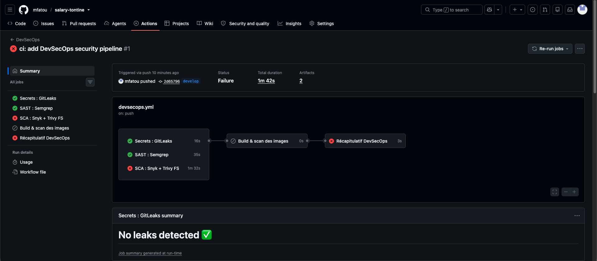

*Vue d'ensemble de l'exécution. Le graphe montre les trois contrôles parallèles, l'échec de*
`SCA : Snyk + Trivy FS`*, et l'icône de saut sur* `Build & scan des images`*. En bas, le résumé de
job de GitLeaks : « No leaks detected ».*

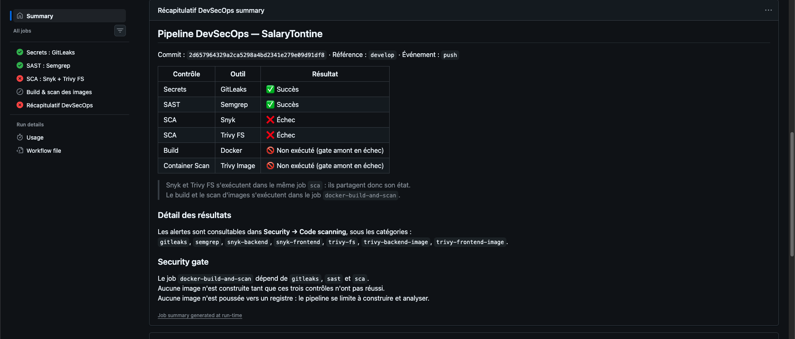

*Le récapitulatif produit par le job* `summary`*. Les six lignes reprennent l'état réel de chaque
job via* `needs.<job>.result`*. Les deux dernières portent « Non exécuté (gate amont en échec) »,
formulation qui distingue explicitement un saut d'un échec. Les sept catégories SARIF et le
fonctionnement du security gate y sont rappelés.*

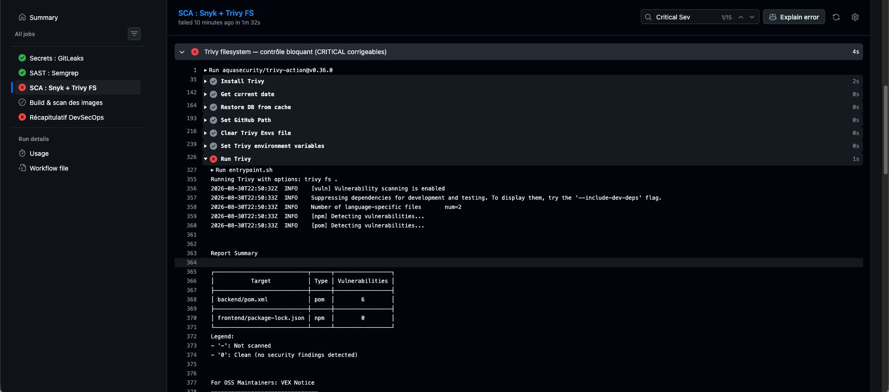

*Sortie du contrôle bloquant Trivy. Le tableau de synthèse distingue nettement les deux
écosystèmes : **6 vulnérabilités pour** `backend/pom.xml`, **0 pour** `frontend/package-lock.json`.
Le frontend est donc indemne au niveau des dépendances.*

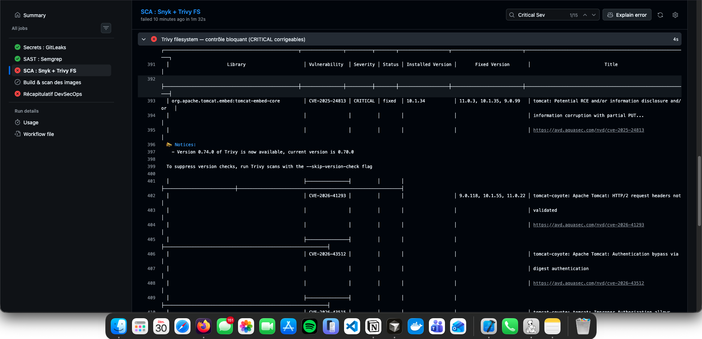

*Détail des vulnérabilités Tomcat. La colonne* `Installed Version` *indique* `10.1.34` *et la colonne*
`Fixed Version` *donne les versions correctives lorsqu'elles sont publiées.*

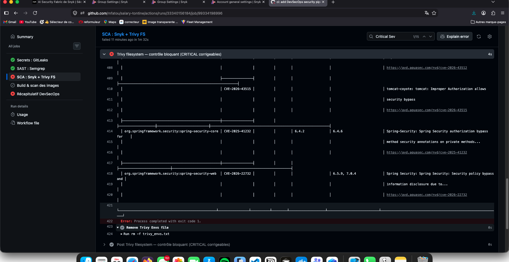

*Fin du tableau, avec les deux CVE Spring Security, puis la ligne décisive :*
`Error: Process completed with exit code 1`*. C'est cette sortie en erreur qui fait échouer le job*
`sca` *et bloque le build Docker.*

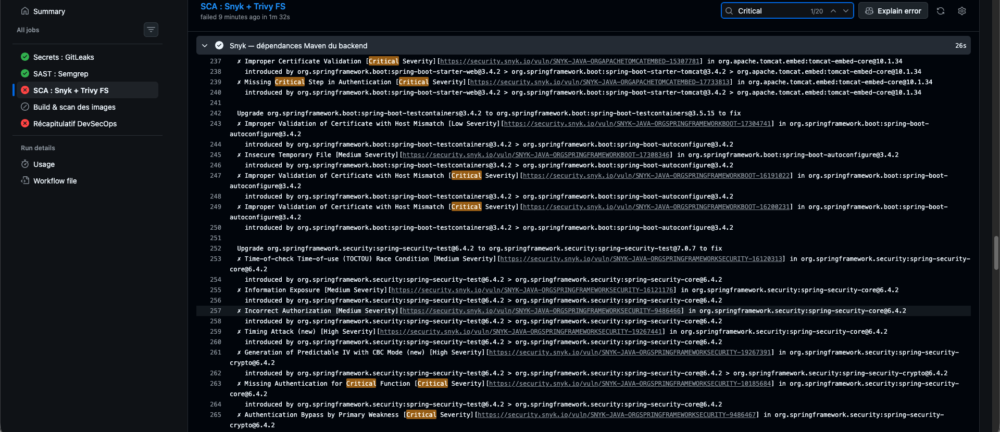

*Extrait du journal Snyk sur les dépendances Maven. Snyk raisonne sur le graphe de dépendances et
affiche pour chaque vulnérabilité la chaîne d'introduction — ici* `spring-security-test@6.4.2 > spring-security-core@6.4.2 > spring-security-crypto@6.4.2`*.*

#### Résultats Snyk — synthèse

Snyk a analysé les deux écosystèmes. Sur le backend Maven, il remonte un volume de findings
sensiblement plus élevé que Trivy, car il inclut les dépendances transitives et les dépendances
de test, et propose pour chacune une montée de version. Les composants concernés et les types de
vulnérabilités réellement observés sont les suivants.


| Composant                                 | Version | Vulnérabilités observées (extraits)                                                                                                                                                |
| ----------------------------------------- | ------- | ---------------------------------------------------------------------------------------------------------------------------------------------------------------------------------- |
| `spring-security-core`                    | 6.4.2   | Missing Authentication for Critical Function (**Critical**), Timing Attack (High), Incorrect Authorization (Medium), Information Exposure (Medium), TOCTOU Race Condition (Medium) |
| `spring-security-crypto`                  | 6.4.2   | Authentication Bypass by Primary Weakness (**Critical**), Generation of Predictable IV with CBC Mode (High)                                                                        |
| `jackson-databind`                        | 2.18.2  | Deserialization of Untrusted Data (**Critical**), Incomplete List of Disallowed Inputs (**Critical**), SSRF                                                                        |
| `tomcat-embed-core`                       | 10.1.34 | Improper Certificate Validation (**Critical**), Missing Critical Step in Authentication (**Critical**)                                                                             |
| `spring-boot-actuator` / `-autoconfigure` | 3.4.2   | Authentication Bypass Using an Alternate Path or Channel (**Critical**), Improper Validation of Certificate with Host Mismatch (**Critical**)                                      |
| `micrometer-core`                         | 1.14.3  | CRLF Injection (High), Allocation of Resources Without Limits (High), Missing Release of Memory (High)                                                                             |
| `commons-lang3`                           | 3.17.0  | Uncontrolled Recursion (High)                                                                                                                                                      |


Le journal complet n'est pas reproduit ici : il compte plusieurs centaines de lignes. Les deux
outils sont complémentaires — Trivy applique un filtre sévérité et corrigibilité qui en fait un
bon gate, Snyk fournit la chaîne d'introduction de chaque vulnérabilité, ce qui oriente la
remédiation vers la bonne dépendance racine.

#### Artefacts et annotations

Deux artefacts ont été produits : `gitleaks-results.sarif` (6,63 Ko) et `semgrep-sarif` (108 Ko).
Quatre annotations d'erreur figurent sur l'exécution, dont celle du contrôle bloquant Trivy et
celle du job `summary` reflétant l'état global.

#### GitHub Security — Code scanning

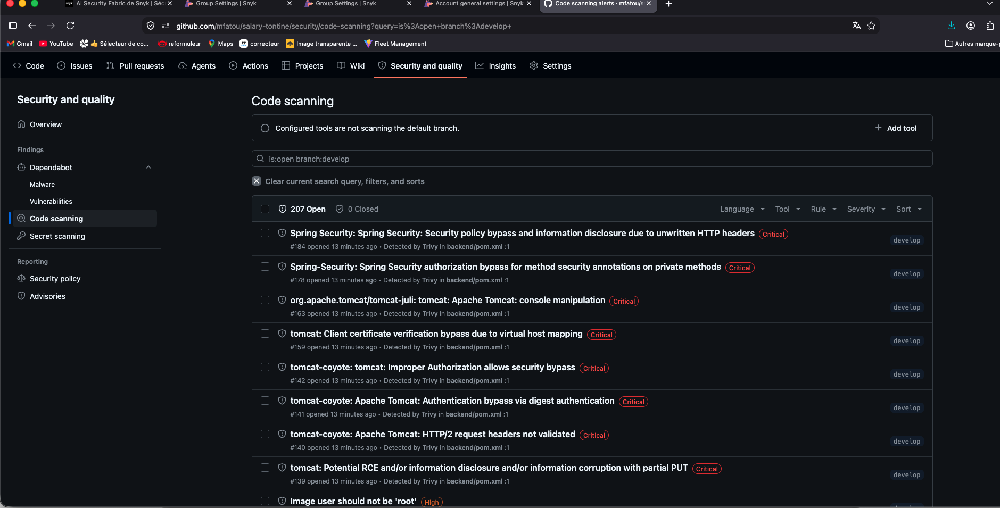

*Onglet Security → Code scanning, filtré sur* `is:open branch:develop`*. **207 alertes ouvertes,
0 fermée.** Les plus critiques sont détectées par Trivy dans* `backend/pom.xml`*, avec les intitulés
correspondant aux CVE analysées ci-dessous. Le bandeau « Configured tools are not scanning the
default branch » confirme que ce premier run a eu lieu sur* `develop` *et non sur* `main`*.*

Une observation complémentaire mérite d'être notée : la liste contient également un finding de
mauvaise configuration, `Image user should not be 'root'` (High), issu du scanner `misconfig` de
Trivy filesystem. Le Dockerfile du backend déclare pourtant bien un utilisateur non privilégié,
ce qui oriente vers le Dockerfile du frontend — **à confirmer en Partie 7**, la capture ne
permettant pas de lire le fichier concerné.

> **Capture finale GitHub Security → Code scanning à ajouter après exécution de la pipeline sur**
> `main`, une fois les corrections de la Partie 7 appliquées et au moins quatre alertes passées
> au statut *Fixed*. La capture ci-dessus, prise sur `develop`, constitue la preuve intermédiaire
> de l'état **avant** correction.

---


### 6.2 Analyse des CVE

Les six vulnérabilités retenues sont celles qui ont déclenché le contrôle bloquant : niveau
CRITICAL, corrigeable, détectées par Trivy dans `backend/pom.xml`.


| #   | CVE              | Package affecté                                     | Version vulnérable | Score CVSS                                                 | Vecteur d'attaque                                          | Version corrigée                                                               |
| --- | ---------------- | --------------------------------------------------- | ------------------ | ---------------------------------------------------------- | ---------------------------------------------------------- | ------------------------------------------------------------------------------ |
| 1   | `CVE-2025-24813` | `org.apache.tomcat.embed:tomcat-embed-core`         | 10.1.34            | À compléter après vérification de la fiche CVE officielle. | À compléter après vérification de la fiche CVE officielle. | 10.1.35, 11.0.3, 9.0.99                                                        |
| 2   | `CVE-2026-41293` | `org.apache.tomcat.embed:tomcat-embed-core`         | 10.1.34            | À compléter après vérification de la fiche CVE officielle. | À compléter après vérification de la fiche CVE officielle. | 10.1.55, 11.0.22, 9.0.118                                                      |
| 3   | `CVE-2026-43512` | `org.apache.tomcat.embed:tomcat-embed-core`         | 10.1.34            | À compléter après vérification de la fiche CVE officielle. | À compléter après vérification de la fiche CVE officielle. | Non affichée dans la sortie observée ; à compléter depuis la fiche officielle. |
| 4   | `CVE-2026-43515` | `org.apache.tomcat.embed:tomcat-embed-core`         | 10.1.34            | À compléter après vérification de la fiche CVE officielle. | À compléter après vérification de la fiche CVE officielle. | Non affichée dans la sortie observée ; à compléter depuis la fiche officielle. |
| 5   | `CVE-2025-41232` | `org.springframework.security:spring-security-core` | 6.4.2              | À compléter après vérification de la fiche CVE officielle. | À compléter après vérification de la fiche CVE officielle. | 6.4.6                                                                          |
| 6   | `CVE-2026-22732` | `org.springframework.security:spring-security-web`  | 6.4.2              | À compléter après vérification de la fiche CVE officielle. | À compléter après vérification de la fiche CVE officielle. | 6.5.9, 7.0.4                                                                   |


Les scores CVSS et les vecteurs d'attaque ne figurent pas dans la sortie Trivy telle qu'observée.
Ils ne sont volontairement pas renseignés : les inventer priverait ce tableau de toute valeur.
Ils seront complétés depuis les fiches officielles, accessibles via les liens
`https://avd.aquasec.com/nvd/<cve>` fournis par Trivy dans son rapport.

#### Intitulés relevés par Trivy


| CVE              | Intitulé                                                                                                   |
| ---------------- | ---------------------------------------------------------------------------------------------------------- |
| `CVE-2025-24813` | *tomcat: Potential RCE and/or information disclosure and/or information corruption with partial PUT*       |
| `CVE-2026-41293` | *tomcat-coyote: Apache Tomcat: HTTP/2 request headers not validated*                                       |
| `CVE-2026-43512` | *tomcat-coyote: Apache Tomcat: Authentication bypass via digest authentication*                            |
| `CVE-2026-43515` | *tomcat-coyote: tomcat: Improper Authorization allows security bypass*                                     |
| `CVE-2025-41232` | *Spring-Security: Spring Security authorization bypass for method security annotations on private methods* |
| `CVE-2026-22732` | *Spring Security: Security policy bypass and information disclosure due to unwritten HTTP headers*         |


#### Impact concret pour SalaryTontine

**Les quatre CVE Tomcat.** SalaryTontine expose son API HTTP via le Tomcat embarqué de Spring
Boot : ce composant est donc en première ligne, il traite chaque requête entrante avant même que
Spring Security n'intervienne. Les vulnérabilités touchant le traitement HTTP sont par
conséquent potentiellement pertinentes pour l'application — potentiellement, car chacune suppose
des préconditions particulières. `CVE-2025-24813` concerne le traitement des requêtes `PUT`
partielles ; `CVE-2026-41293` la validation des en-têtes HTTP/2 ; `CVE-2026-43512`
l'authentification *digest* ; `CVE-2026-43515` un contournement d'autorisation. Déterminer si ces
préconditions sont réunies dans la configuration exacte de SalaryTontine — méthodes HTTP
autorisées, activation ou non de HTTP/2, mécanisme d'authentification employé — demande une
lecture de chaque fiche officielle. **Ce travail n'a pas encore été fait et l'exploitabilité
n'est donc pas affirmée ici.** La remédiation, en revanche, est simple et connue : monter la
version de Tomcat, ce qui se fait en pratique en montant la version de Spring Boot.

**Les deux CVE Spring Security.** Elles méritent une attention particulière, car Spring Security
porte l'intégralité du contrôle d'accès de SalaryTontine : l'authentification par cookie JWT, les
annotations `@PreAuthorize` sur les routes de gestion, et la règle globale
`requestMatchers("/api/admin/**").hasRole("ADMIN")`. Une vulnérabilité de contournement
d'autorisation dans cette couche touche donc directement le mécanisme qui protège les salaires et
les opérations d'administration. `CVE-2025-41232` concerne spécifiquement les annotations de
sécurité appliquées à des méthodes privées — il faudra vérifier si le code du projet présente ce
motif. `CVE-2026-22732` porte sur des en-têtes HTTP non écrits, causant un contournement de
politique et une divulgation d'information. **Là encore, la présence de la dépendance vulnérable
est un fait établi ; l'exploitabilité dans notre configuration précise reste à vérifier
précondition par précondition.**

**Jackson.** `jackson-databind` 2.18.2, remonté par Snyk avec plusieurs vulnérabilités Critical
dont une désérialisation de données non fiables et une SSRF, est présent dans le projet **en
dépendance transitive**, introduite par `jjwt-jackson` pour la sérialisation des jetons JWT.

C'est ici que la distinction la plus importante de cette section doit être posée. Une
**dépendance vulnérable présente** n'équivaut pas à une **vulnérabilité exploitable dans notre
application**. Les vulnérabilités de désérialisation de Jackson supposent typiquement l'activation
du typage polymorphe — `enableDefaultTyping` ou l'annotation `@JsonTypeInfo`. Or l'analyse
manuelle de la Partie 3 a explicitement recherché ces constructions dans l'ensemble du backend :
`grep -rn "ObjectInputStream\|@JsonTypeInfo\|enableDefaultTyping"` sur `backend/src/main` n'a
retourné **aucune occurrence**. La configuration Jackson du projet se limite à un sérialiseur et
un désérialiseur explicites pour le type `YearMonth`. Le vecteur d'exploitation le plus courant
n'est donc pas ouvert dans SalaryTontine.

Cela ne signifie pas qu'il faille ignorer la dépendance : elle doit être mise à jour, et le
raisonnement ci-dessus repose sur l'état actuel du code, qu'une évolution future pourrait
invalider. Mais cela signifie que la **priorité** de cette remédiation n'est pas la même que
celle des CVE Spring Security, qui touchent une couche que l'application utilise activement. C'est
précisément le type d'arbitrage qu'un scanner ne peut pas faire seul, et qui justifie la
comparaison de la section suivante.

---


### 6.3 Comparaison Manuelle vs Automatisée


| Constat                                        | Manuel  | Semgrep | Snyk / Trivy | Analyse                                                                                                |
| ---------------------------------------------- | ------- | ------- | ------------ | ------------------------------------------------------------------------------------------------------ |
| C3 — Cookie sans attribut `Secure`             | Oui     | **Oui** | Non          | Convergence complète. Semgrep confirme le constat manuel par la règle R4, sur `AppProperties.java:115` |
| C8 — Protection CSRF désactivée                | Oui     | **Oui** | Non          | Convergence sur le fait, divergence sur la conclusion — voir ci-dessous                                |
| CVE Tomcat (4 CRITICAL)                        | Non     | Non     | **Oui**      | Hors de portée d'une lecture de code : exige une base de vulnérabilités                                |
| CVE Spring Security (2 CRITICAL)               | Non     | Non     | **Oui**      | Idem                                                                                                   |
| Vulnérabilités `jackson-databind`              | Non     | Non     | **Oui**      | Dépendance transitive, invisible dans le code du projet                                                |
| Vulnérabilités transitives diverses            | Non     | Non     | **Oui**      | Snyk fournit la chaîne d'introduction complète                                                         |
| C1 — Rôle figé dans le JWT                     | **Oui** | Non     | Non          | Exige de comprendre le cycle de vie du jeton et le modèle de rôles                                     |
| C5 — Absence de rate limiting                  | **Oui** | Non     | Non          | Exige de raisonner sur une absence, non sur un motif présent                                           |
| C4 — E-mails exposés sur tontines `DRAFT`      | **Oui** | Non     | Non          | Exige de comprendre la sémantique métier du statut `DRAFT`                                             |
| C6 — Échecs d'authentification non journalisés | **Oui** | Non     | Non          | Exige de savoir ce qui *devrait* être tracé                                                            |
| C2 — Pas de révocation serveur du JWT          | **Oui** | Non     | Non          | Exige de comprendre l'architecture d'authentification                                                  |


#### Trouvé par les deux approches

Deux constats seulement sont communs à l'analyse manuelle et à l'analyse automatisée, et ce sont
les deux findings des règles Semgrep personnalisées : la valeur par défaut `cookieSecure = false`
et la désactivation globale de CSRF. Les deux correspondent à un **motif syntaxique reconnaissable**
dans un fichier de configuration — exactement le terrain où un analyseur statique est performant.

Le cas de CSRF mérite d'être détaillé, car il illustre la limite de l'automatisation. Semgrep
détecte correctement le fait : `.csrf(AbstractHttpConfigurer::disable)` désactive bien la
protection, globalement. Mais l'analyse manuelle de la Partie 3 est allée plus loin en
établissant deux éléments que l'outil ne peut pas connaître. D'une part, le cookie
d'authentification porte `SameSite=Lax`, ce qui empêche le navigateur de l'émettre sur une requête
`POST`, `PATCH` ou `DELETE` inter-site. D'autre part — et c'est le point décisif — la vérification
des quarante-deux endpoints de l'API a montré qu'**aucune route** `GET` **ne modifie l'état**. Or
`Lax` n'émet le cookie que sur une navigation de premier niveau en `GET`. Il n'existe donc pas de
vecteur exploitable sur un navigateur à jour.

La conclusion n'est pas que Semgrep se trompe, mais que son signalement est **incomplet sans
interprétation humaine**. Le fait constaté est exact ; la qualification du risque exige une
connaissance de l'ensemble des routes que seul un examen manuel pouvait produire. C'est la raison
pour laquelle le message de la règle R5 intègre explicitement cette réserve.

#### Trouvé automatiquement, mais pas manuellement

Toutes les CVE relèvent de cette catégorie, sans exception. L'analyse manuelle de la Partie 3 n'en
a identifié aucune, et cela n'est pas une lacune de méthode : c'est une impossibilité structurelle.

Reconnaître que `tomcat-embed-core` 10.1.34 porte `CVE-2025-24813` suppose deux choses qu'aucune
lecture de code ne peut fournir. La première est une **base de vulnérabilités tenue à jour**,
recensant pour chaque composant et chaque version les défauts publiés — les CVE de 2026
concernées n'existaient d'ailleurs pas au moment où le code a été écrit. La seconde est la
capacité à **résoudre le graphe de dépendances complet**, y compris transitives : `pom.xml` ne
mentionne ni Tomcat, ni Jackson, ni Micrometer. Ces composants arrivent par
`spring-boot-starter-web`, `jjwt-jackson` et `spring-boot-starter-actuator`. Snyk affiche
d'ailleurs la chaîne d'introduction complète de chaque vulnérabilité, ce qui permet d'identifier
la dépendance racine sur laquelle agir.

Cette catégorie est donc le domaine propre du SCA, et elle justifie à elle seule sa présence dans
la pipeline : sans Snyk ni Trivy, ces six vulnérabilités CRITICAL seraient restées invisibles.

#### Trouvé manuellement, mais par aucun scanner

C'est la catégorie la plus instructive, et elle contient les constats les plus graves du rapport —
notamment **C1**, classé en tête de la Partie 3.

Aucun des scanners n'a signalé que le rôle est lu depuis le JWT sans jamais être relu en base, ce
qui rend une rétrogradation inopérante pendant une heure. Aucun n'a relevé l'absence de limitation
de débit sur `/api/auth/login`. Aucun n'a vu que l'exception de lecture accordée aux tontines
`DRAFT` expose les adresses e-mail des participants. Aucun n'a signalé que les échecs
d'authentification ne sont pas journalisés, ni l'absence de révocation serveur des jetons.

Ces angles morts ne sont pas fortuits ; ils partagent trois caractéristiques.

D'abord, **plusieurs de ces constats sont des absences**. Un analyseur statique reconnaît des
motifs présents dans le code : il ne peut pas signaler qu'un rate limiter, une trace d'audit ou un
mécanisme de révocation *manque*, car il faudrait pour cela savoir qu'ils devraient exister.

Ensuite, ils **exigent la compréhension de la logique métier**. Que le statut `DRAFT` d'une tontine
ouvre volontairement la lecture aux non-participants est une décision de conception légitime ;
qu'elle expose au passage les adresses e-mail à travers un DTO partagé est un effet de bord que
seule la lecture conjointe du service, du mapper et du DTO permet de saisir.

Enfin, ils **portent sur des interactions entre composants**, non sur une ligne isolée. C1 ne
devient un problème qu'en rapprochant trois éléments : le rôle inscrit dans le jeton à
l'émission, le filtre qui ne relit que le statut, et l'existence d'un endpoint de modification de
rôle. Chacun de ces éléments, pris séparément, est parfaitement anodin.

#### Conclusion de la comparaison

Les deux approches ne se recouvrent que sur deux constats, et se complètent sur tout le reste. Le
SCA a apporté six vulnérabilités CRITICAL qu'aucune relecture n'aurait pu produire ; l'analyse
manuelle a apporté cinq constats structurels qu'aucun scanner n'a vus, dont le plus grave du
rapport. Le SAST, lui, a confirmé deux constats déjà établis — et son second signalement a exigé
une interprétation humaine pour être correctement qualifié.

C'est précisément ce résultat qui justifie l'ordre de travail suivi dans cet examen : l'analyse
manuelle a été conduite **avant** toute exécution d'outil, sur un code non corrigé. Menée après
lecture des rapports, elle se serait très probablement limitée à confirmer ce que les outils
avaient déjà trouvé, et les cinq constats de la troisième catégorie n'auraient sans doute jamais
émergé.

---


## 7. Corrections et Validation

### 7.1 Corrections Appliquées

Six corrections techniques ont été appliquées, au-delà du minimum de quatre exigé. Elles
répondent aux constats de la Partie 3 et aux findings des Parties 4 et 6. Le code demeurait
jusqu'ici dans son état d'origine ; c'est cette section qui documente son passage à l'état
corrigé, et la comparaison avant / après s'appuie sur les deux exécutions réelles de la pipeline.

---

#### Correction 1 — Dépendances vulnérables

| | |
|---|---|
| **Vulnérabilité** | Six CVE CRITICAL dans les dépendances du backend — celles qui bloquaient le security gate |
| **Constat d'origine** | Partie 6.2, détecté par Trivy et Snyk lors de `DevSecOps #1` |
| **Fichier** | `backend/pom.xml` |

**Avant.** Le projet reposait sur le parent `spring-boot-starter-parent` 3.4.2, qui gérait par son
BOM l'ensemble des composants vulnérables :

```xml
<parent>
    <groupId>org.springframework.boot</groupId>
    <artifactId>spring-boot-starter-parent</artifactId>
    <version>3.4.2</version>
</parent>
```

| Artefact | Version résolue avant |
|---|---|
| `org.apache.tomcat.embed:tomcat-embed-core` | 10.1.34 |
| `org.springframework.security:spring-security-core` | 6.4.2 |
| `org.springframework.security:spring-security-web` | 6.4.2 |
| `org.springframework.security:spring-security-crypto` | 6.4.2 |
| `com.fasterxml.jackson.core:jackson-databind` | 2.18.2 |

**Après.** Le parent est monté à 3.5.16, dernière version de la ligne 3.5.x :

```xml
<parent>
    <groupId>org.springframework.boot</groupId>
    <artifactId>spring-boot-starter-parent</artifactId>
    <version>3.5.16</version>
</parent>
```

| Artefact | Version résolue après |
|---|---|
| `tomcat-embed-core` | **10.1.55** |
| `spring-security-core` | **6.5.11** |
| `spring-security-web` | **6.5.11** |
| `spring-security-crypto` | **6.5.11** |
| `jackson-databind` | **2.21.5** |
| `micrometer-core` | 1.15.12 |
| `springdoc-openapi-starter-webmvc-ui` | 2.8.17 |

Quatre montées complémentaires ont été appliquées par **surcharge de propriétés exposées par le
parent**, mécanisme officiel de Spring Boot pour appliquer un correctif avant le patch suivant.
La version reste gérée par le BOM ; seule sa valeur est avancée, et chaque montée demeure dans la
même ligne mineure :

```xml
<postgresql.version>42.7.12</postgresql.version>
<jackson-bom.version>2.21.5</jackson-bom.version>
<log4j2.version>2.25.5</log4j2.version>
<commons-lang3.version>3.18.0</commons-lang3.version>
```

**Explication technique.** Les cinq artefacts vulnérables étaient tous gérés par le BOM Spring
Boot, aucun n'était déclaré directement dans le `pom.xml`. Une montée cohérente du parent était
donc la correction juste, et non une série d'exclusions ou de surcharges arbitraires.

Le choix de la version cible a été établi sur des faits vérifiés, non sur les recommandations
brutes des outils. Snyk proposait notamment de passer `spring-security-test` de 6.4.2 à 7.0.7.
Cette suggestion a été écartée : Spring Security 7 appartient à la ligne Spring Boot 4, et
l'introduire dans une application Spring Boot 3.x aurait rompu la cohérence du BOM sans garantie
de compatibilité. La ligne 3.x a donc été conservée.

Le choix de 3.5.16 plutôt que de la dernière 3.4.x s'appuie sur la comparaison des propriétés des
deux BOM. La dernière 3.4.x aurait été **insuffisante** : elle plafonne à Tomcat 10.1.50 et
Spring Security 6.4.13, soit en deçà des seuils correctifs requis — `CVE-2026-41293` exige Tomcat
10.1.55 et `CVE-2026-22732` exige Spring Security 6.5.9. Seule la ligne 3.5.x franchissait ces
deux seuils.

**CVE CRITICAL initialement bloquantes, résolues :**

| CVE | Composant | Résolue par |
|---|---|---|
| `CVE-2025-24813` | `tomcat-embed-core` | 10.1.34 → 10.1.55 |
| `CVE-2026-41293` | `tomcat-embed-core` | 10.1.34 → 10.1.55 |
| `CVE-2026-43512` | `tomcat-embed-core` | 10.1.34 → 10.1.55 |
| `CVE-2026-43515` | `tomcat-embed-core` | 10.1.34 → 10.1.55 |
| `CVE-2025-41232` | `spring-security-core` | 6.4.2 → 6.5.11 |
| `CVE-2026-22732` | `spring-security-web` | 6.4.2 → 6.5.11 |

La revalidation locale a fait apparaître six vulnérabilités supplémentaires corrigeables, de
niveau HIGH et MEDIUM, également traitées : `CVE-2026-54291` (PostgreSQL), `CVE-2026-54515`,
`CVE-2026-59889` et `GHSA-mhm7-754m-9p8w` (Jackson), `CVE-2026-49844` (Log4j2) et `CVE-2025-48924`
(commons-lang3).

**Une précision de comptage s'impose ici.** Douze CVE ont été résolues au total, mais cela ne
constitue **pas douze corrections de code distinctes**. Il s'agit essentiellement d'**une seule
correction technique** — la remise à niveau cohérente du socle de dépendances — complétée de
quatre avancées de propriétés. Présenter ce résultat comme douze corrections serait un artifice
de comptage : les quatre CVE Tomcat, par exemple, disparaissent toutes par la même montée de
version.

**Validation.**

| Méthode | Résultat |
|---|---|
| `mvn dependency:tree` | Les cinq artefacts cibles résolus aux versions corrigées |
| `mvn test` | 216 tests, 0 échec, 0 erreur |
| `mvn verify` | BUILD SUCCESS, artefact produit |
| Trivy FS local | 0 vulnérabilité corrigeable, toutes sévérités confondues |
| Pipeline `DevSecOps #3` | Job `sca` en succès, gate franchi |

---

#### Correction 2 — Rôle obsolète conservé dans le JWT

| | |
|---|---|
| **Vulnérabilité** | **C1** — le rôle porté par le jeton servait d'autorité effective |
| **Catégorie** | A01:2021 Broken Access Control · CWE-613 |
| **Sévérité** | High — constat classé en tête de la Partie 3 |
| **Fichiers** | `JwtAuthenticationFilter.java`, `UserRepository.java`, `JwtRoleRefreshIntegrationTest.java` |

**Avant.** Le filtre interrogeait la base pour vérifier le statut du compte, mais reconstruisait
le principal à partir du rôle inscrit dans le jeton :

```java
// JwtAuthenticationFilter.java — avant
if (!userRepository.existsByIdAndStatus(payload.userId(), UserStatus.ACTIVE)) {
    return;
}
AuthenticatedUser principal =
        new AuthenticatedUser(payload.userId(), payload.email(), null, payload.role());
```

```java
// UserRepository.java — avant
boolean existsByIdAndStatus(Long id, UserStatus status);
```

**Après.** L'utilisateur actif est réellement chargé, et le principal est construit à partir de
l'entité en base :

```java
// JwtAuthenticationFilter.java — après
User user = userRepository.findByIdAndStatus(payload.userId(), UserStatus.ACTIVE).orElse(null);
if (user == null) {
    return;
}
// Le hash du mot de passe reste hors du contexte de sécurité.
AuthenticatedUser principal =
        new AuthenticatedUser(user.getId(), user.getEmail(), null, user.getRole());
```

```java
// UserRepository.java — après
Optional<User> findByIdAndStatus(Long id, UserStatus status);
```

**Explication technique.** Le jeton prouve l'identité ; il ne décide plus des droits. Un
`ACCOUNTANT` rétrogradé en `EMPLOYEE` perd désormais ses privilèges dès la requête suivante, sans
attendre l'expiration de son jeton. Auparavant, la rétrogradation était bien enregistrée et
auditée mais restait sans effet pendant une heure — la valeur de `JWT_EXPIRATION_SECONDS` — soit
une fenêtre durant laquelle l'intéressé pouvait encore consulter tous les salaires, arbitrer des
adhésions et déclencher des prélèvements.

Deux nuances méritent d'être conservées. D'abord, **le jeton reste vérifié
cryptographiquement** : la signature HMAC-SHA, l'identifiant et l'expiration sont contrôlés comme
avant. Seul le rôle effectif est rafraîchi depuis la source de vérité. Ensuite, **la correction
ne coûte rien** : le filtre effectuait déjà un aller-retour vers la base pour vérifier le statut.
Remplacer `existsByIdAndStatus` par `findByIdAndStatus` conserve exactement une requête par
requête HTTP.

**Validation.** `JwtRoleRefreshIntegrationTest`, trois tests. Le scénario principal reproduit
exactement la situation décrite :

1. un `ACCOUNTANT` se connecte réellement et obtient son cookie ;
2. `GET /api/employees` — route réservée aux gestionnaires — répond **200** ;
3. le rôle est modifié en `EMPLOYEE` directement en base ;
4. **le même cookie**, inchangé, est réutilisé ;
5. `GET /api/employees` répond désormais **403** ;
6. `GET /api/salaries/me` répond **200**.

La sixième étape est celle qui distingue une correction d'une simple invalidation : la session
reste valide, seuls les droits ont changé. Les deux autres tests couvrent la promotion inverse —
un `EMPLOYEE` promu gagne l'accès immédiatement — et la suspension d'un compte, qui coupe l'accès
malgré un jeton valide.

---

#### Correction 3 — Cookie JWT sûr par défaut

| | |
|---|---|
| **Vulnérabilité** | **C3** — attribut `Secure` à `false` par défaut · finding Semgrep **R4** |
| **Catégorie** | A02:2021 Cryptographic Failures · CWE-614 |
| **Fichiers** | `AppProperties.java`, `application.yml`, `docker-compose.yml`, `.env.example`, `README.md` |

**Avant.** La valeur par défaut était `false` à trois niveaux :

```java
// AppProperties.java
private boolean cookieSecure = false;
```
```yaml
# application.yml
cookie-secure: ${JWT_COOKIE_SECURE:false}
```
```yaml
# docker-compose.yml
JWT_COOKIE_SECURE: ${JWT_COOKIE_SECURE:-false}
```

**Après.** Les trois niveaux sont alignés sur la valeur protectrice :

```java
// AppProperties.java
private boolean cookieSecure = true;
```
```yaml
# application.yml
cookie-secure: ${JWT_COOKIE_SECURE:true}
```
```yaml
# docker-compose.yml
JWT_COOKIE_SECURE: ${JWT_COOKIE_SECURE:-true}
```

**Explication technique.** C'est l'application du principe *secure by default*. Ce qui était en
cause n'était pas une exploitation actuelle — l'application ne dispose d'aucun déploiement de
production — mais un défaut qui n'était pas sûr : un déploiement qui aurait omis de renseigner
`JWT_COOKIE_SECURE` héritait silencieusement d'un cookie transmissible en clair sur HTTP. Un
oubli de variable d'environnement suffisait à créer la vulnérabilité. L'inversion du défaut
renverse la charge : c'est désormais l'affaiblissement qui exige une action délibérée.

Le développement local en HTTP reste possible, mais uniquement par déclaration explicite de
`JWT_COOKIE_SECURE=false`. La documentation a été alignée : `.env.example` et le tableau des
variables du `README.md` indiquent le nouveau défaut.

**Validation.**

| Méthode | Résultat |
|---|---|
| `JwtCookieServiceTest` | 4 tests : le défaut est `true`, `Secure`/`HttpOnly`/`SameSite` présents, `Secure` omis seulement sur configuration explicite, cookie de déconnexion cohérent |
| Semgrep R4 `salarytontine-insecure-auth-cookie` | **0 finding** — le motif `boolean *secure* = false` a disparu du code |

---

#### Correction 4 — Limitation de débit sur l'authentification

| | |
|---|---|
| **Vulnérabilité** | **C5** — aucune limitation sur `/api/auth/login` ni `/api/auth/register` |
| **Catégorie** | A07:2021 Identification and Authentication Failures · CWE-307 |
| **Sévérité** | High |
| **Fichiers** | `AuthRateLimitFilter.java` *(créé)*, `SecurityConfig.java`, `AppProperties.java`, `application.yml`, `.env.example`, `AuthRateLimitIntegrationTest.java` *(créé)* |

**Avant.** Aucun mécanisme. Une recherche sur l'ensemble du backend et du `pom.xml` ne retournait
aucune occurrence de limitation, et `AuthenticatedUser.isAccountNonLocked()` retournait `true` en
dur, neutralisant le verrouillage pourtant prévu par Spring Security.

**Après.** Un filtre dédié, `AuthRateLimitFilter`, **sans nouvelle dépendance** :

```java
private boolean isWithinQuota(String key, long window) {
    Counter updated = counters.compute(key, (ignored, current) ->
            (current == null || current.window() != window)
                    ? new Counter(window, 1)
                    : new Counter(window, current.attempts() + 1));

    pruneIfNeeded(window);
    return updated.attempts() <= properties.getMaxAttempts();
}
```

Enregistré en tête de la chaîne de sécurité :

```java
// SecurityConfig.java
.addFilterBefore(authRateLimitFilter, UsernamePasswordAuthenticationFilter.class)
.addFilterBefore(jwtAuthenticationFilter, UsernamePasswordAuthenticationFilter.class);
```

**Explication technique.**

Le filtre ne s'applique qu'aux deux points d'entrée publics d'authentification, en `POST`. La clé
de comptage associe **l'adresse distante et le chemin** : `/login` et `/register` disposent donc
de quotas indépendants, et la saturation de l'un ne ferme pas l'autre.

Le compteur est une **fenêtre fixe en mémoire**. Chaque clé est mise à jour par
`ConcurrentHashMap.compute()`, atomique pour une clé donnée : il n'y a ni verrou global, ni
variable partagée non protégée. Les fenêtres échues sont purgées au-delà de dix mille clés
suivies, pour que le mécanisme de défense ne devienne pas lui-même un vecteur d'épuisement
mémoire sous campagne distribuée.

Un dépassement produit un **HTTP 429** accompagné d'un en-tête `Retry-After`. Le filtre **ne lit
jamais le corps de la requête** : le mot de passe soumis ne transite par aucune de ses traces,
qui ne mentionnent que le chemin et l'adresse d'origine.

Le placement en tête de chaîne est délibéré : une requête au-delà du quota est rejetée **avant
tout traitement coûteux**. BCrypt en coût 12 est volontairement lent, propriété excellente contre
le cassage hors ligne mais qui, sans plafond, faisait de chaque tentative un coût serveur
exploitable. Une requête rejetée ne déclenche désormais aucun hachage.

L'adresse distante réelle sert de clé, jamais un en-tête fourni par le client. `X-Forwarded-For`
est trivialement falsifiable et permettrait de contourner la limite à chaque requête ; derrière
un proxy de confiance, c'est à `server.forward-headers-strategy` de reconstituer l'adresse
d'origine avant que le filtre ne s'exécute.

Les seuils sont externalisés — `APP_RATE_LIMIT_ENABLED`, `APP_RATE_LIMIT_MAX_ATTEMPTS`,
`APP_RATE_LIMIT_WINDOW_SECONDS` — avec pour valeurs par défaut dix tentatives par fenêtre de
soixante secondes.

**Limite assumée de cette solution.** Le compteur est **local à l'instance**. Il convient au
contexte de SalaryTontine, application académique déployée en instance unique, et il a l'avantage
de n'introduire ni dépendance ni infrastructure supplémentaire — donc aucune surface d'attaque ni
CVE additionnelle. Dans une architecture multi-instance derrière un répartiteur de charge, le
quota serait appliqué indépendamment par chaque nœud et le plafond effectif se trouverait
multiplié par leur nombre. Un tel déploiement exigerait un stockage partagé, Redis par exemple,
ou une limitation portée par la passerelle en amont. Ce n'est pas une solution distribuée et elle
n'est pas présentée comme telle.

**Validation.** `AuthRateLimitIntegrationTest`, cinq tests :

| Test | Vérification |
|---|---|
| Usage normal | Trois connexions réussies consécutives, aucune n'est bloquée |
| Dépassement sur `/login` | Onzième tentative → **429** avec `Retry-After` |
| Dépassement sur `/register` | Onzième tentative → **429** |
| Quotas indépendants | `/login` saturé, `/register` répond toujours **201** |
| Portée du filtre | `/api/dashboard` non limitée, quinze appels consécutifs |

La limitation reste **active pendant les 216 tests** de la suite : `AbstractIntegrationTest`
remet le compteur à zéro avant chaque test plutôt que de désactiver le mécanisme. Le fait que
l'ensemble passe démontre que la protection n'entrave pas l'usage légitime de l'application.

---

#### Correction 5 — Journalisation des échecs d'authentification

| | |
|---|---|
| **Vulnérabilité** | **C6** — aucun échec d'authentification tracé |
| **Catégorie** | A09:2021 Security Logging and Monitoring Failures · CWE-778 |
| **Fichiers** | `AuthService.java`, `AuthServiceTest.java` |

**Avant.** L'inscription réussie était tracée, mais l'échec de connexion ne produisait ni trace
d'audit ni journal applicatif :

```java
User user = userRepository.findByEmailIgnoreCase(normalizeEmail(request.email()))
        .orElseThrow(() -> new BadCredentialsException(INVALID_CREDENTIALS_MESSAGE));

if (!passwordEncoder.matches(request.password(), user.getPasswordHash())) {
    throw new BadCredentialsException(INVALID_CREDENTIALS_MESSAGE);
}
```

**Après.** Trois points d'échec journalisés en `WARN` :

```java
String email = normalizeEmail(request.email());

User user = userRepository.findByEmailIgnoreCase(email)
        .orElseThrow(() -> {
            log.warn("Échec d'authentification : aucun compte pour l'adresse {}", email);
            return new BadCredentialsException(INVALID_CREDENTIALS_MESSAGE);
        });

if (!passwordEncoder.matches(request.password(), user.getPasswordHash())) {
    log.warn("Échec d'authentification : mot de passe invalide pour le compte {}", email);
    throw new BadCredentialsException(INVALID_CREDENTIALS_MESSAGE);
}
```

Le troisième cas, le compte non actif, est tracé dans `requireActiveAccount`.

**Explication technique.** Combinée à l'absence de limitation, l'absence de trace rendait une
campagne de force brute totalement silencieuse : après une compromission, l'analyse ne pouvait ni
dater l'intrusion, ni identifier la source. Les deux corrections se complètent — le rate limiting
freine, la journalisation rend visible.

Deux choix de conception méritent d'être explicités.

**Aucune donnée sensible n'est journalisée.** Le mot de passe soumis, le JWT et les secrets
n'apparaissent nulle part. Seuls l'adresse concernée et la nature de l'échec sont tracés.

**Aucune insertion dans `audit_logs`.** L'approche retenue est un journal applicatif, pas une
entrée d'audit métier. La raison est directement sécuritaire : une trace en base pour chaque
tentative anonyme permettrait à un attaquant de gonfler indéfiniment une table métier, transformant
la mesure de détection en vecteur de déni de service. Le choix évite en outre de créer une entrée
d'audit dépendant d'un `User` qui n'existe pas lorsque l'adresse est inconnue.

**La réponse HTTP demeure neutre.** Le journal serveur distingue « compte inconnu » de « mot de
passe invalide », mais l'API continue de renvoyer le même message dans les deux cas. La
distinction sert l'exploitant, jamais l'attaquant.

**Validation.** Quatre tests ajoutés à `AuthServiceTest`, s'appuyant sur un `ListAppender`
Logback qui capture les événements émis :

| Test | Vérification |
|---|---|
| Compte inconnu | Une trace `WARN`, contenant l'adresse, **sans le mot de passe** |
| Mot de passe erroné | Une trace `WARN`, contenant l'adresse, **sans le mot de passe** |
| Trois mots de passe différents | **Aucune trace ne contient l'un d'eux**, quel qu'il soit |
| Authentification réussie | **Aucune trace** émise |

---

#### Correction 6 — Conteneur frontend exécuté en root

| | |
|---|---|
| **Vulnérabilité** | Alerte Trivy `DS-0002` — *Image user should not be 'root'* (High) |
| **Origine** | Relevée dans Code Scanning lors de `DevSecOps #1`, sans que la capture permette d'identifier le fichier |
| **Fichiers** | `frontend/Dockerfile`, `frontend/nginx.conf`, `docker-compose.yml` |

**Identification de la source.** L'inspection des deux Dockerfiles a tranché : le backend
déclarait déjà `USER salarytontine`, tandis que le frontend s'appuyait sur `nginx:1.27-alpine`
sans aucune directive `USER`, donc en root. L'alerte fermée `#207` du run après correction
confirme cette attribution : elle porte explicitement sur `frontend/Dockerfile`.

**Avant.**

```dockerfile
FROM nginx:1.27-alpine AS runtime

COPY --from=build /build/dist /usr/share/nginx/html
COPY nginx.conf /etc/nginx/conf.d/default.conf

EXPOSE 80

HEALTHCHECK --interval=30s --timeout=3s --start-period=5s --retries=3 \
    CMD wget -qO- http://127.0.0.1/ >/dev/null 2>&1 || exit 1
```

**Après.**

```dockerfile
FROM nginxinc/nginx-unprivileged:1.27-alpine AS runtime

COPY --from=build /build/dist /usr/share/nginx/html
COPY nginx.conf /etc/nginx/conf.d/default.conf

USER 101

EXPOSE 8080

HEALTHCHECK --interval=30s --timeout=3s --start-period=5s --retries=3 \
    CMD wget -qO- http://127.0.0.1:8080/ >/dev/null 2>&1 || exit 1
```

Le changement de port est une conséquence directe, non un choix arbitraire : un processus non
privilégié ne peut pas ouvrir un port inférieur à 1024. Il a été propagé de façon cohérente à
`nginx.conf` (`listen 8080`), à `EXPOSE`, au `HEALTHCHECK` et à `docker-compose.yml`
(`"5173:8080"`). **Le port publié vers l'hôte reste 5173** : ni le `Makefile`, ni le `README`, ni
aucune procédure de développement n'ont eu à changer.

**Pourquoi un `USER 101` explicite alors que l'image de base l'applique déjà.** Après le passage
à l'image non privilégiée, Trivy continuait de signaler `DS-0002`. Son analyseur de configuration
est **statique** : il lit le Dockerfile sans résoudre l'image de base, et exige donc une directive
`USER` dans le fichier lui-même.

Répéter la directive n'est pas un contournement de scanner, c'est une amélioration réelle. Le
Dockerfile porte désormais lui-même sa garantie : la propriété devient lisible sans connaître
l'image de base, et un futur changement de base ne peut plus ramener le conteneur à root en
silence — il faudrait retirer une ligne explicite pour cela.

**Le backend n'était pas concerné.** Il déclarait déjà `USER salarytontine` et s'exécutait en
`uid=100`. Un `HEALTHCHECK` lui a été ajouté, ce qui répond à l'alerte `DS-0026` (LOW) et rend
l'image auto-descriptive pour un orchestrateur autre que Compose. **C'est un durcissement
complémentaire, pas la correction d'une vulnérabilité majeure.**

**Validation.**

| Méthode | Résultat |
|---|---|
| Build des deux images | OK |
| `docker inspect` backend | `Config.User = salarytontine` |
| Exécution backend | `uid=100(salarytontine) gid=101(salarytontine)` |
| `docker inspect` frontend | `Config.User = 101` |
| Exécution frontend | `uid=101(nginx) gid=101(nginx)` |
| Requête sur le conteneur frontend | `GET /` → **HTTP 200** sur le port 8080 |
| Trivy misconfiguration | **0** sur `backend/Dockerfile` et **0** sur `frontend/Dockerfile` |
| Code Scanning | Alerte `#207` fermée en *fixed* |

---

#### Tableau synthétique des corrections

| # | Correction | Avant | Après | Validation |
|---|---|---|---|---|
| 1 | **Dépendances vulnérables** — 6 CVE CRITICAL bloquantes | Spring Boot 3.4.2 · Tomcat 10.1.34 · Spring Security 6.4.2 · Jackson 2.18.2 | Spring Boot 3.5.16 · Tomcat 10.1.55 · Spring Security 6.5.11 · Jackson 2.21.5 | `dependency:tree`, `mvn verify`, Trivy FS **0 vulnérabilité**, gate franchi |
| 2 | **Rôle figé dans le JWT** (C1, CWE-613) | Principal construit avec `payload.role()` | Principal construit avec `user.getRole()`, relu en base | `JwtRoleRefreshIntegrationTest` — 403 après rétrogradation, même cookie |
| 3 | **Cookie non `Secure` par défaut** (C3, CWE-614) | `cookieSecure = false` sur trois niveaux | `true` par défaut, `false` sur déclaration explicite | `JwtCookieServiceTest` · Semgrep R4 **0 finding** |
| 4 | **Aucune limitation d'authentification** (C5, CWE-307) | Aucun plafond sur `/login` ni `/register` | Filtre dédié, 10 tentatives/60 s, **HTTP 429** | `AuthRateLimitIntegrationTest` — 5 tests |
| 5 | **Échecs d'authentification non tracés** (C6, CWE-778) | Aucune trace, aucun journal | Trois points tracés en `WARN`, sans donnée sensible | `AuthServiceTest` — 4 tests Logback |
| 6 | **Conteneur frontend en root** (Trivy `DS-0002`, High) | `nginx:1.27-alpine`, aucun `USER`, port 80 | `nginx-unprivileged`, `USER 101`, port 8080 | `uid=101(nginx)` · HTTP 200 · Trivy misconfig **0** · alerte `#207` *fixed* |

**Six corrections techniques**, pour un minimum de quatre exigé.

---

#### Validation globale après correction

**Backend**

| Contrôle | Résultat |
|---|---|
| `mvn test` | **216 tests, 0 échec, 0 erreur** — contre 200 avant, soit 16 tests ajoutés |
| `mvn verify` | **BUILD SUCCESS**, artefact `salary-tontine-backend-1.0.0.jar` produit |

**Frontend**

| Contrôle | Résultat |
|---|---|
| `npm ci` | 0 vulnérabilité signalée |
| `npm test` | **66 tests**, 12 fichiers, tous au vert |
| `npm run build` | 149 modules transformés, build réussi |
| Trivy sur `frontend/package-lock.json` | 0 vulnérabilité — déjà le cas avant correction |

**Semgrep — règles personnalisées**

| Règle | Avant | Après |
|---|---|---|
| R1 — Injection SQL / JPQL | 0 | **0** |
| R2 — Injection de commande | 0 | **0** |
| R3 — Secret codé en dur | 0 | **0** |
| R4 — Cookie non `Secure` | **1** | **0** — corrigé |
| R5 — CSRF désactivée | 1 | **1** — conservé volontairement |
| R6 — XSS React | 0 | **0** |

**Trivy**

| Contrôle | Avant | Après |
|---|---|---|
| Vulnérabilités CRITICAL corrigeables | **6** | **0** |
| Vulnérabilités corrigeables, toutes sévérités | 12 | **0** |
| Misconfiguration `backend/Dockerfile` | 1 (LOW) | **0** |
| Misconfiguration `frontend/Dockerfile` | 1 (HIGH) | **0** |
| Code de sortie du gate `exit-code: '1'` | **1** — bloqué | **0** — franchi |

**Docker**

| Image | Build | Utilisateur d'exécution |
|---|---|---|
| `salary-tontine-backend` | OK | `uid=100(salarytontine)` — déjà non-root avant |
| `salary-tontine-frontend` | OK | `uid=101(nginx)` — corrigé |

---

#### Exécution GitHub Actions après correction

L'exécution `DevSecOps #3` porte le commit `dca42c4` sur la branche `develop`.

**Résultat global : SUCCESS**, en 5 min 27 s, avec 5 artefacts produits.

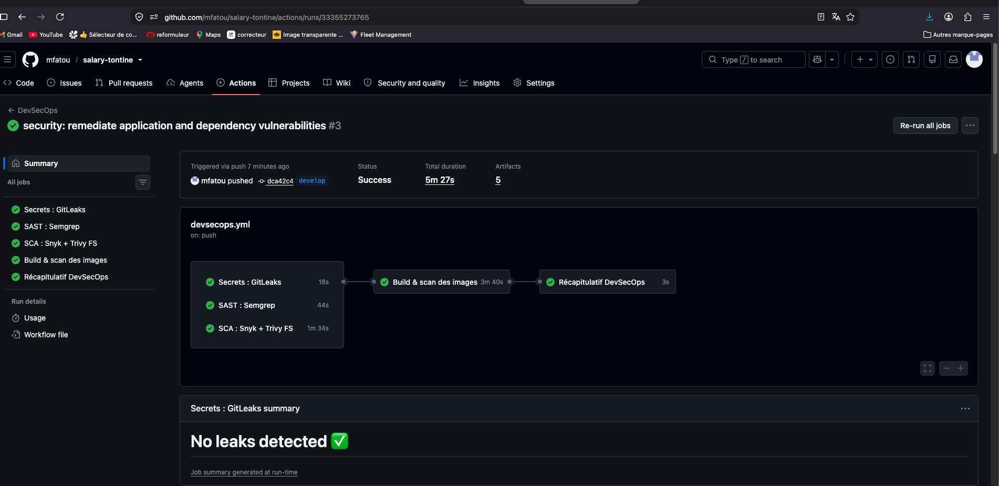

*Exécution `DevSecOps #3` — statut **Success**. Les cinq jobs sont au vert : `Secrets : GitLeaks`
(18 s), `SAST : Semgrep` (44 s), `SCA : Snyk + Trivy FS` (1 min 34 s), `Build & scan des images`
(3 min 40 s) et `Récapitulatif DevSecOps` (3 s). Le graphe montre que le job de build, jusque-là
sauté, s'exécute désormais après le franchissement du gate. GitLeaks confirme à nouveau
« No leaks detected ».*

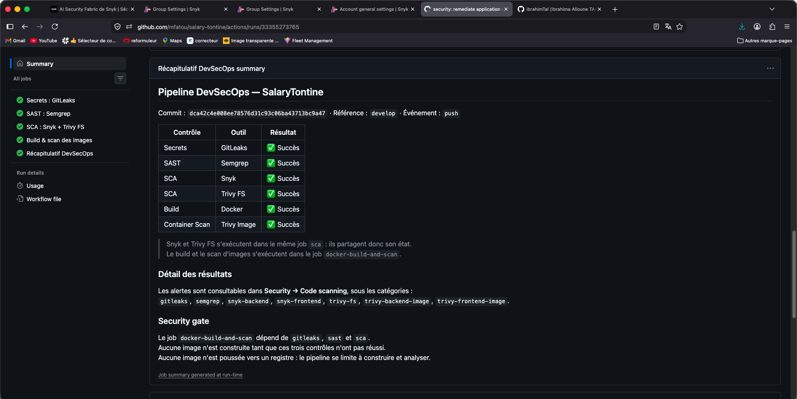

*Le récapitulatif produit par le job `summary` : les six lignes affichent **Succès**, y compris
`Build | Docker` et `Container Scan | Trivy Image`, qui portaient « Non exécuté (gate amont en
échec) » lors du premier run.*

**Comparaison avant / après**

| | `DevSecOps #1` — avant | `DevSecOps #3` — après |
|---|---|---|
| Commit | `2d65796` | `dca42c4` |
| **Résultat global** | **FAILURE** | **SUCCESS** |
| Durée | 1 min 42 s | 5 min 27 s |
| Artefacts | 2 | **5** |
| Secrets — GitLeaks | SUCCESS | SUCCESS |
| SAST — Semgrep | SUCCESS | SUCCESS |
| SCA — Snyk + Trivy FS | **FAILURE** — 6 CRITICAL | **SUCCESS** |
| Build Docker | **SKIPPED** — gate non franchi | **SUCCESS** |
| Scan d'images — Trivy | **SKIPPED** | **SUCCESS** |
| Récapitulatif | **FAILURE** | SUCCESS |

L'écart de durée et le nombre d'artefacts sont significatifs : lors du premier run, la chaîne
s'arrêtait au gate et ne produisait que deux rapports, ceux de GitLeaks et de Semgrep. Le
franchissement du gate ajoute la construction des deux images et leurs deux rapports d'analyse.

---

#### Alertes passées au statut *Fixed*

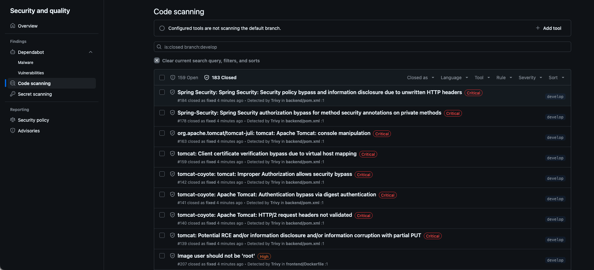

*Onglet Security → Code scanning, filtré sur `is:closed branch:develop` : **183 alertes fermées**
contre **159 encore ouvertes**. Les alertes visibles sont toutes marquées « closed as **fixed** »
et détectées par Trivy.*

Les alertes fermées visibles sur la capture, **neuf au total**, dépassent largement le minimum de
quatre exigé :

| Alerte | Intitulé | Sévérité | Fichier |
|---|---|---|---|
| `#184` | Spring Security : contournement de politique et divulgation d'information via des en-têtes HTTP non écrits | Critical | `backend/pom.xml` |
| `#178` | Spring Security : contournement d'autorisation sur les annotations de sécurité appliquées à des méthodes privées | Critical | `backend/pom.xml` |
| `#163` | `tomcat-juli` : manipulation de la console | Critical | `backend/pom.xml` |
| `#159` | Tomcat : contournement de la vérification du certificat client par mappage d'hôte virtuel | Critical | `backend/pom.xml` |
| `#142` | `tomcat-coyote` : autorisation incorrecte permettant un contournement de sécurité | Critical | `backend/pom.xml` |
| `#141` | `tomcat-coyote` : contournement d'authentification via l'authentification *digest* | Critical | `backend/pom.xml` |
| `#140` | `tomcat-coyote` : en-têtes de requête HTTP/2 non validés | Critical | `backend/pom.xml` |
| `#139` | Tomcat : RCE potentielle, divulgation ou corruption d'information via `PUT` partiel | Critical | `backend/pom.xml` |
| `#207` | *Image user should not be 'root'* | High | `frontend/Dockerfile` |

Les huit premières correspondent aux montées de version de la Correction 1 ; la neuvième au
passage du conteneur frontend en non-root, Correction 6. Cette dernière lève par ailleurs
l'incertitude signalée en Partie 6 : la capture du premier run ne permettait pas d'identifier le
Dockerfile concerné, l'alerte fermée le nomme explicitement.

**Il reste 159 alertes ouvertes**, et il serait malhonnête de présenter la situation autrement.
Elles correspondent aux vulnérabilités que la politique retenue ne traite pas — celles pour
lesquelles aucun correctif n'est publié, et celles de sévérité inférieure au seuil bloquant. Le
gate porte sur les vulnérabilités CRITICAL corrigeables : c'est cette catégorie qui est passée de
six à zéro.

---

### 7.2 Plan de Remédiation

Les points suivants n'ont **pas** été corrigés. Chacun a été vérifié comme toujours applicable
dans l'état actuel du code, et aucun n'est présenté ici comme résolu.

#### 1 — Protection CSRF désactivée

`SecurityConfig.java` conserve `.csrf(AbstractHttpConfigurer::disable)`, et le finding Semgrep R5
reste présent. Ce choix est délibéré et documenté depuis la Partie 3 : il ne s'agit pas d'un
oubli.

L'analyse manuelle a établi deux faits que l'outil ne peut pas connaître. Le cookie
d'authentification porte `SameSite=Lax`, qui empêche le navigateur de l'émettre sur une requête
`POST`, `PATCH` ou `DELETE` inter-site. Et la vérification des quarante-deux endpoints a montré
qu'aucune route `GET` ne modifie l'état — or `Lax` n'émet le cookie que sur une navigation de
premier niveau en `GET`. Il n'existe donc pas de vecteur exploitable sur un navigateur à jour. Le
CORS restreint à une origine unique constitue une barrière supplémentaire.

Le risque résiduel subsiste pour les navigateurs anciens ignorant `SameSite`, et en cas de
compromission d'un sous-domaine du même site, `SameSite` ne distinguant pas les origines au sein
d'un même domaine enregistré. La défense en profondeur consisterait à activer
`CookieCsrfTokenRepository`.

Aucune suppression Semgrep n'a été créée pour masquer ce finding : il reste visible dans Code
Scanning, ce qui est le comportement souhaité pour un risque assumé.

#### 2 — Absence de révocation serveur des JWT

Vérifié : aucun mécanisme de `tokenVersion`, de liste de révocation ou d'invalidation n'existe
dans le code. La déconnexion se limite à renvoyer un cookie expiré ; un jeton capté auparavant
reste valide jusqu'à son expiration.

Le risque est borné par la durée de vie d'une heure et par le fait que le cookie est `HttpOnly`,
donc non exfiltrable par XSS. Il reste qu'aucune action ne permet aujourd'hui de couper une
session compromise. La remédiation consisterait à ajouter une colonne `token_version` sur
`users`, à la porter en *claim*, à l'incrémenter à la déconnexion et au changement de mot de
passe, puis à la comparer dans le filtre — lequel lit désormais déjà l'entité en base depuis la
Correction 2, ce qui rend l'ajout peu coûteux.

#### 3 — Adresses e-mail exposées sur les tontines `DRAFT`

Vérifié : `TontineMapper` transporte toujours `member.getUser().getEmail()`, et l'exception de
lecture accordée au statut `DRAFT` reste en place dans `checkReadAccess`. Tout compte authentifié
peut donc reconstituer nom et adresse professionnelle des participants d'une tontine ouverte aux
inscriptions.

L'exception `DRAFT` est légitime — un employé doit pouvoir examiner une tontine avant de demander
à la rejoindre — mais son périmètre est trop large. La remédiation consiste à appliquer la
minimisation des données : retirer `userEmail` du DTO pour les non-gestionnaires, ou limiter
l'exception à la fiche de la tontine sans la liste nominative.

#### 4 — Swagger et OpenAPI publics

Vérifié : `/swagger-ui/**` et `/v3/api-docs/**` figurent toujours parmi les routes publiques. La
surface complète de l'API reste consultable sans authentification.

Aucune donnée métier n'est servie par ces routes, et `/actuator` n'expose que `health` avec
`show-details: never`. C'est une aide à la reconnaissance, pas un accès. Le comportement est
approprié en développement ; en production, springdoc devrait être conditionné à un profil ou
protégé par `hasRole('ADMIN')`.

#### 5 — Pagination absente sur la plupart des listes

Vérifié : un seul controller sur dix utilise `PageResponse`, celui du journal d'audit. Les huit
routes de liste identifiées en Partie 3 retournent toujours des collections non bornées.

Sans conséquence à l'échelle d'une PME, mais la remédiation est simple : généraliser
`PageResponse`, déjà présent et éprouvé, aux routes à croissance non bornée.

#### 6 — Port PostgreSQL publié sur l'hôte

Vérifié : `docker-compose.yml` publie toujours `"${DB_PORT:-5432}:5432"` pour le service
`postgres`. Le backend joint pourtant la base par le réseau interne `salarytontine-net` : cette
publication ne sert que le confort de développement.

Sur un serveur exposé, elle rendrait le port accessible depuis l'extérieur et permettrait de
franchir la frontière **TB2** du modèle de menaces, contournant l'intégralité des règles métier
pour ne laisser que les contraintes SQL — sans qu'aucune trace n'apparaisse dans le journal
d'audit, alimenté par la couche applicative.

#### Tableau de remédiation

| Action | Priorité | Effort | Échéance proposée | Justification |
|---|---|---|---|---|
| Retirer la publication du port PostgreSQL | **Moyenne** | Faible | Avant tout déploiement hors poste de développement | Franchit la frontière TB2 et contourne toutes les règles métier ; sans usage en dehors du confort local |
| Ajouter une révocation par `token_version` | **Moyenne** | Moyen | Prochain cycle | Seul moyen de couper une session compromise ; le filtre lit déjà l'entité en base, l'ajout est peu coûteux |
| Minimiser les données des tontines `DRAFT` | **Moyenne** | Faible | Prochain cycle | Donnée personnelle exposée à tout compte authentifié ; correction confinée au DTO et au mapper |
| Activer `CookieCsrfTokenRepository` | **Faible à moyenne** | Moyen | Selon le contexte de déploiement | Non exploitable aujourd'hui grâce à `SameSite=Lax` et à l'absence de `GET` mutant ; devient prioritaire si des sous-domaines tiers apparaissent ou si des navigateurs anciens doivent être supportés |
| Conditionner Swagger à un profil | **Faible** | Faible | Avant mise en production | Aucune donnée métier exposée ; réduit seulement l'effort de reconnaissance d'un attaquant |
| Généraliser `PageResponse` | **Faible** | Moyen | Selon la montée en charge | Aucun impact à l'échelle actuelle ; devient nécessaire au-delà de quelques milliers d'enregistrements |

---

### 7.3 Dockerfile Sécurisé

Le projet compte deux Dockerfiles réels ; aucun Dockerfile racine n'a été créé pour les besoins de
la pipeline. Leur situation de départ était très différente, et il importe de ne pas les
confondre.

#### Backend — déjà conforme, durci à la marge

`backend/Dockerfile` respectait déjà les bonnes pratiques essentielles **avant** toute
correction : build multi-étapes séparant la compilation Maven de l'exécution, image d'exécution
JRE Alpine minimale, et surtout **utilisateur non privilégié dédié**.

```dockerfile
# Déjà présent avant correction
FROM maven:3.9-eclipse-temurin-21 AS build
...
FROM eclipse-temurin:21-jre-alpine AS runtime
RUN addgroup -S salarytontine && adduser -S -G salarytontine salarytontine
COPY --from=build /build/target/*.jar app.jar
RUN chown -R salarytontine:salarytontine /app
USER salarytontine
```

**Il n'était pas exécuté en root**, et l'affirmer serait inexact. La seule évolution apportée est
l'ajout d'un `HEALTHCHECK`, qui répond à l'alerte Trivy `DS-0026` (LOW) et rend l'image
auto-descriptive pour un orchestrateur autre que Compose :

```dockerfile
HEALTHCHECK --interval=30s --timeout=5s --start-period=40s --retries=3 \
    CMD wget -qO- http://127.0.0.1:8080/actuator/health | grep -q UP || exit 1
```

Le `COPY` reste minimal — seul le jar produit entre dans l'image d'exécution, ni sources, ni
dépendances de build. Aucun secret n'est embarqué : la configuration provient exclusivement de
variables d'environnement fournies à l'exécution, et l'inspection de l'image confirme que `/app`
ne contient que `app.jar`.

#### Frontend — correction réelle

C'est ici que se situait la vulnérabilité. L'image reposait sur `nginx:1.27-alpine` sans aucune
directive `USER`, donc en root.

```dockerfile
# AVANT
FROM nginx:1.27-alpine AS runtime
COPY --from=build /build/dist /usr/share/nginx/html
COPY nginx.conf /etc/nginx/conf.d/default.conf
EXPOSE 80
HEALTHCHECK ... CMD wget -qO- http://127.0.0.1/ ...
```

```dockerfile
# APRÈS
FROM nginxinc/nginx-unprivileged:1.27-alpine AS runtime
COPY --from=build /build/dist /usr/share/nginx/html
COPY nginx.conf /etc/nginx/conf.d/default.conf
USER 101
EXPOSE 8080
HEALTHCHECK ... CMD wget -qO- http://127.0.0.1:8080/ ...
```

```nginx
# frontend/nginx.conf
server {
    listen 8080;   # au lieu de 80
    ...
}
```

```yaml
# docker-compose.yml
ports:
  - "5173:8080"   # au lieu de 5173:80
```

#### Comparaison

| Aspect | Avant | Après | Gain sécurité |
|---|---|---|---|
| **Backend — build** | Multi-étapes | Multi-étapes *(inchangé)* | Ni sources ni dépendances de build dans l'image finale |
| **Backend — image d'exécution** | `eclipse-temurin:21-jre-alpine` | *(inchangé)* | Surface d'attaque minimale : JRE seul, pas de JDK |
| **Backend — utilisateur** | `USER salarytontine` — `uid=100` | *(inchangé)* | Déjà non-root : une évasion de conteneur n'obtient pas root sur l'hôte |
| **Backend — sonde** | Aucune | `HEALTHCHECK` sur `/actuator/health` | Un processus bloqué devient détectable par tout orchestrateur |
| **Backend — secrets** | Aucun | *(inchangé)* | Configuration exclusivement par variables d'environnement |
| **Frontend — build** | Multi-étapes | Multi-étapes *(inchangé)* | Seul `dist/` entre dans l'image finale, pas `node_modules` |
| **Frontend — image de base** | `nginx:1.27-alpine` | `nginxinc/nginx-unprivileged:1.27-alpine` | Image officielle conçue pour l'exécution non privilégiée |
| **Frontend — utilisateur** | Aucun — **root** | `USER 101` explicite — `uid=101(nginx)` | **Correction principale** : plus de processus root dans le conteneur |
| **Frontend — port interne** | 80 | 8080 | Conséquence nécessaire : un non-root ne peut ouvrir un port < 1024 |
| **Frontend — port publié** | 5173 | 5173 *(inchangé)* | Aucune procédure de développement modifiée |
| **Frontend — sonde** | `http://127.0.0.1/` | `http://127.0.0.1:8080/` | Cohérence avec le nouveau port d'écoute |
| **Trivy — misconfiguration** | 1 HIGH sur le frontend, 1 LOW sur le backend | **0 sur les deux** | Alertes `DS-0002` et `DS-0026` fermées |

#### Vérification à l'exécution

Les deux images ont été reconstruites et inspectées :

```
salary-tontine-backend    Config.User = salarytontine
                          id → uid=100(salarytontine) gid=101(salarytontine)

salary-tontine-frontend   Config.User = 101
                          id → uid=101(nginx) gid=101(nginx)
```

Le conteneur frontend a été démarré et interrogé : `GET /` répond **HTTP 200** sur le port 8080,
avec les processus nginx s'exécutant sous l'utilisateur `nginx`. La correction ne dégrade donc
aucune fonctionnalité.

---


## 8. Bilan et Leçons Apprises

---

*Examen Final 2INF2311 — SUP de CO Dakar*