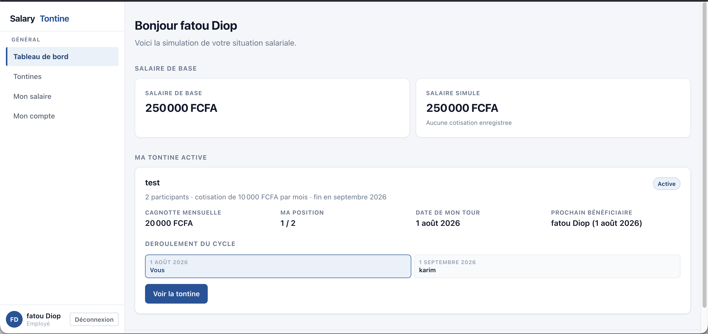
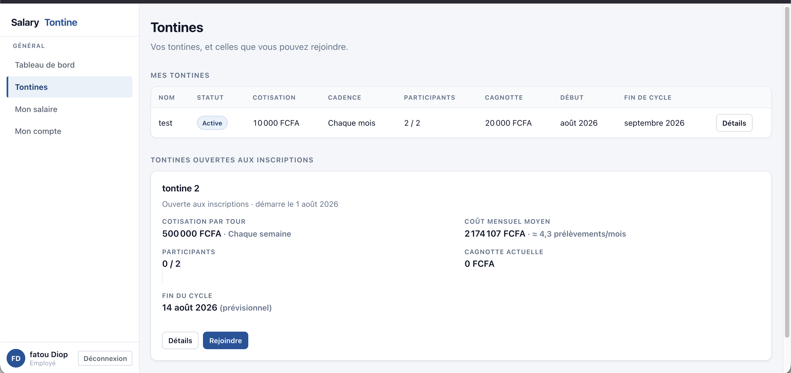
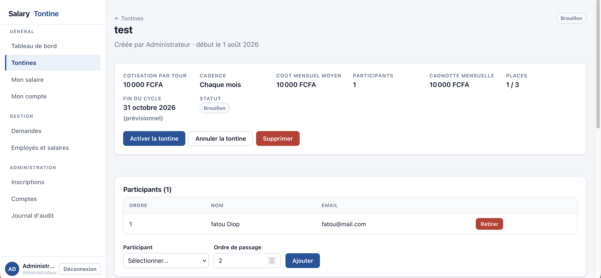
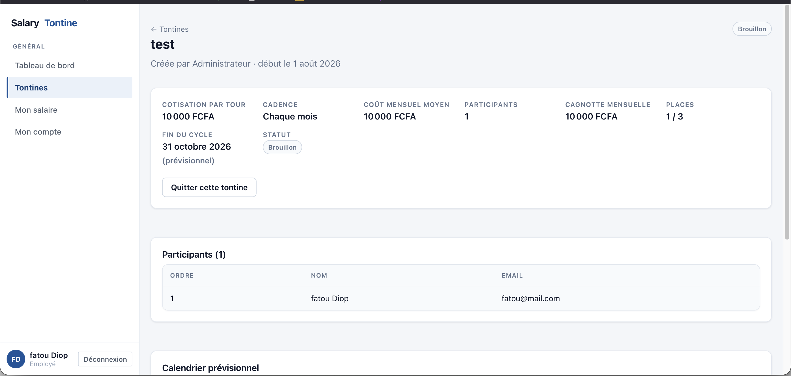

# SalaryTontine

SalaryTontine est une application web de gestion de **tontines salariales**. Une tontine réunit
plusieurs employés qui versent chacun une cotisation à intervalle régulier ; à chaque tour, un
participant différent perçoit la cagnotte, jusqu'à ce que tout le monde ait été servi une fois.
L'application relie ce mécanisme à la paie : la cotisation est déduite du salaire de base, et le
bénéficiaire du tour voit la cagnotte s'y ajouter.

**Aucune transaction financière réelle n'a lieu.** Il n'y a ni virement bancaire, ni Mobile
Money, ni manipulation d'argent. Tous les montants sont **simulés**, et les données du dépôt sont
académiques ou de démonstration.

L'application repose sur un frontend **React / TypeScript**, un backend **Spring Boot** exposant
une API REST, une base **PostgreSQL**, une authentification par **JWT en cookie HttpOnly**, et se
déploie via **Docker**. Elle est accompagnée d'une chaîne **DevSecOps** automatisée décrite plus
bas.

> Ce dépôt contient également le travail réalisé dans le cadre de l'examen final
> **Sécurité Logicielle & DevSecOps**. Le rapport détaillé — threat modeling, audit OWASP, règles
> Semgrep, pipeline, résultats et corrections — est disponible dans
> **[RAPPORT_FINAL.md](RAPPORT_FINAL.md)**.

---

## Aperçu de l'application



*Tableau de bord d'un employé : salaire de base, salaire simulé, tontine active, cagnotte du
mois, position dans le cycle, date de son tour et prochain bénéficiaire.*



*Liste des tontines : celles auxquelles l'employé participe, et celles ouvertes aux inscriptions
qu'il peut rejoindre. Le coût mensuel moyen est calculé selon la cadence — ici une cotisation
hebdomadaire, soit environ 4,3 prélèvements par mois.*



*Détail d'une tontine au statut Brouillon, vue par un administrateur : composition, ordre de
passage, ajout ou retrait de participants, activation, annulation, suppression. Le menu latéral
donne accès aux sections Gestion et Administration.*



*La même tontine vue par un employé : le menu est réduit aux sections générales et la seule
action disponible est « Quitter cette tontine ». Le contrôle d'accès par rôle est appliqué côté
serveur ; l'interface ne fait que refléter les droits réels.*

---

## Fonctionnalités principales

| Domaine | Fonctionnalités |
|---|---|
| **Authentification** | Inscription publique, connexion par JWT en cookie HttpOnly, changement de mot de passe par son propriétaire, validation des inscriptions par un administrateur |
| **Tontines** | Création, modification tant que la tontine est au statut brouillon, activation figeant la composition, annulation, suppression |
| **Cadence** | Hebdomadaire, tous les 10 jours, quinzaine, mensuelle, ou durée libre de 1 à 365 jours |
| **Adhésions** | L'employé demande à rejoindre une tontine ouverte, un gestionnaire accepte ou refuse et fixe l'ordre de passage |
| **Cycle** | Calendrier prévisionnel, bénéficiaire de chaque tour, fin de cycle calculée, ordres de passage renumérotés après un départ |
| **Salaires** | Salaire de base par employé, cotisations générées par tour, bulletin mensuel consolidé toutes tontines confondues |
| **Multi-tontines** | Participation simultanée à plusieurs tontines, plafonnée par le salaire de base |
| **Traitement automatique** | Tâche planifiée quotidienne qui génère les cotisations et les salaires de tous les tours échus |
| **Administration** | Gestion des rôles, annuaire salarial, journal d'audit paginé |

---

## Rôles

| Rôle | Ce qu'il peut faire |
|---|---|
| **EMPLOYEE** | Consulte son tableau de bord et ses salaires simulés, parcourt les tontines ouvertes, demande à en rejoindre une, quitte une tontine non démarrée |
| **ACCOUNTANT** | Tout ce que peut un employé — il en est un — et gère les tontines, arbitre les adhésions, consulte et fixe le salaire de base des employés, déclenche les générations |
| **ADMIN** | Valide les inscriptions, attribue les rôles, consulte le journal d'audit, et dispose des droits du comptable sur les tontines |

Trois règles de séparation des tâches sont appliquées côté serveur : **personne ne fixe son
propre salaire de base**, **personne ne s'ajoute soi-même à une tontine**, **personne n'arbitre sa
propre demande d'adhésion**. L'administrateur n'est pas salarié : il ne participe pas aux
tontines et n'a pas de salaire de base.

---

## Architecture

| Couche | Technologies |
|---|---|
| **Frontend** | React 19, TypeScript, Vite, React Router, Axios, Vitest et Testing Library |
| **Backend** | Java 21, Spring Boot 3.5, Spring Security, Spring Data JPA / Hibernate, Flyway, JJWT, springdoc-openapi, Actuator |
| **Base de données** | PostgreSQL 16, schéma versionné par migrations Flyway |
| **Infrastructure** | Docker et Docker Compose, Nginx pour servir le frontend, GitHub Actions |


*Architecture générale : navigateur, SPA React servie par Nginx, API REST Spring Boot, base
PostgreSQL, et traitement planifié.*

---

## Sécurité et Threat Modeling

Le travail de sécurité a suivi un ordre volontaire : **modéliser les menaces, auditer
manuellement, puis seulement ensuite exécuter les outils.**

Un modèle de menaces a été construit avec **OWASP Threat Dragon** selon la méthode **STRIDE** :
**8 menaces** documentées, couvrant les **6 catégories STRIDE**, réparties sur les processus, le
magasin de données et les flux, avec **2 frontières de confiance** — navigateur / backend, et
backend / PostgreSQL.

Un **audit manuel OWASP Top 10** a ensuite été conduit **avant toute exécution d'outil**, sur le
code non corrigé : inventaire des 42 endpoints, revue des contrôles d'accès, de la validation des
DTO et de la gestion des secrets. Huit constats ont été retenus, dont cinq qu'aucun scanner n'a
détectés — ils relevaient de la logique métier.


*Diagramme de flux de données annoté dans OWASP Threat Dragon, avec les deux frontières de
confiance.*

Le modèle exporté est disponible en JSON :
**[threat-model_mame-fatou-laye-diop.json](threat-model_mame-fatou-laye-diop.json)**. Le fichier
[threat-model.json](threat-model.json) en est une copie identique, sous le nom générique attendu
par l'arborescence des livrables.

Le détail des 8 menaces et leur priorisation figurent dans la **Partie 2** de
[RAPPORT_FINAL.md](RAPPORT_FINAL.md) ; l'audit manuel dans la **Partie 3**.

---

## DevSecOps

Une pipeline GitHub Actions s'exécute à chaque `push` sur `main` et `develop`, ainsi que sur
chaque *pull request*.

```
Secrets  →  SAST  →  SCA  →  Build Docker  →  Scan des images  →  Récapitulatif
GitLeaks    Semgrep   Snyk                     Trivy image        GitHub Summary
                      Trivy FS
```

| Étape | Outil | Rôle |
|---|---|---|
| Secrets | **GitLeaks** | Analyse l'arbre de travail **et l'historique Git complet** (`fetch-depth: 0`) |
| SAST | **Semgrep** | 6 règles personnalisées au projet, plus les rulesets `p/owasp-top-ten` et `p/nodejs` |
| SCA | **Snyk** | Dépendances Maven et npm, avec la chaîne d'introduction de chaque vulnérabilité |
| SCA | **Trivy filesystem** | Dépendances et mauvaises configurations ; porte le contrôle bloquant |
| Build | **Docker Buildx** | Construit les deux images, taguées par l'empreinte du commit ; aucune poussée vers un registre |
| Conteneurs | **Trivy image** | Analyse les deux images avec `ignore-unfixed: true` |
| Restitution | **SARIF** | 7 rapports publiés dans GitHub Code Scanning sous des catégories distinctes |

**Le build Docker dépend du succès des contrôles amont.** Le job de construction déclare
`needs: [gitleaks, sast, sca]` : aucune image n'est construite tant que la détection de secrets,
l'analyse statique et l'analyse des dépendances n'ont pas toutes réussi. Une vulnérabilité
**CRITICAL pour laquelle un correctif existe** fait échouer le job SCA et **bloque réellement la
chaîne**.

Fichiers : **[.github/workflows/devsecops.yml](.github/workflows/devsecops.yml)** et
**[.semgrep/rules.yaml](.semgrep/rules.yaml)**.

---

## Résultats de la démarche DevSecOps

| | Avant correction | Après correction |
|---|---|---|
| Pipeline | **FAILURE** | **SUCCESS** |
| Vulnérabilités CRITICAL corrigeables | **6** | **0** |
| Job SCA | Bloqué au gate | Validé |
| Build et scan des images Docker | Non exécuté | Exécuté et analysé |
| Rôle porté par le JWT | Figé jusqu'à expiration | Relu en base à chaque requête |
| Cookie d'authentification | `Secure = false` par défaut | `Secure = true` par défaut |
| Limitation sur `/login` et `/register` | Aucune | 10 tentatives / 60 s, HTTP 429 |
| Conteneur backend | Non-root — déjà conforme | Inchangé |
| Conteneur frontend | **root** | Non-root (`uid=101`) |
| Tests backend | 200 | **216**, 0 échec |
| Tests frontend | 66 | **66**, 0 échec |
| Alertes Code Scanning fermées | — | **183**, dont 9 visibles sur la capture finale |
| Alertes Code Scanning ouvertes | — | **159** |

**159 alertes restent ouvertes.** Elles correspondent aux vulnérabilités sans correctif publié et
à celles de sévérité inférieure au seuil bloquant. Ce qui est passé de six à zéro, c'est la
catégorie que la politique de sécurité contrôle : les vulnérabilités CRITICAL corrigeables. Les
risques résiduels sont documentés dans la **Partie 7.2** de [RAPPORT_FINAL.md](RAPPORT_FINAL.md).


*Pipeline DevSecOps après corrections — ensemble des jobs validés.*


*GitHub Code Scanning après remédiation — alertes fermées / Fixed.*

---

## Principales corrections de sécurité

| # | Correction | Effet |
|---|---|---|
| 1 | **Mise à niveau du socle de dépendances** — parent Spring Boot 3.4.2 → 3.5.16, en respectant le BOM plutôt qu'en surchargeant des versions transitives | 12 CVE résolues, dont les 6 CRITICAL bloquantes |
| 2 | **Rôle relu depuis la base** au lieu d'être lu dans le JWT | Une rétrogradation prend effet immédiatement, sans attendre l'expiration du jeton |
| 3 | **Cookie JWT `Secure = true` par défaut** | Sûr par défaut ; le HTTP local exige désormais une configuration explicite |
| 4 | **Limitation de débit sur `/login` et `/register`** | Freine le bourrage d'identifiants ; une requête hors quota ne déclenche aucun calcul BCrypt |
| 5 | **Journalisation des échecs d'authentification** | Rend une campagne de force brute détectable, sans jamais journaliser de mot de passe |
| 6 | **Conteneur frontend non-root** — image `nginx-unprivileged`, `USER 101`, port interne 8080 | Plus aucun processus root dans les conteneurs |

Le `HEALTHCHECK` ajouté à l'image backend est un durcissement complémentaire, pas la correction
d'une vulnérabilité majeure. Le détail — code avant / après, explication et validation de chaque
correction — figure dans la **Partie 7** de [RAPPORT_FINAL.md](RAPPORT_FINAL.md).

---

## Livrables DevSecOps

| Livrable | Emplacement |
|---|---|
| Rapport complet | [RAPPORT_FINAL.md](RAPPORT_FINAL.md) |
| Schéma d'architecture | [docs/architecture-salarytontine.png](docs/architecture-salarytontine.png) |
| Modèle de menaces (JSON) | [threat-model_mame-fatou-laye-diop.json](threat-model_mame-fatou-laye-diop.json) · [threat-model.json](threat-model.json) |
| DFD Threat Dragon | [docs/threat-model-salarytontine.png](docs/threat-model-salarytontine.png) |
| Règles Semgrep personnalisées | [.semgrep/rules.yaml](.semgrep/rules.yaml) |
| Pipeline GitHub Actions | [.github/workflows/devsecops.yml](.github/workflows/devsecops.yml) |
| Captures et preuves d'exécution | [docs/screenshots/](docs/screenshots/) |
| Code backend | [backend/](backend/) |
| Code frontend | [frontend/](frontend/) |
| Dockerfiles | [backend/Dockerfile](backend/Dockerfile) · [frontend/Dockerfile](frontend/Dockerfile) |

Les captures `run1-*` documentent l'état **avant** correction, les captures `run2-*` l'état
**après**.

### GitHub Actions

Onglet **Actions** du dépôt → workflow **DevSecOps** :
<https://github.com/mfatou/salary-tontine/actions>

### Résultats de sécurité

Onglet **Security** → **Code scanning** :
<https://github.com/mfatou/salary-tontine/security/code-scanning>

Les alertes y sont réparties sous sept catégories : `gitleaks`, `semgrep`, `snyk-backend`,
`snyk-frontend`, `trivy-fs`, `trivy-backend-image` et `trivy-frontend-image`.

---

## Tests

| Périmètre | Résultat à la validation finale |
|---|---|
| Backend — `mvn test` | **216 tests**, 0 échec, 0 erreur |
| Backend — `mvn verify` | BUILD SUCCESS |
| Frontend — `npm test` | **66 tests**, 12 fichiers |
| Frontend — `npm run build` | Build validé |

Les corrections de sécurité importantes disposent de **tests de régression** dédiés :
rafraîchissement du rôle depuis la base, limitation de débit, attribut `Secure` du cookie, et
journalisation des échecs d'authentification sans fuite de mot de passe.

---

## Installation locale

### Le plus rapide

Un `Makefile` regroupe les commandes courantes :

```bash
make dev     # PostgreSQL (Docker) + backend (Maven) + frontend (Vite), rechargement à chaud
make up      # pile Docker complète, prod-like
make help    # liste toutes les cibles
```

`make dev` est le mode de développement : une modification du frontend est rechargée
instantanément, une modification Java demande `make restart-back`.

### Prérequis

- Java 21
- Maven 3.9+ (un wrapper `./mvnw` est fourni)
- Node.js 20+ et npm
- Docker (pour PostgreSQL et pour les tests d'intégration Testcontainers)

### Étape 1 — Configuration

```bash
cp .env.example .env
```

Renseignez au minimum `DB_PASSWORD` et `JWT_SECRET`. Générer un secret robuste :

```bash
openssl rand -base64 48
```

`.env.example` est la référence des variables et ne contient **aucune valeur** ; `.env` est
ignoré par Git.

### Étape 2 — Base de données

```bash
docker run -d --name st-postgres \
  -e POSTGRES_DB=salarytontine \
  -e POSTGRES_USER=salarytontine \
  -e POSTGRES_PASSWORD=<votre_mot_de_passe> \
  -p 5432:5432 postgres:16-alpine
```

Flyway crée et migre le schéma automatiquement au démarrage du backend.

### Étape 3 — Backend

```bash
cd backend
set -a; source ../.env; set +a     # charge les variables d'environnement
./mvnw spring-boot:run
```

L'API écoute sur <http://localhost:8080>.

### Étape 4 — Frontend

```bash
cd frontend
cp .env.example .env
npm install
npm run dev
```

L'interface est disponible sur <http://localhost:5173>.

---

## Variables d'environnement

Toutes les variables sont documentées dans `.env.example`. **Ce fichier ne contient aucune valeur
secrète réelle.**

| Variable | Rôle | Défaut |
|---|---|---|
| `DB_HOST`, `DB_PORT`, `DB_NAME`, `DB_USERNAME` | Connexion PostgreSQL | `localhost`, `5432`, `salarytontine`, `salarytontine` |
| `DB_PASSWORD` | Mot de passe PostgreSQL | — *(obligatoire)* |
| `JWT_SECRET` | Clé de signature HMAC-SHA, **32 caractères minimum** | — *(obligatoire)* |
| `JWT_EXPIRATION_SECONDS` | Durée de validité du jeton | `3600` |
| `JWT_COOKIE_NAME` | Nom du cookie d'authentification | `salarytontine_token` |
| `JWT_COOKIE_SECURE` | Attribut `Secure`. `false` uniquement pour un accès local en HTTP | `true` |
| `APP_RATE_LIMIT_ENABLED` | Limitation des tentatives d'authentification | `true` |
| `APP_RATE_LIMIT_MAX_ATTEMPTS` | Tentatives autorisées par fenêtre et par origine | `10` |
| `APP_RATE_LIMIT_WINDOW_SECONDS` | Durée de la fenêtre, en secondes | `60` |
| `APP_FRONTEND_URL` | Origine autorisée par CORS | `http://localhost:5173` |
| `APP_ADMIN_EMAIL`, `APP_ADMIN_PASSWORD` | Compte administrateur initial (mot de passe : 12 caractères minimum) | — |
| `APP_SEED_ENABLED`, `APP_SEED_PASSWORD` | Jeu de données de démonstration | `false`, — |
| `APP_SCHEDULING_ENABLED`, `APP_MONTHLY_RUN_CRON` | Traitement automatique quotidien | `true`, `0 0 2 * * *` |
| `SERVER_PORT` | Port d'écoute de l'API | `8080` |
| `VITE_API_BASE_URL` | URL de l'API, figée au build du frontend | `http://localhost:8080` |

Le backend **refuse de démarrer** si `JWT_SECRET` est absent ou trop court. Aucun secret n'est
écrit en dur dans le code source.

### Le compte administrateur

Il est créé **au démarrage, et uniquement si la base ne contient aucun `ADMIN`**, à partir de
`APP_ADMIN_EMAIL` et `APP_ADMIN_PASSWORD`. Sans lui, une base vierge n'offrirait aucun moyen
d'entrer : l'inscription publique ne crée que des `EMPLOYEE`, et il faut déjà être `ADMIN` pour
attribuer un rôle.

L'administrateur **ne crée pas** de comptes et ne choisit jamais le mot de passe d'un autre :
chaque employé s'inscrit lui-même, puis son inscription est validée. Générer un mot de passe
robuste :

```bash
LC_ALL=C tr -dc 'A-Za-z0-9' < /dev/urandom | head -c 24
```

> Restez sur des caractères alphanumériques : un `#` dans une valeur de `.env` serait interprété
> comme un début de commentaire par le `Makefile`.

---

## Docker

```bash
cp .env.example .env      # puis renseigner DB_PASSWORD et JWT_SECRET
docker compose up --build # ou : make up
```

| Service | URL |
|---|---|
| Frontend | <http://localhost:5173> |
| Backend | <http://localhost:8080> |
| Swagger UI | <http://localhost:8080/swagger-ui.html> |
| PostgreSQL | `localhost:5432` |

Le backend attend que PostgreSQL soit sain avant de démarrer, et le frontend attend que le
backend réponde sur `/actuator/health`. Les données persistent dans le volume
`salarytontine-postgres-data`.

```bash
docker compose down            # conserve les données
docker compose down -v         # supprime aussi le volume PostgreSQL
```

Les deux images sont construites en multi-étapes et s'exécutent sous un utilisateur non
privilégié.

---

## Commandes utiles

```bash
# Tests
cd backend && ./mvnw test        # unitaires + intégration (Testcontainers, Docker requis)
cd frontend && npm test          # exécution unique
cd frontend && npm run lint      # vérification TypeScript stricte

# Analyse de sécurité locale
semgrep scan --config .semgrep/rules.yaml backend/src/main/java frontend/src

# Makefile
make test                        # backend + frontend
make logs                        # journaux des services
make status                      # état des services
make reset-db                    # réinitialise la base
```

Les tests d'intégration démarrent un **vrai PostgreSQL** via Testcontainers ; Docker doit être en
cours d'exécution. H2 n'est volontairement pas utilisé, afin de tester le même moteur qu'en
production.

> **Note Docker récent** — les daemons Docker Engine 25+ refusent la version d'API négociée par
> défaut par le client embarqué dans Testcontainers. Le projet fixe `api.version=1.44` dans la
> configuration Surefire. Sur un daemon plus ancien : `./mvnw test -Ddocker.api.version=1.43`.

---

## Documentation de l'API

Backend démarré :

- Swagger UI : <http://localhost:8080/swagger-ui.html>
- Schéma OpenAPI : <http://localhost:8080/v3/api-docs>

La documentation décrit les 42 endpoints, les DTO et le schéma de sécurité par cookie.

---

## Structure du dépôt

```
salary-tontine/
├── backend/                          Spring Boot — API REST
│   ├── src/main/java/com/salarytontine/
│   ├── src/main/resources/db/migration/    migrations Flyway
│   ├── src/test/java/com/salarytontine/    216 tests
│   ├── Dockerfile
│   └── pom.xml
├── frontend/                         React + TypeScript
│   ├── src/                          pages, composants, api, routes
│   ├── Dockerfile, nginx.conf
│   └── package.json
├── docs/
│   ├── architecture-salarytontine.png
│   ├── threat-model-salarytontine.png
│   └── screenshots/                  captures applicatives et preuves run1 / run2
├── .github/workflows/devsecops.yml   pipeline DevSecOps
├── .semgrep/rules.yaml               6 règles Semgrep personnalisées
├── threat-model_mame-fatou-laye-diop.json
├── threat-model.json
├── docker-compose.yml
├── Makefile
├── .env.example
├── RAPPORT_FINAL.md
└── README.md
```

---

## Auteur

**Mame Fatou Laye Diop**

Projet réalisé dans le cadre de l'examen final **Sécurité Logicielle & DevSecOps**.
